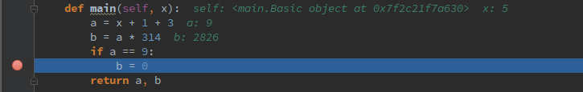
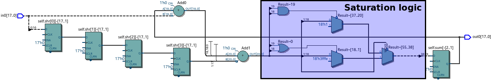

.. _2_pyha:

Hardware design with Pyha
=========================

This chapter introduces the main contribution of this thesis, Pyha - a tool to design digital hardware in Python.
The fist half of the chapter demonstrates how basic hardware constructs can be defined, using Pyha. Follows the
introduction to fixed-point type.

.. note:: The examples in the first half of this chapter are based on ``integer`` types in order to reduce complexity.

.. All the examples presented in this chapter can be found online HERE, including all the Python sources, unit-tests,
    VHDL conversion files and Quartus project for synthesis.

Introduction
------------

.. confusing on segane..

Conventional HDL languages promote concurrent and entity oriented models which can be confusing.
In this thesis, Pyha has been designed as a sequential object-oriented language, that works directly on
Python code. Using a sequential design flow is much easier to understand and is equally well synthesizable as shown
in this thesis. Object-oriented design helps to better abstract the RTL details and ease design reuse.

For illustration purposes, :numref:`pyha_basic` shows an example Pyha design. The ``main`` function has been
chosen as a top level entry point, other functions can be used as pleased.

.. kuidagi järsku tuleb see

.. code-block:: python
    :caption: Simple combinatory design, implemented in Pyha
    :name: pyha_basic

    class Basic(HW):
        def main(self, x):
            a = x + 1 + 3
            b = a * 314

            if a == 9:
                b = 0

            return a, b

One of the contributions of this thesis is sequential OOP VHDL model which is used to simplify conversion from Pyha to VHDL.
The example of the VHDL conversion is shown in :numref:`pyha_basic_vhdl`, more details are given in
:numref:`3_synthesis`.

.. siin võiks olla väike tests VHDL kohta, et ta on sarnane vms

.. code-block:: vhdl
    :caption: :numref:`pyha_basic` converted to VHDL, by Pyha conversion routines
    :name: pyha_basic_vhdl

    procedure main(self:inout self_t; x: integer; ret_0:out integer; ret_1:out integer) is
        variable a: integer;
        variable b: integer;
    begin
        a := x + 1 + 3;
        b := a * 314;

        if a = 9 then
            b := 0;
        end if;

        ret_0 := a;
        ret_1 := b;
    end procedure;

:numref:`basic_rtl` shows the synthesis result. The ``a`` output is formed by adding '1' and '3' to the ``x`` input. Next
the ``a`` signal is compared to ``9``; if equal, ``b`` is outputted as 0, otherwise ``b = a * 314``. This complies exactly with the Python and VHDL descriptions.

.. _basic_rtl:
.. figure:: ../examples/basic/img/basic_rtl.png
    :align: center
    :figclass: align-center

    Synthesised RTL of :numref:`pyha_basic_vhdl` (Intel Quartus RTL viewer)

One aspect of hardware design that Pyha aims to improve is testing. Conventional testing flow requires the
construction of testbenches that can be executed using simulators.

.. mis probleem on nendega?

.. Even the higher level tools dont simplify this step, for example the C based tools HLS tools want testbench in C language, which is not an
    improvement from VHDL or Verilog.

Pyha has been designed so that the synthesis output is behaviourally equivalent to the Python run
output, this means that Pyha designs can use all the Python debugging tools.
:numref:`py_debug` shows a debugging session on the :numref:`pyha_basic` code, this can drastically help
the development process.

.. see pilt valge taustaga teha?

.. _py_debug:

    Debugging using PyCharm (Python editor)

Furthermore, unit testing is accelerated by providing ``simulate(dut, x)`` function, that runs the following
simulations without any boilerplate code:

    - Model: this can be any Python code that fits as an high level model;
    - Pyha: like :numref:`pyha_basic`, Python domain simulation;
    - RTL: simulation in VHDL domain, Pyha model is converted to VHDL;
    - GATE: synthesises the VHDL code, using Intel Quartus, and simulates the resulting gate-level netlist.

This kind of testing function enables test-driven development, where tests can be first defined for the model and
fully reused for later RTL implementation.
:numref:`pyha_basic_test` shows an example unit test for the ``Basic()`` module. Python ``assert`` statements can be used
for unit test development. Pyha also provides ``assert_simulate(dut, expected, x)`` function that automatically compares
the output list to the ``expected`` list.

.. code-block:: python
    :caption: Unit test for the Basic module
    :name: pyha_basic_test

    x = [1, 2, 3, 4, 5, 6, 7, 8]
    dut = Basic()
    y = simulation(dut, x) # y contains result of all simulations
    # assert something

Sequential logic
----------------

The way how registers are inferred is a fundamental difference between the HDL and HLS languages.
HDL languages leave the task to the designer, while HLS languages automate the process.
In this work, Pyha has been designed to follow the HDL language approach, because this simplifies the conversion
to VHDL. Extensions can be considered in future editions.

In conventional programming, state is usually captured by using class variables which can retain values between function calls.
Inspired from this, all the class variables in Pyha are handled as registers.

Accumulator example
~~~~~~~~~~~~~~~~~~~

Consider the design of an accumulator (:numref:`acc`); it operates by sequentially adding up
all the input values of every successive function call.

.. code-block:: python
    :caption: Accumulator implemented in Pyha
    :name: acc

    class Acc(HW):
        def __init__(self):
            self.acc = 0

        def main(self, x):
            self.next.acc = self.acc + x
            return self.acc

The class structure in Pyha has been designed so that the ``__init__`` function shall define all
the memory elements in the design, the function itself is not converted to VHDL, only the variables are extracted.
For example
``__init__`` function could be used to call ``scipy.signal.firwin()`` to design FIR filter coefficients, initial
assignments to class variables are used for register initial/reset values.

Note the ``self.next.acc = ...``, simulates the hardware behaviour of registers, that is delayed assignment.
In general, this is equivalent to the VHDL ``<=`` operator. Values are transferred from **next** to **current**
before the ``main`` call. In Pyha each call to the ``main`` function can be considered as an clock edge.

The synthesis results displayed in the :numref:`acc_rtl` shows the adder and register, that is the expected result for accumulator.

.. _acc_rtl:
.. figure:: ../examples/accumulator/img/acc_rtl.png
    :align: center
    :figclass: align-center

    Synthesis result of :numref:`acc` (Intel Quartus RTL viewer)

One inconvenience is that every register on the signal path delays the output signal by 1 sample, this is also called
pipeline delay or latency. The delay can
be seen from :numref:`acc_sim_delay`, where hardware related simulations are delayed by 1 sample as
compared to the software model.

.. _acc_sim_delay:
.. figure:: ../examples/accumulator/img/acc_sim_delay.png
    :align: center
    :figclass: align-center

    Simulation of the ``Acc`` module, input is a random integer [-5;5]. Hardware simulations are delayed by 1, caused by the register

Pyha reserves a :code:`self._delay` variable, that hardware classes can use to specify their delay.
Simulation functions read this variable to compensate the simulation outputs.
Setting the ``self._delay = 1`` in the ``__init__`` function
would shift the hardware simulations left by 1 sample, so that all the simulation would be exactly equal. This functionality is useful for documenting the delay of modules and simplifies the use of unit-tests.

.. _ch_sliding_adder:

Block processing and sliding adder
~~~~~~~~~~~~~~~~~~~~~~~~~~~~~~~~~~

A common technique required to implement DSP systems is block processing, i.e. calculating results on a block of
input samples. Until now, the ``main`` function has worked with a single input sample, registers can be used to
keep history of samples, so that block processing can be applied.

For example, consider an algorithm that outputs the sum of last 4 input values.
:numref:`block_adder` shows the Pyha implementation, it works by keeping history of 4 last input samples and
summing them for output.

.. code-block:: python
    :caption: Sliding adder algorithm, implemented in Pyha
    :name: block_adder

    class SlidingAdder(HW):
        def __init__(self):
            self.shr = [0, 0, 0, 0] # define list of registers
            self.y = 0              # output register

        def main(self, x):
            # add new 'x' to list, throw away last element
            self.next.shr = [x] + self.shr[:-1]

            # add all elements in 'shr'
            sum = 0
            for x in self.shr:
                sum = sum + x

            # register the output
            self.next.y = sum
            return self.y

The ``self.next.shr = [x] + self.shr[:-1]`` implements an 'shift register', because on every call it
shifts the list contents to the right and adds new ``x`` as the first element. Sometimes the same structure is used as a
delay-chain, because the sample ``x`` takes 4 updates to travel from ``shr[0]`` to ``shr[3]``.
This is a very common element in hardware designs. :numref:`block_adder_rtl` shows the synthesis results.

.. _block_adder_rtl:
.. figure:: ../examples/block_adder/img/rtl.png
    :align: center
    :figclass: align-center

    Synthesis result of :numref:`block_adder` (Intel Quartus RTL viewer)

This design can be made generic by changing the ``__init__`` function to take the window length as a parameter
(:numref:`block_adder_generic`), so that ``SlidingAdder(window_len=4)`` would add 4 last elements, while
``SlidingAdder(window_len=6)`` would add 6.

.. code-block:: python
    :caption: Generic sliding adder, ``window_len`` controls the ``shr`` list length
    :name: block_adder_generic

    class SlidingAdder(HW):
        def __init__(self, window_len):
            self.shr = [0] * window_len
        ...

This design has a few issues when the ``window_len`` is increased (:numref:`rtl_6_critical`).
First, every stage requires a separate adder which increases the resource cost,
this also forms a long critical path which in turn decreases the maximum clock rate of the design.

.. _rtl_6_critical:
.. figure:: ../examples/block_adder/img/rtl_6_critical.png
    :align: center
    :figclass: align-center

    Synthesis result of ``SlidingAdder(window_len=6)``, the red line shows the critical path (Intel Quartus RTL viewer)

Conveniently, the algorithm can be optimized to use only 2 adders, no matter the window length.
:numref:`slider_optim` shows that instead of summing all the elements, the overlapping part of
the previous calculation can be used to significantly optimize the algorithm.

.. code-block:: python
    :caption: Optimizing the sliding adder algorithm by using recursive implementation
    :name: slider_optim

    y[4] = x[4] + x[5] + x[6] + x[7] + x[8] + x[9]
    y[5] =        x[5] + x[6] + x[7] + x[8] + x[9] + x[10]
    y[6] =               x[6] + x[7] + x[8] + x[9] + x[10] + x[11]

    # optimized way to calculate by reusing previous results (recursive)
    y[5] = y[4] + x[10] - x[4]
    y[6] = y[5] + x[11] - x[5]

:numref:`optimal_adder` gives the implementation of the optimal sliding adder; it features a new register ``sum``,
that keeps track of the previous output.

.. code-block:: python
    :caption: Optimal sliding adder, implemented in Pyha
    :name: optimal_adder

    class OptimalSlideAdd(HW):
        def __init__(self, window_len):
            self.shr = [0] * window_len
            self.sum = 0 # register to remember the 'last' sum

            self._delay = 1

        def main(self, x):
            self.next.shr = [x] + self.shr[:-1]

            # add new 'x' to sample and subtract the delayed 'x'
            self.next.sum = self.sum + x - self.shr[-1]
            return self.sum

:numref:`rtl_optimal_int_critical` shows the synthesis result. Now the critical path is 2 adders, no matter
the ``window_len``. In addition, notice how the ``shr`` is just a stack of registers to delay the input signal.

.. _rtl_optimal_int_critical:
.. figure:: ../examples/block_adder/img/rtl_optimal_int_critical.png
    :align: center
    :figclass: align-center

    Synthesis result of ``OptimalSlideAdd(window_len=4)`` (Intel Quartus RTL viewer)

.. _ch_fixed:

Fixed-point designs
-------------------

DSP systems are commonly described in floating-point arithmetic, which are supported by all conventional programming
languages. Floating-point arithmetic can also be used in RTL languages, but the problem is high resource usage
:cite:`fixvsfp`.
The alternative is to use fixed-point numbers, that work with integer arithmetic. Another benefit of fixed-point numbers
is that they can map to FPGA DSP blocks, thus providing higher clocks speed and reduced resource use [#floatdsp]_.

The common workflow is to experiment and write model using the floating-point arithmetic, then convert to fixed-point
for hardware implementation. One contribution of this thesis is the implementation of fixed-point class for the Python domain.

.. [#floatdsp] Some high-end FPGAs also include floating-point DSP blocks :cite:`arria_dsp`

Fixed-point support in Pyha
~~~~~~~~~~~~~~~~~~~~~~~~~~~

In this work, Pyha has been designed to support signed fixed-point type by providing the ``Sfix`` class.
The implementation maps directly to the VHDL fixed-point library :cite:`vhdlfixed` [#fixvhdl]_,
that is already known in the VHDL community and proven to be well synthesizable.

``Sfix`` class works by allocating bits to the ``left`` and ``right`` side of the decimal point. Bits to the
``left`` determine the integer bounds (sign bit is implicit), while the ``right`` bits determine the minimum resolution of the number.
For example, ``Sfix(left=0, right=-17)`` represents a number between [-1;1] with resolution of 0.000007629 (``2^-17``).
:numref:`fp_basics` shows a few examples on how reducing the ``right`` reduces the number precision.

.. code-block:: python
    :caption: Example of ``Sfix`` type, more bits give better accuracy
    :name: fp_basics

    >>> Sfix(0.3424, left=0, right=-17)
    0.34239959716796875 [0:-17]
    >>> Sfix(0.3424, left=0, right=-7)
    0.34375 [0:-7]
    >>> Sfix(0.3424, left=0, right=-4)
    0.3125 [0:-4]

The default and recommended fixed-point type in Pyha has been chosen to be ``Sfix(left=0, right=-17)``, because it
can represent normalized numbers and fits into FPGA DSP blocks :cite:`cycloneiv` :cite:`fixvsfp`. Keeping block inputs
and outputs in the normalized range can simplify the overall design process.

.. [#fixvhdl] https://github.com/FPHDL/fphdl.

.. _ch_fp_sliding_adder:

Converting sliding adder to fixed-point
~~~~~~~~~~~~~~~~~~~~~~~~~~~~~~~~~~~~~~~

Consider converting the sliding window adder (developed in :numref:`ch_sliding_adder`)
to a fixed-point implementation. This requires
changes only in the ``__init__`` function (:numref:`fp_sliding_adder`).

.. code-block:: python
    :caption: Fixed-point sliding adder, the rest of the code is identical to the one in :numref:`ch_sliding_adder`
    :name: fp_sliding_adder

    def __init__(self, window_size):
        self.shr = [Sfix()] * window_size # lazy type
        self.sum = Sfix(left=0)           # always resize left to 0

The first line sets ``self.shr`` to store ``Sfix()`` elements, this is a lazy statement as it does not specify the
fixed-point bounds i.e. it will take bounds from the first assignment to the ``self.shr`` variable.
The ``Sfix(left=0)`` forces ``left`` to 0 bits, while the fractional part is determined by the first assign.
One problem with the VHDL fixed-point library is that the designer is constantly forced to resize the value to
desired format, this thesis has automated this step i.e. every assign to fixed-point variable
is resized to the initial format, the bounds may be taken from the assigned value if initial value is lazy.

Synthesis results in :numref:`rtl_sfix_saturate` show that inputs and outputs are now 18-bits wide,
this is due the use of default fixed-point type.
Another main addition is the saturation logic, which prevents the wraparound behaviour by saturating the value instead.
Wraparound related bugs can be very hard to find, thus it is suggested to keep saturation logic enabled when the
overflows are possible.

.. _rtl_sfix_saturate:

    RTL of fixed-point sliding adder, default fixed-point type (Intel Quartus RTL viewer)

The ``simulate`` function in Pyha has been designed to automatically convert floating-point inputs to
fixed-point, the same goes for outputs. This way the unit-test can be kept simple, :numref:`fp_test` gives an example.

.. code-block:: python
    :caption: Pyha enables testing of fixed-point design with floating-point numbers
    :name: fp_test

    dut = OptimalSlidingAddFix(window_len=4)
    x = np.random.uniform(-0.5, 0.5, 64) # random signal in [-0.5, 0.5] range
    y = simulate(dut, x)                 # all outputs are floats
    # assert or plot results

The simulation results shown in :numref:`fix_sat_wrap`, show that the hardware related simulations differ from the
model. This is because the model is implemented in floating-point arithmetic while hardware typing is limited to
[-1;1] range. Notice that the mismatch starts when the value rises over ``1.0``.

.. _fix_sat_wrap:
.. figure:: ../examples/block_adder/img/sim_fix.png
    :align: center
    :figclass: align-center

    Simulation results of fixed-point sliding sum, input is random signal in [-0.5; 0.5] range

.. write about semi and automatic fix conversion?

Summary
-------

This chapter has demonstrated the major features of the proposed tool and the motivation behind them. It was shown that Pyha
is an sequential object-oriented programming language based on Python. It falls in the category of behavioral languages,
meaning that the output of Python program is equivalent to the output of the generated hardware. Pyha provides ``simulate``
functions to automatically and without any boilerplate code run model and hardware related simulations, this helps the
design of unit-tests. In addition, Pyha designs are fully debuggable in Python ecosystem.
Class variables are used to define registers, this has been inspired by traditional programming languages.
DSP systems can be implemented by using the fixed-point type. Pyha has 'semi-automatic' conversion from
floating point to fixed point numbers. Verifying against floating point model accelerates the design process.

