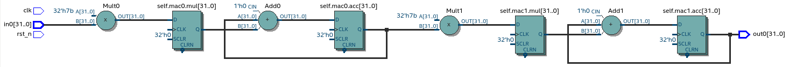
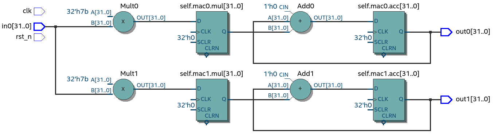
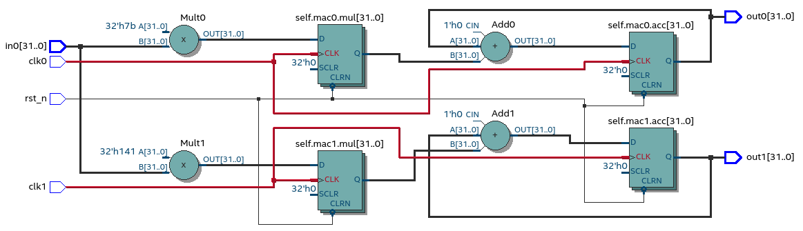

.. _ch_conversion:

Synthesis
=========

.. Many tools on the market are capable of converting higher level language to VHDL.
    However, these tools only make use of the very basic dataflow semantics of VHDL language,
    resulting in complex conversion process and typically unreadable VHDL output.

Majority of the hardware related tools end up converting to either VHDL or SystemVerilog, because these are supported
by the synthesis tools. Most often the higher level language is converted to very low level VHDL/SV code, resulting
in a confusing conversion process and unreadable code.

This thesis tests an alternative path by contributing the sequential synthesizable object-oriented (OOP) programming model for VHDL.
The main motivation is to use it as an conversion target for higher level languages. Major advantages are
that the conversion process is simple, output VHDL readable and structured.

VHDL has been chosen over SystemVerilog(SV) because it is a strict language and forbids many mistakes during compile time.
SV on the other hand is much more permissive, for example allowing out-of-bounds array indexing :cite:`sysverilog_gotcha`.
In future both could be supported.

.. _conversion:

    Process of converting Pyha to VHDL.

:numref:`conversion` shows the process of converting Pyha to VHDL. This relies heavily on the final VHDL model
(:numref:`ch_oopvhdl`). The process of type inference and syntax conversion is described in :numref:`ch_pyvhdl`.

.. _ch_oopvhdl:

Structured, Object-oriented style for VHDL
------------------------------------------

.. This chapter develops sequential synthesizable object-oriented (OOP) programming model for VHDL.
    The main motivation is to use it as an intermediate language for High-Level synthesis of hardware.

.. todo:: Give links to examples, top levels etc, redo images (in0, out0), why int types?

Structured programming in VHDL has been studied by Jiri Gaisler in :cite:`structvhdl_gaisler`. He showed that
combinatory logic is easily described by functions with sequential statements
and proposed the 'two-process' design method,
where the first process is used to describe combinatory logic and the second process describes registers.
This thesis contributes to the 'two process' model by adding an object-oriented approach, which
allows fully sequential designs, easier reuse and removes the one clock domain limitation.

The basic idea behind OOP is to strictly define functions that can perform actions on some group of data.
This idea fits well with hardware design, as 'data' can be thought as registers and combinatory logic as functions that
perform operations on the data. VHDL has no direct support for OOP,
but the OOP style can be still used by grouping data in record (same as C struct)
and passing it as a parameter to functions. This is essentially the same way how C programmers do it.

:numref:`vhdl_oop` demonstrates pipelined multiply-accumulate(MAC), written in OOP VHDL. Recall that all the items
in the ``self_t`` record are expected to synthesise as registers.

.. code-block:: vhdl
    :caption: OOP style multiply-accumulate in VHDL
    :name: vhdl_oop

    type self_t is record
        mul: integer;
        acc: integer;
        coef: integer;
    end record;

    procedure main(self: inout self_t; a: in integer; ret_0: out integer) is
    begin
        self.mul := a * self.coef;
        self.acc := self.acc + self.mul;
        ret_0 := self.acc; -- return via 'out' argument
    end procedure;

The synthesis results (:numref:`ghetto_comb_mac_rtl`) show that a functionally correct MAC has been implemented.
However, in terms of hardware, it is not quite what was wanted.
The data model specified 3 registers, but only the one for ``acc`` is present, and even that is not placed on the
critical path.

.. _ghetto_comb_mac_rtl:
.. figure:: img/ghetto_comb_mac_rtl.png
    :align: center
    :figclass: align-center

    Unexpected synthesis result of :numref:`vhdl_oop`, ``self.coef=123`` (Intel Quartus RTL viewer)

Defining registers with variables
~~~~~~~~~~~~~~~~~~~~~~~~~~~~~~~~~

Previous section made a mistake of expecting the registers to work in the same way
as 'class variables' in traditional programming languages. Actually registers are delayed elements, so to say
they take the next value.
VHDL defines a special 'signal assignment' operator for this kind of delayed assignment, that can be used on
VHDL signal objects like like :code:`a <= b`. These objects are hard to map to higher level languages and have
limited usage in VHDL structured code constructs. Cannot map to record.

Conveniently, the signal assignment can be mimicked with two variables,
to represent the **next** and **current** values.
Signal assignment operator sets the value of **next** variable. On the next simulation delta, all the
signals are updated i.e. **next** written to **current**. This way of writing sequential logic has been
suggested by Pong P. Chu in his VHDL book :cite:`chu_vhdl` and is also used in MyHDL signal objects
:cite:`jan_myhdl_signals`.

Adapting this style for the MAC example is shown in :numref:`mac_next`, the data model now includes the
``nexts`` member, that should be used to write register values.

.. code-block:: vhdl
    :caption: Data model with **next**, in OOP-style VHDL
    :name: mac_next

    type next_t is record -- new record to hold 'next' values
        mul: integer;
        acc: integer;
        coef: integer;
    end record;

    type self_t is record
        mul: integer;
        acc: integer;
        coef: integer;

        nexts: next_t; -- new element
    end record;

    procedure main(self: inout self_t; a: integer; ret_0: out integer) is
    begin
        self.nexts.mul := a * self.coef;        -- now assigns to self.nexts
        self.nexts.acc := self.acc + self.mul;  -- now assigns to self.nexts
        ret_0 := self.acc;
    end procedure;

VHDL signal assignment automatically updates the signal values, now with the variables method, this has to be
done manually. :numref:`mac-next-update` defines new function
'update_registers', taking care of this task.

.. code-block:: vhdl
    :caption: Function to update registers, in OOP-style VHDL
    :name: mac-next-update

    procedure update_register(self: inout self_t) is
    begin
        self.mul := self.nexts.mul;
        self.acc := self.nexts.acc;
        self.coef:= self.nexts.coef;
    end procedure;

.. note:: Function 'update_registers' is called on clock raising edge. While the 'main' is called as combinatory function.

Synthesising the revised code shows that the pipelined MAC has been implemented (:numref:`mac_rtl_end`)..

.. _mac_rtl_end:
.. figure:: img/mac_rtl.png
    :align: center
    :figclass: align-center

    Synthesis result of the revised code (Intel Quartus RTL viewer)

The OOP model
~~~~~~~~~~~~~

The OOP model, developed in this thesis, consists of following elements:

    - Record for 'next',
    - Record for 'self',
    - User defined functions (like 'main'),
    - 'Update registers' function,
    - 'Reset' function.

VHDL supports 'packages', that can be used to group all these elements into common namespace.
:numref:`package-mac` shows the template package for VHDL 'class'.
All the class functionality is now in common namespace.

.. code-block:: vhdl
   :caption: Class template for OOP style VHDL
   :name: package-mac

    package MAC is
        type next_t is record
            ...
        end record;

        type self_t is record
            ...
            nexts: next_t;
        end record;

        -- function prototypes
    end package;

    package body MAC is
        procedure reset(self: inout self_t) is
            ...
        procedure update_registers(self: inout self_t) is
            ...
        procedure main(self:inout self_t) is
            ...
        -- other user defined functions
    end package body;

The 'reset' function sets the initial values for registers.
:numref:`mac-vhdl-reset` shows a reset function for the MAC circuit. Note that the hardcoded
``self.nexts.coef := 123;`` could be replaced with VHDL package generics.

.. code-block:: vhdl
    :caption: Reset function for MAC, in OOP-style VHDL
    :name: mac-vhdl-reset

    procedure reset(self: inout self_t) is
    begin
        self.nexts.coef := 123;
        self.nexts.mul := 0;
        self.nexts.sum := 0;
        update_registers(self);
    end procedure;

The hardcoded ``self.nexts.coef := 123;`` could be replaced with package generic, for example ``coef``.
Then each new package could define a new reset value for it (:numref:`vhdl-package-init`).

.. code-block:: vhdl
    :caption: Initialize new package MAC_0, with 'coef' 123
    :name: vhdl-package-init

    package MAC_0 is new MAC
       generic map (COEF => 123);

Use cases
~~~~~~~~~

This section demonstrates how instances of  VHDL 'classes' can be used for design reused.
Consider an example that consists of two MAC instances and aims to connect them in series (:numref:`mac_series`).
In ``main``,

.. code-block:: vhdl
    :caption: Series MACs in OOP-style VHDL
    :name: mac_series

    type self_t is record
        mac0: MAC_0.self_t; -- define 2 MACs as part of data model
        mac1: MAC_1.self_t;

        nexts: next_t;
    end record;

    procedure main(self:inout self_t; a: integer; ret_0:out integer) is
        variable out_tmp: integer;
    begin
        MAC_0.main(self.mac0, a, ret_0=>out_tmp); -- connect MAC_0 output to MAC_1 input
        MAC_1.main(self.mac1, out_tmp, ret_0=>ret_0); -- connect MAC_1 to output
    end procedure;

Synthesis result shows that two MACs are connected in series :numref:`mac_reuse_stack`.

.. _mac_reuse_stack:

    Synthesis result of the new class (Intel Quartus RTL viewer)

Connecting two MAC's instead in parallel can be done with simple modification to ``main`` function
to return both outputs (:numref:`mac-parallel`).

.. code-block:: vhdl
    :caption: Main function for parallel instances, in OOP-style VHDL
    :name: mac-parallel

    procedure main(self:inout self_t; a: integer; ret_0:out integer; ret_1:out integer) is
    begin
        MAC_0.main(self.mac0, a, ret_0=>ret_0); -- return MAC_0 output
        MAC_1.main(self.mac1, a, ret_0=>ret_1); -- return MAC_1 output
    end procedure;

Two MAC's are synthesized in parallel, as shown in :numref:`mac_reuse_parallel`.

.. _mac_reuse_parallel:

    Synthesis result of :numref:`mac-parallel` (Intel Quartus RTL viewer)

Multiple clock domains can be easily supported by updating registers at different clock edges.
By reusing the parallel MAC's example, consider that MAC_0 and MAC_1  are specified to work in different clock domain.
For this only the top level process must be modified (:numref:`mac-parallel-clocks`), rest of the code stays the same.

.. code-block:: vhdl
    :caption: Top-level for multiple clocks, in OOP-style VHDL
    :name: mac-parallel-clocks

    if (not rst_n) then
        ReuseParallel_0.reset(self); -- reset everything
    else
        if rising_edge(clk0) then
            MAC_0.update_registers(self.mac0); -- update 'mac0' on 'clk0' rising edge
        end if;

        if rising_edge(clk1) then
            MAC_1.update_registers(self.mac1); -- update 'mac1' on 'clk1' rising edge
        end if;
    end if;

Synthesis result (:numref:`mac_parallel_two_clocks`) show that
registers are clocked by different clocks. The reset signal is common for the whole design.

.. _mac_parallel_two_clocks:

    Synthesis result with modified top-level process (Intel Quartus RTL viewer)

.. _ch_pyvhdl:

Converting Python to VHDL
-------------------------

The conversion process requires no major transformations or 'understanding' of the source code, this is made possible
by the OOP VHDL model, that allows easy mapping of Python constructs to VHDL. Even so, the conversion process poses
some challenges like type inference and syntax conversion.

.. _pyvhdl_types:

Type inference
~~~~~~~~~~~~~~

One of the biggest difference between Python and VHDL is the typing system.
Python uses dynamic typing i.e. types are determined during code execution, while VHDL is statically typed.
This poses a major problem for conversion, as the missing type info in Python sources must be somehow inferred in order
to produce VHDL code.
Naive way to tackle this problem is to try inferring the types directly from code, for example clearly the type of
'``a = 5``' is integer. However typically the task is more complex, consider :numref:`types_problem` as an example,
no types can be inferred from this code.

.. code-block:: python
    :caption: What are the types of ``self.coef``, ``a`` and ``local_var``?
    :name: types_problem

    class SimpleClass(HW):
        def __init__(self, coef):
            self.coef = coef

        def main(self, a):
            local_var = a

Alternative is to follow the definition of dynamic typing and execute the code, after what the value can be inspected
and type inferred. :numref:`class-vars` shows this method applied on the class variable,
the Python function``type()`` can be used to query the variable type.

.. code-block:: python
    :caption: Solving the problem for class variables
    :name: class-vars

    >>> dut = SimpleClass(coef=5)
    >>> dut.coef
    5
    >>> type(dut.coef)
    <class 'int'>

This solves the problem for class values. The same method cannot be applied for the local variables of functions,
because these only exist in the stack.
This problem has been encountered before in :cite:`py_locals_decorator`, which proposes to modify the Python
profiling interface in order to keep track of function local variables. Pyha has applied this method, usage example
is shown on :numref:`class-locals`.

.. code-block:: python
    :caption: Solving the problem for local variables
    :name: class-locals

    >>> dut.main.locals # locals are unknown before call
    {}
    >>> dut.main(1) # call function
    >>> dut.main.locals # locals can be extracted
    {'a': 1, 'local_var': 1}
    >>> type(dut.main.locals['local_var'])
    <class 'int'>

In sum, this method requires the execution of the Python code before types can be inferred. Main advantage of this
is very low complexity. In addition this allows the usage of 'lazy' fixed point types as shown in :numref:`ch_fixed`.
This method can also be used to to keep track of all the values a variable takes, this can enable automatic conversion
from floating-point to fixed-point.
The code execution needed for conversion is automated in the ``simulate`` functions by running the Python domain
simulation.

Syntax conversion
~~~~~~~~~~~~~~~~~

.. The syntax of Python and VHDL is surprisingly similar. VHDL is just much more verbose, requires types and Python
    has indention oriented blocks.

Python provides tools that simplify the traversing of source files, like abstract syntax tree (AST) module,
that works by parsing the Python file into a tree structure, which can then be modified. Using AST for syntax conversion
is known to work but it has very low abstraction level, thus most of the time resulting in complex conversion process.
RedBaron :cite:`redbaron` is a recent high-level AST tool, that aims to simplify operations with Python source code,
unlike AST it also keeps the code formatting and comments.

RedBaron parses the source code into rich objects, for example the '``a = 5``' would result in an ``AssignmentNode``.
Nodes can be overwritten to change some part of the behaviour. For example, the ``AssignmentNode`` can be modified to
change ``=`` to ``:=`` and add ``;`` to the end of statement.
Resulting in a VHDL compatible statement '``a := 5;``'. This simple modification turns **all** the assignments
in the code to VHDL style assignments.

:numref:`syn_py` shows a more complex Python code that is converted to VHDL (:numref:`syn_vhdl`), by Pyha.
Most of the transforms are obtained by the same method described above. Some of the transforms are a bit more complex,
like return statement to output argument conversion.

.. code-block:: python
    :caption: Python function to be converted to VHDL
    :name: syn_py

    def main(self, x):
        y = x
        for i in range(4):
            y = y + i

        return y

.. code-block:: vhdl
    :caption: Conversion of :numref:`syn_py`, assuming ``integer`` types
    :name: syn_vhdl

    procedure main(self:inout self_t; x: integer; ret_0:out integer) is
        variable y: integer;
    begin
        y := x;
        for i in 0 to (4) - 1 loop
            y := y + i;
        end loop;

        ret_0 := y;
    end procedure;

Summary
-------

This chapter has shown that Pyha achieves synthesizability by converting the Python code to VHDL.
The sequential object-oriented VHDL model is one of the contributions of this thesis, it has been developed to provide
simpler conversion from Python to VHDL.
Python converts directly to the VHDL model by using RedBaron based syntax conversions. Type information is acquired
trough the simulation before. Pyha provides ``simulate`` functions that automate the simulation and
conversion parts.
In general the conversion method of Pyha is relatively simple and producing well formatted and readable VHDL
output, same method could be used to convert Pyha into other languages like SystemVerilog or C.

