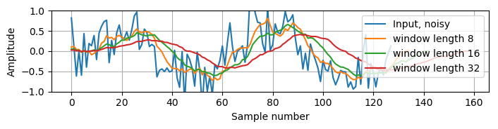
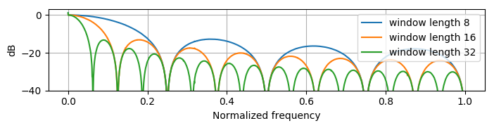
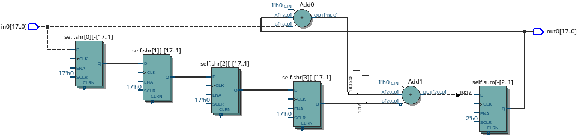
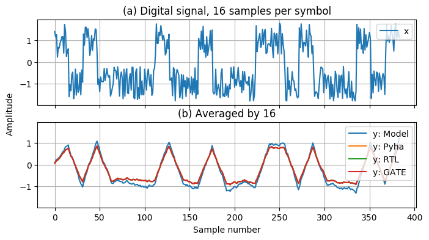
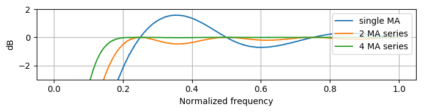
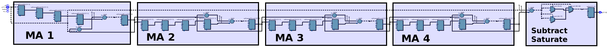
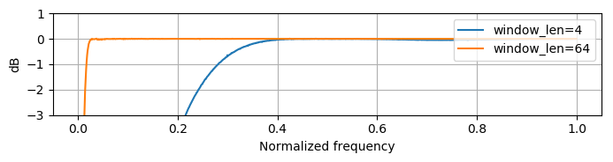

.. _4_examples:

Case studies
============

This chapter demonstrates that Pyha is already usable for real designs.
First designs an moving average filter and later reuses this for linear-phase DC removal filter.
Last chapter also compares the developed tool to other available toolsets.

.. todo:: fix

Pyha is based on the object-oriented design practices, this greatly simplifies the design reuse as the classes
can be used to initiate objects.
Another benefit is that classes can abstract away the implementation details, in that sense Pyha can become a
high-level synthesis (HLS) language.

Lastly we showed that Pyha is already usable to convert some mdeium complexity designs, like
    FSK demodulator, that was used on Phantom 2 stuff..

Moving average filter
---------------------

The moving average (MA) is the easiest digital filter to understand and use.
It is optimal filter for for reducing random noise while retaining a sharp step response :cite:`dspbook`. In
communication systems, MA is widely used as an matched filter for rectangular pulses.
:numref:`moving_average_noise` shows an example of applying MA filter to reduce noise on harmonic signal.
Higher window length (averaged over more elements) reduces more noise but also increases the complexity and delay of
the filter (MA is a special case of FIR filter :cite:`dspbook`).

.. _moving_average_noise:

    Moving average filter applied on noisy signal, coded in :numref:`mavg-pyha`

Good noise reduction performance can be explained by the frequency response of the MA filter (:numref:`mavg_freqz`),
showing that it is a low-pass filter. The passband width and stopband attenuation are controlled by the
window length.

.. _mavg_freqz:

    Frequency response of the moving average filter, illustrated in :numref:`moving_average_noise` and coded in :numref:`mavg-pyha`

MA filter is implemented by sliding sum, that is divided by the sliding window length. The division can be
carried out by a shift operation if divisor is a power of two.
In addition, division can be performed on each sample instead of on the sum, that is ``(a + b) / c = a/c + b/c``. This
guarantees that the ``sum`` is always in the [-1;1] range and no saturation logic is needed.

:numref:`mavg-pyha` shows the MA filter implementation in Pyha. It is based on the sliding sum, that was implemented
in :numref:`ch_fp_sliding_adder`. Minor modifications are commented in the code.

.. code-block:: python
    :caption: MA implementation in Pyha
    :name: mavg-pyha
    :linenos:

    class MovingAverage(HW):
        def __init__(self, window_len):
            # calculate power of 2 value of 'window_len', used for division
            self.window_pow = Const(int(np.log2(window_len)))

            # 'overflow_style' turns the saturation off
            self.sum = Sfix(0, 0, -17, overflow_style=fixed_wrap)
            self.shr = [Sfix()] * window_len
            self._delay = 1

        def main(self, x):
            # divide by shifting
            div = x >> self.window_pow

            self.next.shr = [div] + self.shr[:-1]
            self.next.sum = self.sum + div - self.shr[-1]
            return self.sum

:numref:`mavg_rtl` shows the synthesized result of this work; as expected it looks very similar to the
sliding sum RTL schematics. In general, shift operators are hard to notice on the RTL schematics because they are implemented
by routing semantics.

.. _mavg_rtl:

    RTL view of moving average (Intel Quartus RTL viewer)

:numref:`mavg_matched` shows simulation results of MA filter used for matched filtering.
The plot in (a) shows digital input signal that is corrupted by noise.
Plot (b) shows that the MA with a window length equal to the number of samples per symbol can recover (optimal result) the
signal from the noise. Next the signal could be sampled to recover bit values (0.5=1, -0.5=0).

.. _mavg_matched:

    Moving average as matched filter. (b) noisy input signal, (a) averaged by 16, Pyha simulations

Linear-phase DC removal Filter
------------------------------

This section demonstrates how the object-oriented nature of Pyha can be used for simple design reuse by chaining
multiple MA filters to implement linear-phase DC removal filter.

Direct conversion (homodyne or zero-IF) receivers have become very popular recently especially in the realm of
software defined radio. There are many benefits to direct conversion receivers,
but there are also some serious drawbacks, the largest being DC offset and IQ imbalances :cite:`bladerfdoc`.
DC offset looks like a peak near the 0 Hz on the frequency response. In time domain it manifests as a constant
component on the harmonic signal.

In :cite:`dcremoval_lyons`, Rick Lyons investigates the use of moving average algorithm as a DC removal
circuit. This works by subtracting the MA output from the input signal. The problem of this approach is the
3 dB passband ripple. However, by connecting multiple stages of MA's in series, the ripple can be avoided
(:numref:`dc_freqz`) :cite:`dcremoval_lyons`.

.. _dc_freqz:

    Frequency response of DC removal filter (MA window length is 8)

The algorithm is composed of two parts. First, four MA's are connected in series, outputting the DC component of the
signal. Second, the MA's output is subtracted from the input signal, thus giving the signal without
DC component. :numref:`dc_removal` shows the Pyha implementation.

.. code-block:: python
    :caption: DC-Removal implementation in Pyha
    :name: dc_removal

    class DCRemoval(HW):
        def __init__(self, window_len):
            self.mavg = [MovingAverage(window_len), MovingAverage(window_len),
                         MovingAverage(window_len), MovingAverage(window_len)]
            self.y = Sfix(0, 0, -17)

            self._delay = 1

        def main(self, x):
            # run input signal over all the MA's
            dc = x
            for mav in self.mavg:
                dc = mav.main(dc)

            # dc-free signal
            self.next.y = x - dc
            return self.y
        ...

This implementation is not exactly following that of :cite:`dcremoval_lyons`. They suggest to delay-match the
step 1 and 2 of the algorithm, but since the DC component is more more or less stable, this can be
omitted.

:numref:`dc_rtl_annotated` shows that the synthesis generated 4 MA filters that are connected in series,
output of this is subtracted from the input.

.. _dc_rtl_annotated:

    Synthesis result of ``DCRemoval(window_len=4)`` (Intel Quartus RTL viewer)

In a real application, one would want to use this component with a larger ``window_len``. Here 4 was chosen to keep
the synthesis result simple. For example, using ``window_len=64`` gives much better cutoff frequency (:numref:`dc_comp`);
FIR filter with the same performance would require hundreds of taps :cite:`dcremoval_lyons`.

.. _dc_comp:

    Comparison of frequency response

This implementation is also very light on the FPGA resource usage (:numref:`resource_usage`).

.. code-block:: text
    :caption: Cyclone IV FPGA resource usage for ``DCRemoval(window_len=64)``, (Intel Quartus synthesis report)
    :name: resource_usage

    Total logic elements                242 / 39,600 ( < 1 % )
    Total memory bits                   2,964 / 1,161,216 ( < 1 % )
    Embedded Multiplier 9-bit elements	0 / 232 ( 0 % )

:numref:`dc_sim` shows the simulation results for input signal with DC component of +0.5,
the output of the filter starts countering the DC component until it is removed.

.. _dc_sim:
.. figure:: ../examples/dc_removal/img/dc_sim.png
    :align: center
    :figclass: align-center

    Simulation of DC-removal filter in the time domain

Comparison to similar tools
---------------------------

.. warning:: this section very very in progress

At this point all the major features of Pyha has been introduced and it can be compared to similar tools.

Main feature of the developed tool is that it works on pure Python
Main advancements Pyha brings to the HDL table are:

    - Python domain
    - Fully sequential and object-oriented design
    - Strong fixed-point support and semi-automatic conversion
    - Simpler simulation functions
    - Design reuse
    - Simpler to use and understand

Traditional HDL languages like VHDL and SV work on large number of concurrent statements and processes,
connected trough signals. This is also known as event-based system, when some signal changes it may trigger the
execution of processes. The reasoning behind this model is of course that it models how hardware works. However,
the major downside is implementation and readability complexity.
The sequentially executed programming style, proposed in this thesis, is much more familiar and productive,
that also results in a same outcome. In addition, clearly writing in Python is simpler then in VHDL or SV.
In addition the simulations processes are greatly improved.

MyHDL is a hardware description language that also bases on Python, but works in the same event-driven way as
VHDL/SV. The convertible subset of MyHDL is limited to function based designs. Pyha supports object-oriented design method,
that much easier to understand and simplifies design reuse.
In general the synthesizable subset of MyHDL is very limited,
it has been found that the tool is more useful for high-level modeling purposes :cite:`jan_sim`. MyHDL also does not
implement fixed-point type support, thus it is not oriented on DSP designs.

.. Another package in the Python ecosystem is Migen, that replaces the event-driven paradigm with the notions of
    combinatorial and synchronous statements :cite:`migenweb`. Migen can be considered as meta-programming in Python so
    it is a bit complicated to use in practice by non-specialists.

.. matlab hind https://www.bdti.com/InsideDSP/2012/09/05/MathWorks

The MATLAB based DSP to HDL tools work on similar abstraction levels as Pyha i.e. sequential code but require user
input on the usage of registers. Pyha support object-oriented designs while MATLAB is function based like MyHDL.
In general working with registers and reusing the design is much simplified in Pyha.
The SIMULINK flow is based mostly on connecting together already existing blocks.
As shown in this chapter, Pyha blocks can be connected easy and in purely Pythonic way.
MATLAB also offers an floating-point to fixed point conversion tool (for additional 10000$ :cite:`matlab_price`).
Pyha matches this with semi-automatic conversion by supporting lazy vector bounds, the
conversion process is suitable for future implementation of fully automatic conversion.

The high level synthesis tools in general are C based that try to turn the behaviour model directly to the RTL level.
However, there have been many studies that suggest the productivity gain of these tools is lower or equivalent to
the HDL languages like MyHDL or Chisel :cite:`emp_hls` :cite:`felton_no_hls`. This is because more often the C
algorithm must be fitted to suite the hardware approach :cite:`2015arXiv150900036Q` :cite:`vivado_hls_case_study`.
However, the main reason why these tools are popular is that they enable software developers to enter the
hardware world more easily. This is also the case for Pyha, as it uses pure Python classes and functions,
only difference is how the class variables are used for registers.

.. bibliography:: bibliography.bib
    :style: unsrt