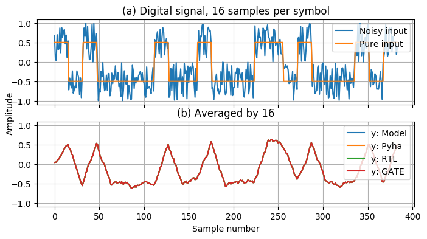

Case studies
============

Moving average filter
---------------------

.. todo:: rephrase as this is copy paste!

The moving average (MA) is the most common filter in DSP, mainly because it is the easiest digital
filter to understand and use.  In spite of its simplicity, the moving average filter is
optimal for a common task: reducing random noise while retaining a sharp step response.  This makes it the
premier filter for time domain encoded signals :cite:`dspbook`.

:numref:`moving_average_noise` shows that MA is a good algorithm for noise reduction.
Increasing the window length reduces more noise but also increases the complexity and delay of
the system (MA is a special case of FIR filter, same delay semantics apply).

.. _moving_average_noise:
.. figure:: ../examples/moving_average/img/moving_average_noise.png
    :align: center
    :figclass: align-center

    MA algorithm in removing noise

Good noise reduction performance can be explained by the frequency response of MA (:numref:`mavg_freqz`),
showing that it is a low-pass filter. Passband width and stopband attenuation are controlled by the
window length.

.. _mavg_freqz:

    Frequency response of MA filter

MA is implemented by using a sliding sum that is divided by the sliding window length.
The sliding sum part has already been implemented in :numref:`ch_fp_sliding_adder`.
The division can be implemented by a shift right operation, assuming that the divisor is power of two.

In addition, division can be performed on each sample instead of on the sum, that is ``(a + b) / c = a/c + b/c``.
Doing this guarantees that the ``sum`` variable is always in the [-1;1] range, thus the saturation logic can be removed.

.. code-block:: python
    :caption: MA implementation in Pyha
    :name: mavg-pyha
    :linenos:

    class MovingAverage(HW):
        def __init__(self, window_len):
            self.window_pow = Const(int(np.log2(window_len)))

            self.shr = [Sfix()] * window_len
            self.sum = Sfix(0, 0, -17, overflow_style=fixed_wrap)
            self._delay = 1

        def main(self, x):
            div = x >> self.window_pow

            self.next.shr = [div] + self.shr[:-1]
            self.next.sum = self.sum + div - self.shr[-1]
            return self.sum
        ...

The code in :numref:`mavg-pyha` makes only few changes to the sliding sum:

    * On line 3, ``self.window_pow`` stores the bit shift count (to support generic ``window_len``)
    * On line 6, type of ``sum`` is changed so that saturation is turned off
    * On line 10, shift operator performs the division

:numref:`mavg_rtl` shows the synthesized result of this work; as expected it looks very similar to the
sliding sum RTL schematics. In general, shift operators are hard to notice on the RTL schematics because they are implemented
by routing semantics.

.. _mavg_rtl:
.. figure:: ../examples/moving_average/img/mavg_rtl.png
    :align: center
    :figclass: align-center

    RTL view of moving average (Intel Quartus RTL viewer)

MA is an optimal solution for performing matched filtering of rectangular pulses :cite:`dspbook`.
This is important for communication systems. :numref:`mavg_matched` shows an example of
and digital signal, that is corrupted with noise. MA with window length equal to samples per symbol can recover the
signal from the noise.

.. _mavg_matched:

    Moving average as matched filter

The 'model' deviates from rest of the simulations because the input signal violates the [-1;1] bounds and hardware
simulations are forced to saturate the values.

Linear-phase DC removal Filter
------------------------------

Pyha has been designed in the way that it can represent RTL designs exactly as the user defines, however thanks
to the object-oriented nature all these low level details can be abstracted away and then Pyha turns into HLS
language. To increase productivity, abstraction is needed.

Pyha is based on the object-oriented design practices, this greatly simplifies the design reuse as the classes
can be used to initiate objects.
Another benefit is that classes can abstract away the implementation details, in that sense Pyha can become a
high-level synthesis (HLS) language.

This chapter gives an example on how to reuse the moving average filter for ...

Direct conversion (homodyne or zero-IF) receivers have become very popular recently especially in the realm of
software defined radio. There are many benefits to direct conversion receivers,
but there are also some serious drawbacks, the largest being DC offset and IQ imbalances :cite:`bladerfdoc`.

DC offset looks like a peak near the 0Hz on the frequency response.
In the time domain, it manifests as a constant component on the harmonic signal.

In :cite:`dcremoval_lyons`, Rick Lyons investigates the use of moving average algorithm as a DC removal
circuit. This works by subtracting the MA output from the input signal. The problem of this approach is the
3 dB passband ripple. However, by connecting multiple stages of MA's in series, the ripple can be avoided
(:numref:`dc_freqz`) :cite:`dcremoval_lyons`.

.. _dc_freqz:
.. figure:: ../examples/dc_removal/img/dc_freqz.png
    :align: center
    :figclass: align-center

    Frequency response of DC removal filter (MA window length is 8)

The algorithm is composed of two parts. First, four MA's are connected in series, outputting the DC component of the
signal. Second, the MA's output is subtracted from the input signal, thus giving the signal without
DC component. :numref:`dc_removal` shows the Pyha implementation.

.. code-block:: python
    :caption: DC-Removal implementation
    :name: dc_removal

    class DCRemoval(HW):
        def __init__(self, window_len):
            self.mavg = [MovingAverage(window_len), MovingAverage(window_len),
                         MovingAverage(window_len), MovingAverage(window_len)]
            self.y = Sfix(0, 0, -17)

            self._delay = 1

        def main(self, x):
            # run input signal over all the MA's
            tmp = x
            for mav in self.mavg:
                tmp = mav.main(tmp)

            # dc-free signal
            self.next.y = x - tmp
            return self.y
        ...

This implementation is not exactly following that of :cite:`dcremoval_lyons`. They suggest to delay-match the
step 1 and 2 of the algorithm, but since we can assume the DC component to be more or less stable, this can be
omitted.

:numref:`dc_rtl_annotated` shows that the synthesis generated 4 MA filters that are connected in series,
output of this is subtracted from the input.

.. _dc_rtl_annotated:
.. figure:: ../examples/dc_removal/img/dc_rtl_annotated.png
    :align: center
    :figclass: align-center

    Synthesis result of ``DCRemoval(window_len=4)`` (Intel Quartus RTL viewer)

In a real application, one would want to use this component with larger ``window_len``. Here 4 was chosen to keep
the RTL simple. For example, using ``window_len=64`` gives much better cutoff frequency (:numref:`dc_comp`);
FIR filter with the same performance would require hundreds of taps :cite:`dcremoval_lyons`. Another benefit is that
this filter delays the signal by only 1 sample.

.. _dc_comp:
.. figure:: ../examples/dc_removal/img/dc_comp.png
    :align: center
    :figclass: align-center

    Comparison of frequency response

This implementation is also very light on the FPGA resource usage (:numref:`resource_usage`).

.. code-block:: text
    :caption: Cyclone IV FPGA resource usage for ``DCRemoval(window_len=64)``
    :name: resource_usage

    Total logic elements                242 / 39,600 ( < 1 % )
    Total memory bits                   2,964 / 1,161,216 ( < 1 % )
    Embedded Multiplier 9-bit elements	0 / 232 ( 0 % )

:numref:`dc_sim` shows the situation where the input signal is corrupted with a DC component (+0.25),
the output of the filter starts countering the DC component until it is removed.

.. _dc_sim:
.. figure:: ../examples/dc_removal/img/dc_sim.png
    :align: center
    :figclass: align-center

    Simulation of DC-removal filter in the time domain

Comparison to other tools
-------------------------

MyHDL is following the event-driven approach which is a trait of the classical HDL's. It features an function based
design that is very similar to Verilog processes. In general the synthesizable subset of MyHDL is very limited,
it has been found that the tool is more useful for high-level modeling purposes :cite:`jan_sim`.
Another package in the Python ecosystem is Migen, that replaces the event-driven paradigm with the notions of
combinatorial and synchronous statements :cite:`migenweb`. Migen can be considered as meta-programming in Python so
it is a bit complicated. Both Migen and MyHDL are more aimed at the control logic, neither implements the fixed-point
data type, that is a standard for hardware DSP designs.

Pyha aims to raise the abstraction level by using sequential object-oriented style, major advantage of this
is that existing blocks can be connected together in purely Pythonic way, the
designer needs to know nothing about the underlying RTL implementation.

.. bibliography:: bibliography.bib
    :style: unsrt