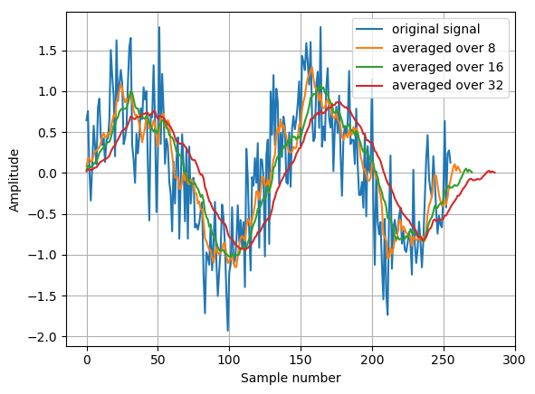
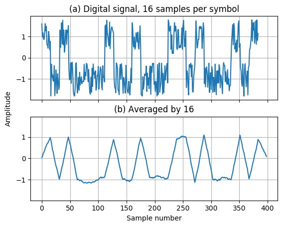
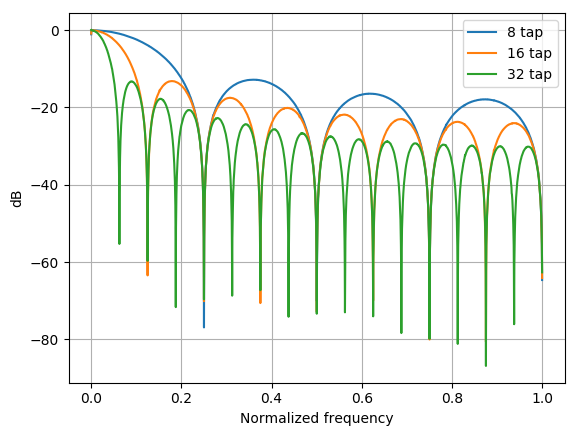

Design examples
===============
This chapter provides some example designs implemented using the experimental compiler.

First example developes and moving-average filter.

First three examples will interatively implement
DC-removal system. First design implements an simple fixed-point accumulator. Second one builds upon this and implements
moving average filter. Lastly multiple moving average filters are chained to form a DC removal circuit.

Second example is an FIR filter, with reloadable switchable taps ?

Third design example shows how to chain togather already exsisting Pyha blocks to implement greater systems.
In this case it is FSK receiver. This examples does not go into details.

Moving Average
--------------

The moving average is the most common filter in DSP, mainly because it is the easiest digital
filter to understand and use.  In spite of its simplicity, the moving average filter is
optimal for a common task: reducing random noise while retaining a sharp step response.  This makes it the
premier filter for time domain encoded signals.  However, the moving average is the worst filter
for frequency domain encoded signals, with little ability to separate one band of frequencies from
another.  Relatives of the moving average filter include the Gaussian, Blackman, and multiple-
pass moving average.  These have slightly better performance in the frequency domain, at the
expense of increased computation time. :cite:`dspbook`

Consider following data:

>>> l = [0.1, 0.2, 0.3, 0.4, 0.5, 0.6]
>>> out[0] = (l[0] + l[1]) / 2
>>> out[1] = (l[1] + l[2]) / 2
>>> out[2] = (l[2] + l[3]) / 2

Somehow explain how this stuff is equal to convolution.

.. code-block:: python
    :caption: Implementation of moving average algorithm in Python
    :name: pymavg

    avg_len = 4
    taps = [1 / avg_len] * avg_len
    ret = np.convolve(inputs, taps, mode='full')

:numref:`pymavg` shows how to implement moving average algorithm in Python, it uses the
fact that it is basically convolution...bla bla bla.

.. _mavg_noise_reduction:

    Example of moving averager as noise reduction

As shown on :numref:`mavg_noise_reduction`, moving average is a good noise reduction algorithm.
Increasing the averaging window reduces more noise but also increases the complexity and delay of
the system.

.. _mavg_matched:

    Moving average as matched filter

In addition, moving average is also an optimal solution for performing matched filtering of
rectangular pulses :cite:`dspbook`.  On :numref:`mavg_matched` (a) digital signal is corrupted
with noise, by using moving average with length equal to the signal samples per symbol, enables to
recover the signal and send it to sampler (b).

.. _mavg_freqz:

    Frequency response of moving average filter

:numref:`mavg_freqz` shows that the moving average algorithm acts basically as a low-pass
filter in the frequency domain. Passband width and stopband attenuation are controlled by the
moving averages length. Note that when taps number get high, then moving average basically returns
the DC offset of a signal.

In  short,  the  moving  average  is  an exceptionally  good smoothing  filter
(the  action  in  the  time  domain),  but  an exceptionally bad low-pass filter
(the action in the frequency domain). :cite:`dspbook`

Implementing the model
~~~~~~~~~~~~~~~~~~~~~~

As shown in the previous chapter, in Pyha, model can be one part of the class definition.
This helps to keep stuff synced.

.. code-block:: python
    :caption: Moving average model and tests
    :name: mavg_model

    class MovingAverage(HW):
        def __init__(self, window_len):
            self.window_len = window_len

        def model_main(self, inputs):
            taps = [1 / self.window_len] * self.window_len
            ret = np.convolve(inputs, taps, mode='full')
            return ret[:-self.window_len + 1]

    def test_basic():
        mov = MovingAverage(window_len=4)
        x = [-0.2, 0.05, 1.0, -0.9571, 0.0987]
        expected = [-0.05, -0.0375, 0.2125, -0.026775, 0.0479]
        assert_sim_match(mov, expected, x, simulations=[SIM_MODEL])

    def test_max():
        mov = MovingAverage(window_len=4)
        x = [1., 1., 1., 1., 1., 1.]
        expected = [0.25, 0.5, 0.75, 1., 1., 1.]
        assert_sim_match(mov, expected, x, simulations=[SIM_MODEL])

:numref:`mavg_model` defines an :code:`MovingAverage` class which includes the special
:code:`model_main` function, dedicated for defining model code. In addtion it defines 2 simple
tests, in general there should be more tests defined but here we keep things minimal.

:code:`test_max` tests the model for maximum valued inputs, assuming that we are working with
numbers that are normalized to [-1, 1] range. :code:`test_basic` uses just some random data and
expected output.

Implementing for hardware
~~~~~~~~~~~~~~~~~~~~~~~~~
Hardware implementation of moving average could be to implement a convolution, but this takes
alot of resources and frankly is an overkill.

A  tremendous  advantage  of  the  moving  average  filter  is  that  it  can  be
implemented  with  an  algorithm  that  is  very  fast.    To  understand  this
algorithm, imagine passing an input signal,
, through a seven point moving x[] average  filter  to  form  an  output  signal,
. Now  look  at  how  two  adjacent y[] output points, and , are calculated:

>>> y[4] = x[1] + x[2] + x[3] + x[4]
>>> y[5] = x[2] + x[3] + x[4] + x[5]
>>> y[6] = x[3] + x[4] + x[5] + x[6]

These  are  nearly  the  same  calculation. If :code:`y[4]` has already been calculated, the
most efficient way to calculate :code:`y[5]` is:

>>> y[5] = y[5] + x[5] + x[1]
:cite:`dspbook`

.. code-block:: python
    :caption: Moving average hw model
    :name: mavg_hw_model

    # THIS CODE IS SHIT
    class MovingAverage(HW):
        def __init__(self, window_len):
            self.window_pow = int(np.log2(window_len))

            # registers
            self.shift_register = [Sfix()] * self.window_len
            self.sum = Sfix(left=self.window_pow, overflow_style=fixed_wrap, round_style=fixed_truncate)

            # module delay
            self._delay = 1

        def main(self, x):
            # add new element to shift register
            self.next.shift_register = [x] + self.shift_register[:-1]

            # calculate new sum
            self.next.sum = self.sum + x - self.shift_register[-1]

            # divide sum by amount of window_len, and resize to same format as input 'x'
            ret = resize(self.sum >> self.window_pow, size_res=x)
            return ret

        def model_main(self, inputs):
            ...

In order to implement this in hardware we must define some registers. First we need to
keep track of last :code:`window_len` inputs, for that the standard way is to write a shift
register. Shift register is basically just an fixed size array that on each clock tick takes in
a new values and shifts out the oldest value (to make space for the new one).

Secondary we need to keep track of the sum. Since this is an accumulator, we need to provide a
large enough integer side to avoid overflows. As we know the :code:`window_len` and that the
input numbers are normalized we can calculate that the maximum value this sum can take is infact equal
to :code:`window_len`. Then we use the bit counts as left value to avoid overflows in the core.

Also due to the registers in the signal path we have to specify it, by using :code:`self._delay`
. Since we added two registers we set this to value 2.

Testing the newly written code is very simple, we just have to add required simulation flags
to the already written unit tests.

Conversion and RTL simulations
^^^^^^^^^^^^^^^^^^^^^^^^^^^^^^

Conversion is done as a part of running the unit-test with :code:`SIM_RTL` mode.

GATE level simulation
^^^^^^^^^^^^^^^^^^^^^

As written in some chapter, Pyha supports also rupports running GATE-level simulations
by integrating with Intel Quartus software

Running the GATE simulation, will produce ‘quartus’ directory in dir_path. One useful tool in Quartus software is RTL viewer, it can be opened from Tools-Netlist viewers-RTL viewer.

RTL of this tutorial:

Linear phase DC Removal
-----------------------
.. todo:: What is DC and why to remove it?

FIR filter
----------
Maybe skip this one?

FSK receiver
------------
Glue blocks togather...needs explanation...

`Pyhacores <https://github.com/petspats/pyhacores>`__ is a repository collecting cores implemented in Pyha,
for example it includes CORDIC, FSK modulator and FSK demodulator cores.

