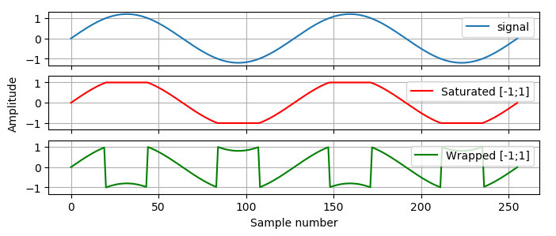

.. _ch_app_fixed:

Fixed-point type implementation details
---------------------------------------

This appendix provides more information about the fixed-point and complex fixed-point types. Basics have been covered in :numref:`ch_fixed`. The ``Sfix`` type was built in such a way that all the functions map to the VHDL library :cite:`vhdlfixed`, so that the conversion process is simple. This has also allowed to verify the implementation against a known working solution.

.. Overflows and Saturation
.. ~~~~~~~~~~~~~~~~~~~~~~~~

Practical fixed-point variables can store only a part of what floating-point value could. Converting a design from floating-point to fixed-point, opens up a possibility of overflows i.e. the value grows bigger or smaller than the format can represent. By default Pyha uses fixed-point numbers that have saturation enabled, meaning that the fixed-point bounds are forced when value goes out of bounds. :numref:`fixed_saturation` shows some examples of the saturation process.

.. code-block:: python
    :caption: Example of saturation, note that Pyha emits ``warning`` when the saturation happens
    :name: fixed_saturation

    >>> Sfix(2.5, left=0, right=-17)
    WARNING:pyha.common.sfix:Saturation 2.5 -> 0.9999923706054688
    0.9999923706054688 [0:-17]

    >>> Sfix(2.5, left=1, right=-17)
    WARNING:pyha.common.sfix:Saturation 2.5 -> 1.9999923706054688
    1.9999923706054688 [1:-17]

    >>> Sfix(2.5, left=2, right=-17)
    2.5 [2:-17]

For some designs the wrap-around behaviour of fixed-point variables could be a feature, for example an
free running counter, that wraps to 0 when maximum value is reached.
For these cases, saturation can be disabled as shown on :numref:`fixed_wrap`.

.. code-block:: python
    :caption: Saturation disabled, values wrap around
    :name: fixed_wrap

    >>> Sfix(0.9, left=0, right=-17, overflow_style=fixed_wrap)
    0.9000015258789062 [0:-17]

    >>> Sfix(0.9 + 0.1, left=0, right=-17, overflow_style=fixed_wrap)
    -1.0 [0:-17]

:numref:`fix_sat_wrap` shows an comparison of the overflow modes. The input is an sine wave that exceeds the fixed-point bounds. In general the saturation logic can minimize the damage.

.. _fix_sat_wrap:

    Comparison of overflow modes.

.. Rounding
.. ~~~~~~~~

.. Pyha support rounding on arithmetic, basically it should be turned off as it costs alot.
.. For low level FPGAs.

.. ref https://www.embeddedrelated.com/showarticle/1015.php

.. Fixed-point arithmetic and sizing rules
.. ~~~~~~~~~~~~~~~~~~~~~~~~~~~~~~~~~~~~~~~

Arithmetic operations on fixed-point variables work as usual with an exception of division, that is not defined as it is almost always unnecessary in hardware. The philosophy of fixed point library is to guarantee no precision loss happens during arithmetic operations, in order
to do this it has to extend the output format. It is designers job to resize numbers back into optimal format after
operations.

:numref:`fixed_add` shows an example, where two numbers of range [-1, 1] are added. Library avoids the overflow condition by adding one  bit to the integer side, thus guaranteeing that overflows are impossible.

.. code-block:: python
    :caption: Arithmetic rules of fixed-point numbers
    :name: fixed_add

    >>> Sfix(0.9, 0, -17)
    0.9000015258789062 [0:-17]

    >>> Sfix(0.9, 0, -17) + Sfix(0.9, 0, -17)
    1.8000030517578125 [1:-17]

.. Resizing
..  ~~~~~~~~

Fixed-point number can be forced to whatever size by using the resize functionality, :numref:`fixed_resize` gives an example of this.

.. code-block:: python
    :caption: Arithmetic rules of fixed-point numbers
    :name: fixed_resize

    >>> a = Sfix(0.89, left=0, right=-17)
    >>> a
    0.8899993896484375 [0:-17]

    >>> b = resize(a, 0, -6)
    >>> b
    0.890625 [0:-6]

    >>> c = resize(a, size_res=b)
    >>> c
    0.890625 [0:-6]

Pyha support automatic resizing for registers i.e. all assignments to the ``self`` will be automatically resized to the
original type of the initial definition in the ``__init__`` function.

.. Complex fixed-point
.. -------------------

Objective of this work was to simplify model based design and verification of DSP to FPGA models.
One frequent problem with DSP models was that they require the use of complex numbers.
In order to unify the interface of the model and hardware model, Pyha supports complex numbers for interfacing means,
arithmetic operations are not defined. That means complex values can be passed around and registered but calculations must be done on :code:`.real` and :code:`.imag` elements, that are just Sfix objects. Example of complex fixed-point support is shown on :numref:`complex_sfix`.

.. code-block:: python
    :caption: Complex fixed-point type
    :name: complex_sfix

    >>> a = ComplexSfix(0.45 + 0.88j, left=0, right=-17)
    >>> a
    0.45+0.88j [0:-17]

    >>> a.real
    0.4499969482421875 [0:-17]

    >>> a.imag
    0.8799972534179688 [0:-17]

    >>> a = Sfix(-0.5, 0, -17)
    >>> b = Sfix(0.5, 0, -17)
    >>> ComplexSfix(a, b)
    -0.50+0.50j [0:-17]
