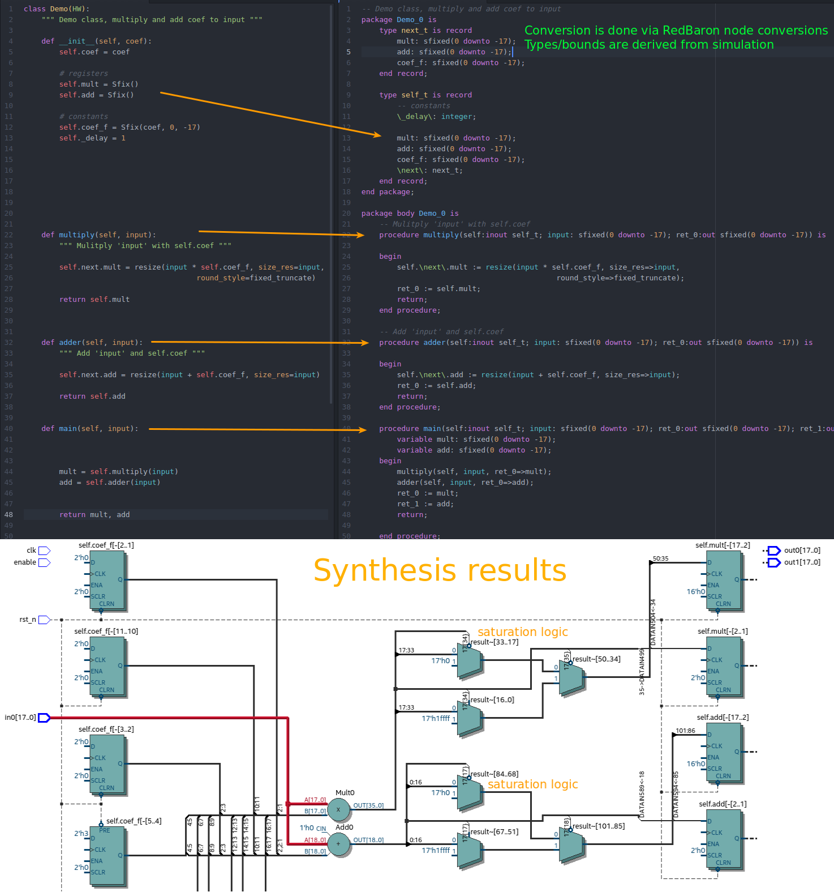

============
Introduction
============

Essentially this is a Python to VHDL converter, with a specific focus on implementing DSP systems.

Main features:

    - Simulate in Python. Integration to run RTL and GATE simulations.
    - Structured, all-sequential and object oriented designs
    - Fixed point type support(maps to `VHDL fixed point library`_)
    - Decent quality VHDL output (get what you write, keeps hierarchy)
    - Integration to Intel Quartus (run GATE level simulations)
    - Tools to simplify verification

Long term goal is to implement more DSP blocks, especially by using GNURadio blocks as models.
In future it may be possible to turn GNURadio flow-graphs into FPGA designs, assuming we have matching FPGA blocks available.

.. _VHDL fixed point library: https://github.com/FPHDL/fphdl

Working principle
-----------------
.. _label:

    Caption

As shown on :numref:`label`, Python sources are turned into synthesizable VHDL code.
In :code:`__init__`, any valid Python code can be used, all the variables are collected as registers.
Objects of other classes (derived from HW) can be used as registers, even lists of objects is possible.

In addition, there are tools to help verification by automating RTL and GATE simulations.

.. code-block:: python
   :caption: this.py
   :name: this-py

   print('Explicit is better than implicit.')

See on :numref:`this-py` shows print statement

Limitations/future work
-----------------------

Currently designs are limited to one clock signal, decimators are possible by using Streaming interface.
Future plans is to add support for multirate signal processing, this would involve automatic PLL configuration.
I am thinking about integration with Qsys to handle all the nasty clocking stuff.

Synthesizability has been tested on Intel Quartus software and on Cyclone IV device (one on BladeRF and LimeSDR).
I assume it will work on other Intel FPGAs as well, no guarantees.

Fixed point conversion must be done by hand, however Pyha can keep track of all class and local variables during
the simulations, so automatic conversion is very much possible in the future.

Integration to bus structures is another item in the wish-list. Streaming blocks already exist in very basic form.
Ideally AvalonMM like buses should be supported, with automatic HAL generation, that would allow design of reconfigurable FIR filters for example.

Objective/goal
--------------
Provide simpler way of turning DSP blocks to FPGA.
Reduce the gap between regular programming and hardware design.
Turn GNURadio flowgraphs to FPGA?
Model based verification!
Why do it?
opensource

Scope
-----
Focus on LimeSDR board and GnuRadio Pothos, frameworks.

Structure
---------
First chapter of this thesis gives an short background about

