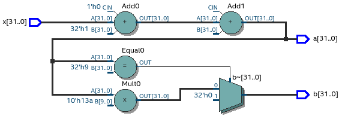

Hardware design with Pyha
=========================

This chapter introduces the main contribution of this thesis, Pyha - a tool to design digital hardware in Python.

Pyha proposes to program hardware in the same way as software; much of this chapter is focused on showing
differences between hardware and software constructs.

The fist half of the chapter demonstrates how basic hardware constructs can be defined, using Pyha.

The second half introduce the fixed-point type and provides use-cases on designing with Pyha.

All the examples presented in this chapter can be found online HERE, including all the Python sources, unit-tests,
VHDL conversion files and Quartus project for synthesis.

.. todo:: organise examples to web and put link

Introduction
------------

While the conventional HDL languages promote concurrent and entity oriented model, this is more confusing.
In this thesis, Pyha has been designed as an sequential object-oriented language, that works directly on
Python code. Using an sequential design flow is much easier to understand and is equally well synthesizable as shown
by this thesis. Object-oriented design helps to better abstract the RTL details and ease design reuse.

For illustration purposes, :numref:`pyha_basic` shows an example Pyha design. The ``main`` function has been
chosen as a top level entry point, other functions can be used as pleased.

.. note:: First few examples of this chapter use ``integer`` types in order to reduce complexity.

.. code-block:: python
    :caption: Simple combinatory design, implemented in Pyha
    :name: pyha_basic

    class Basic(HW):
        def main(self, x):
            a = x + 1 + 3
            b = a * 314

            if a == 9:
                b = 0

            return a, b

One of the contributions of this thesis is sequential OOP VHDL model, that is used by Pyha for simple conversion
to VHDL. Example of the VHDL conversion is shown on :numref:`pyha_basic_vhdl`, more details are given in chapter
:numref:`ch_conversion`.

.. code-block:: vhdl
    :caption: :numref:`pyha_basic` converted to VHDL, by Pyha
    :name: pyha_basic_vhdl

    procedure main(self:inout self_t; x: integer; ret_0:out integer; ret_1:out integer) is
        variable a: integer;
        variable b: integer;
    begin
        a := x + 1 + 3;
        b := a * 314;

        if a = 9 then
            b := 0;
        end if;

        ret_0 := a;
        ret_1 := b;
    end procedure;

:numref:`basic_rtl` shows the synthesis result. The ``a`` output is formed by adding '1' and '3' to the ``x`` input. Next
the ``a`` signal is compared to ``9``, if equal ``b`` is outputted as 0, otherwise ``b = a * 314``. That
exactly complies with the Python and VHDL descriptions.

.. _basic_rtl:

    Synthesised RTL of :numref:`pyha_basic_vhdl` (Intel Quartus RTL viewer)

One aspect of hardware design that Pyha aims to improve is testing. Conventional tools like VHDL require the
construction of special testbenches that can be executed on simulators. Even the higer level tools often dont
simplify this step, for example the C based tools HLS tools want testbench in C language, which is not an
improvement from VHDL or Verilog.

First of all, Pyha has been designed so that the synthesis output is behaviourally equivalent to the Python run
output, this means that Pyha designs can use all the Python debugging tools.
:numref:`add_multi_debug` shows a debugging session on the :numref:`pyha_basic` code, this can drastically help
the development process.

.. _py_debug:
.. figure:: ../examples/basic/img/debug.png
    :align: center
    :figclass: align-center

    Debugging using PyCharm (Python editor)

Furthermore, unit testing is accelerated by providing ``simulate(dut, x)`` function, that runs the following
simulations without any boilerplate code:

    - Model: this can be any Python code that fits as an high level model;
    - Pyha: like :numref:`pyha_basic`, Python domain simulation;
    - RTL: converts the Pyha model to VHDL and uses the combinition of GHDL and Cocotb for simulation;
    - GATE: synthesises the VHDL code, using Intel Quartus, and simulates the resulting gate-level netlist.

This kind of testing function enables test-driven development, where tests can be first defined for the model and
fully reused for later RTL implementation.
:numref:`pyha_adder_test` shows an example unit test for the ``Basic()`` module.

.. code-block:: python
    :caption: Unit test for the Basic module
    :name: pyha_basic_test

    x = [1, 2, 3, 4, 5, 6, 7, 8]
    dut = Basic()
    y = simulation(dut, x)
    # assert something

Designs with registers
----------------------

In hardware registers are used as an memory element and for pipelining. In general digital logic synthesis relies on
timing synthesis that only works when analized logic is between registers.

The way how registers are inferred is a fundamental difference between the RTL and HLS languages. Main complexity of
HLS is about automatically inferring registers for memory elements or for pipelining. RTL languages on the other hand
leave the task up to the designer.
In this work, Pyha has been designed to follow the RTL language approach, because this comes free with conversion
to VHDL. In future extensions can be considered.

In conventional programming, most commonly state is captured by using the class variables, which can keep the
values between function calls. Inspired from this, all the class variables in Pyha are handled as registers, class
functions can be interpreted as combinatory functions calculating the next state values for the registers.

Accumulator
~~~~~~~~~~~

Consider the design of an accumulator (:numref:`acc`); it operates by sequentially adding up all the input values.

.. code-block:: python
    :caption: Accumulator implemented in Pyha
    :name: acc
    :linenos:

    class Acc(HW):
        def __init__(self):
            self.acc = 0

        def main(self, x):
            self.next.acc = self.acc + x
            return self.acc

The class structure in Pyha has been designed so that the ``__init__`` function shall define all
the memory elements in the design, the function itself is not converted to VHDL, only the variables are extracted.
For example
``__init__`` function could be used to call ``scipy.signal.firwin()`` to design FIR filter coefficients, initial
assignments to class variables are used as register initial/reset values.

Note the ``self.next.acc = ...``, simulates the hardware behaviour of registers, that is delayed assignment.
In general this is equivalent to the VHDL ``<=`` operator. Values are transfered from **next** to **current** just
before the ``main`` call. In general Pyha abstracts the clock signal away by denoting that each call to ``main`` is
a clock edge. Think that the ``main`` function is started with the **current** register values known and the objective of
the ``main`` function is to find the **next** values for the registers.

The synthesis results shown in the :numref:`acc_rtl` shows the adder and register.

.. _acc_rtl:
.. figure:: ../examples/accumulator/img/acc_rtl.png
    :align: center
    :figclass: align-center

    Synthesis result of :numref:`acc` (Intel Quartus RTL viewer)

One inconvenience is that every register on signal path delays the output signal by 1 sample, this is also called
pipeline delay or latency. This situation is shown on :numref:`acc_sim_delay` that shows the simulation results for the
``Acc`` module. Note that the model is implemented without register semantics, thus has no pipeline delays. This can
be seen from the :numref:`acc_sim_delay`, hardware related simulations are delayed by 1 compared to the software model.

.. _acc_sim_delay:
.. figure:: ../examples/accumulator/img/acc_sim_delay.png
    :align: center
    :figclass: align-center

    Simulation of the ``Acc`` module, input is a random integer [-5;5]

Pyha reserves a :code:`self._delay` variable, that hardware classes can use to specify their delay.
Simulation functions read this variable and compensate the simulation data so that the delay is compensated, so that
the compensation does not have to be made in unit-tests. Setting the ``self._delay = 1` in the ``__init__`` function
would shift the hardware simulations left by 1 sample, so that all the simulatiosn would be exactly equal.

.. _ch_sliding_adder:

Block processing and sliding adder
~~~~~~~~~~~~~~~~~~~~~~~~~~~~~~~~~~

One very common task in DSP designs is to calculate results based on some number of input samples (block processing).
Until now, the ``main`` function has worked with a single input sample,
this can now be changed by keeping the history with registers.

Consider an algorithm that adds the last 4 input values. :numref:`block_adder` shows an implementation that keeps
track of the last 4 input values and sums them. Note that
the design also uses the output register ``y``.

.. code-block:: python
    :caption: Sliding adder algorithm
    :name: block_adder

    class SlidingAdder(HW):
        def __init__(self):
            self.shr = [0, 0, 0, 0] # list of registers
            self.y = 0

        def main(self, x):
            # add new 'x' to list, throw away last element
            self.next.shr = [x] + self.shr[:-1]

            # add all element in the list
            sum = 0
            for a in self.shr:
                sum = sum + a

            self.next.y = sum
            return self.y

The ``self.next.shr = [x] + self.shr[:-1]`` line is also known as a 'shift register', because on every call it
shifts the list contents to the right and adds new ``x`` as the first element. Sometimes the same structure is used as a
delay-chain, because the sample ``x`` takes 4 updates to travel from ``shr[0]`` to ``shr[3]``.
This is a very common element in hardware DSP designs.

:numref:`block_adder_rtl` shows the RTL for this design, as expected the ``for`` has been unrolled, thus all the
summing is done.

.. _block_adder_rtl:
.. figure:: ../examples/block_adder/img/rtl.png
    :align: center
    :figclass: align-center

    Synthesis result of :numref:`block_adder` (Intel Quartus RTL viewer)

Optimizing the design
^^^^^^^^^^^^^^^^^^^^^

This design can be made generic by changing the ``__init__`` function to take the window length as a parameter
(:numref:`block_adder_generic`).

.. code-block:: python
    :caption: Generic sliding adder
    :name: block_adder_generic

    class SlidingAdder(HW):
        def __init__(self, window_len):
            self.shr = [0] * window_len
        ...

The problem with this design is that it starts using more resources as the ``window_len`` gets larger as every
stage requires a separate adder. Another problem is that the critical path gets longer, decreasing the
clock rate. For example, the design with ``window_len=4`` synthesises to maximum clock of
170 MHz, while ``window_len=6`` to only 120 MHz.

.. todo:: MHz on what FPGA?

.. _rtl_6_critical:
.. figure:: ../examples/block_adder/img/rtl_6_critical.png
    :align: center
    :figclass: align-center

    RTL of ``window_len=6``, the red line shows the critical path (Intel Quartus RTL viewer)

In that sense, it can be considered a poor design, as it is hard to reuse.
Conveniently, the algorithm can be optimized to use only 2 adders, no matter the window length.
:numref:`slider_optim` shows that instead of summing all the elements, the overlapping part of
the previous calculation can be used to significantly optimize the algorithm.

.. code-block:: python
    :caption: Optimizing the sliding adder algorithm by using recursive implementation
    :name: slider_optim

    y[4] = x[4] + x[5] + x[6] + x[7] + x[8] + x[9]
    y[5] =        x[5] + x[6] + x[7] + x[8] + x[9] + x[10]
    y[6] =               x[6] + x[7] + x[8] + x[9] + x[10] + x[11]

    # reusing overlapping parts implementation
    y[5] = y[4] + x[10] - x[4]
    y[6] = y[5] + x[11] - x[5]

:numref:`optimal_adder` gives the implementation of the optimal sliding adder; it features a new register ``sum`,
that keeps
track of the previous output. Note that the ``shr`` stayed the same, but is now rather used as a delay-chain.

.. code-block:: python
    :caption: Optimal sliding adder
    :name: optimal_adder

    class OptimalSlideAdd(HW):
        def __init__(self, window_len):
            self.shr = [0] * window_len
            self.sum = 0

            self._delay = 1

        def main(self, x):
            self.next.shr = [x] + self.shr[:-1]

            self.next.sum = self.sum + x - self.shr[-1]
            return self.sum
        ...

:numref:`rtl_optimal_int_critical` shows the synthesis result; as expected, the critical path is along 2 adders.

.. _rtl_optimal_int_critical:
.. figure:: ../examples/block_adder/img/rtl_optimal_int_critical.png
    :align: center
    :figclass: align-center

    Synthesis result of :numref:`block_adder`, ``window_len=4`` (Intel Quartus RTL viewer)

Simulations results (:numref:`block_adder_sim`) show that the hardware desing behaves exactly as the software model.
Note that the class has ``self._delay=1`` to compensate for the register delay.

.. _block_adder_sim:
.. figure:: ../examples/block_adder/img/sim.png
    :align: center
    :figclass: align-center

    Simulation results for ``OptimalSlideAdd(window_len=4)``

Fixed-point designs
-------------------

Examples in the previous chapters have used only the ``integer`` type, in order to simplify the designs.

.. todo:: explain why float costs greatly?

DSP algorithms are mostly described using floating point numbers. As shown in previous sections, every operation
in hardware takes resources and floating point calculations cost greatly. For that reason, fixed-point arithmetic
is often used in hardware designs.

Fixed-point arithmetic is in nature equal to integer arithmetic and thus can use the DSP blocks that
come with many FPGAs (some high-end FPGAs have also floating point DSP blocks :cite:`arria_dsp`).

Basics
~~~~~~

Pyha defines ``Sfix`` for FP objects; it is a signed number.
It works by defining bits designated for ``left`` and ``right``
of the decimal point. For example ``Sfix(0.3424, left=0, right=-17)`` has 0 bits for integer part
and 17 bits for the fractional part. :numref:`fp_basics` shows some examples.
more information about the fixed point
type is given on APPENDIX.

.. todo:: Add more information about fixed point stuff to the appendix

.. code-block:: python
    :caption: Example of ``Sfix`` type, more bits give better results
    :name: fp_basics

    >>> Sfix(0.3424, left=0, right=-17)
    0.34239959716796875 [0:-17]
    >>> Sfix(0.3424, left=0, right=-7)
    0.34375 [0:-7]
    >>> Sfix(0.3424, left=0, right=-4)
    0.3125 [0:-4]

The default FP type in Pyha is ``Sfix(left=0, right=-17)``, it represents numbers between [-1;1] with
resolution of 0.000007629 (``2**-17``). This format is chosen because it fits into common FPGA DPS blocks
(18 bit signals :cite:`cycloneiv`)
and it can represent normalized numbers.

The general recommendation is to keep all the inputs and outputs of the block in the default type.

.. _ch_fp_sliding_adder:

Fixed-point sliding adder
~~~~~~~~~~~~~~~~~~~~~~~~~

Consider converting the sliding window adder, described in :numref:`ch_sliding_adder`, to FP implementation. This
requires changes only in the ``__init__`` function (:numref:`fp_sliding_adder`).

.. code-block:: python
    :caption: Fixed-point sliding adder
    :name: fp_sliding_adder

    def __init__(self, window_size):
        self.shr = [Sfix()] * window_size
        self.sum = Sfix(left=0)
    ...

The first line sets ``self.shr`` to store ``Sfix()`` elements. Notice that it does not define the
fixed-point bounds, meaning it will store 'whatever' is assigned to it. The final bounds are determined during simulation.

.. todo:: lazy stuff needs more explanation

The ``self.sum`` register uses another lazy statement of ``Sfix(left=0)``, meaning that the integer bits
are forced to 0 bits on every assign to this register. The fractional part is left determined by simulation.
The rest of the code is identical to the one described in :numref:`ch_sliding_adder`.

Synthesis results are shown in :numref:`rtl_sfix_saturate`. In general, the RTL diagram looks similar to the one at
:numref:`ch_sliding_adder`. First noticeable change is that the signals are now 18 bits wide due to the
default FP type. The second addition is the saturation logic, which prevents the wraparound behaviour by
forcing the maximum or negative value when they are out of fixed point format. Saturation logic is by default enabled for
FP types.

.. _rtl_sfix_saturate:
.. figure:: ../examples/block_adder/img/rtl_sfix_saturate.png
    :align: center
    :figclass: align-center

    RTL of fixed-point sliding adder (Intel Quartus RTL viewer)

:numref:`fix_sat_wrap` plots the simulation results for input of random signal in [-0.5;0.5] range.
Notice that the hardware simulations are bounded to [-1;1] range by the saturation logic, that is why the model
simulation is different at some points.

.. _fix_sat_wrap:
.. figure:: ../examples/block_adder/img/sim_fix.png
    :align: center
    :figclass: align-center

    Simulation results of FP sliding sum

Simulation functions can automatically convert 'floating-point' inputs to default FP type. In same manner,
FP outputs are converted to floating point numbers. That way, the designer does not have to deal with FP numbers
in unit-testing code. An example is given in :numref:`fp_test`.

.. code-block:: python
    :caption: Test fixed-point design with floating-point numbers
    :name: fp_test

    dut = OptimalSlidingAddFix(window_len=4)
    x = np.random.uniform(-0.5, 0.5, 64)
    y = simulate(dut, x)
    # plotting code ...

Summary
-------

This chapter has demonstrated that in Pyha traditional software language features can be used
to infer hardware components and their outputs are equivalent.
One must still keep in mind how the code converts to hardware, for example that the loops will be unrolled.
A major difference between hardware and software is that in hardware, every arithmetical operator takes up resources.

Class variables can be used to add memory to the design. In Pyha, class variables must be assigned to
``self.next`` as this mimics the **delayed** nature of registers. The general rule is to always register the outputs of
Pyha designs.

DSP systems can be implemented by using the fixed-point type. Pyha has ‘semi-automatic conversion’ from
floating point to fixed point numbers. Verifying against floating point model helps the design process.

Reusing Pyha designs is easy thanks to the object-oriented style that also works well for design abstraction.

Pyha provides the ``simulate`` function that can automatically run Model, Pyha, RTL and GATE level simulations. In
addition, ``assert_simulate`` can be used for fast design of unit-tests. These functions can automatically handle
fixed point conversion, so that tests do not have to include fixed point semantics. Pyha designs are debuggable
in the Python domain.

In Pyha all class variables are interpreted as hardware registers. The ``__init__`` function may contain any Python code
to evaluate reset values for registers.

The key difference between software and hardware approaches is that hardware registers have **delayed assignment**,
they must be assigned to ``self.next``.

The delay introduced by the registers may drastically change the algorithm,
that is why it is important to always have a model and unit tests, before starting hardware implementation.
The model delay can be specified by ``self._delay`` attribute, this helps the simulation functions to compensate for the delay.

Registers are also used to shorten the critical path of chained logic elements, thus allowing higher clock rate. It is encouraged
to register all the outputs of Pyha designs.

In Pyha, DSP systems can be implemented by using the fixed-point type.
The combination of 'lazy' bounds and default Sfix type provide simplified conversion from floating point to fixed point.
In that sense it could be called 'semi-automatic conversion'.

Simulation functions can automatically perform the floating to fixed point conversion, this enables writing
unit-tests using floating point numbers.

Comparing the FP implementation to the floating-point model can greatly simplify the final design process.

