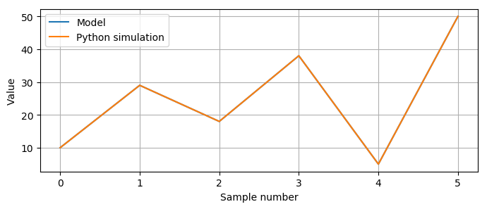

Introduction hardware design with Pyha
======================================

This chapter introduces the main contribution of this thesis, Pyha, that is a way of designing digital hardware using
Python programming language.

First part of this chapter gives an short introduction to the hardware design with Pyha. Just as Pyha tries to bring
software world practices to hardware world, i trie to write this chapter in readable way to software people.

This chapter is written in mind software developers that could start hardware programming, for that reason
many references and abstractsions are made.

The second half of this chapter shows off Pyha features for fixed point design, by gradually designing an FIR filter.

Contributions:

    - Show HW vs SW differences
    - Development of Object-oriented VHDL model
    - Ease hardware development for software engineers

Introduction
------------

Pyha is exploratory project, to see how well software approach could fit into hardware world.

Pyha is a tool that allows writing of digital hardware in Python language. Currently it focuses mostly on the DSP
applications.

Main features:

    - Simulate hardware in Python. Integration to run RTL and GATE simulations.
    - Structured, all-sequential and object oriented designs
    - Fixed point type support(maps to `VHDL fixed point library`_)
    - Semi-automatic conversion to fixed-point
    - Decent quality VHDL conversion output (get what you write, keeps hierarchy)
    - Integration to Intel Quartus (run GATE level simulations)
    - Tools to simplify verification

Pyha specifically focuses on making testing of the DSP algorithms simpler.
While many alternatives are based on C language, but most of the hardware design time is used up in
the process of testing and verification, who would like to do this in C, Python is much better language
for this!

Pyha proposes to use classes as a way of describing hardware. More specifically all the class variables
are to be interpreted as hardware registers, this fits well as they are long term state elements.

This chapter focuses on the Python side of Pyha, while the next chapter gives details on how Pyha details are
converted to VHDL and how they can be synthesised.

Pyha tries to be as like to software programming as possible, some things written for soft vs hardware can give
suprisingly different results, this thesis tries to keep this in mind and hinglight such cases.

Target software people, make it easy to transition.

Introduces Pyha and shows how hardware design differs from software design.

Model based design
~~~~~~~~~~~~~~~~~~

Pyha encourages model based design, it is optional. Idea of the model is to provide a simples possible solution for the problem, this can also serve as some form of
documentation to the module. Also as programmer guarantees equality of model and RTL, model can be used to run fast
simulations and experiments. Model can be verified against RTL.

Describing hardware
-------------------

    * Model
    * Clocking abstraction
    * Hardware is parallel, for is unrolled, comb example
    * Register needed for longer term state
    * Register adds delay
    * Register for pipelines and clock stuff
    * Sample based processing to block processing
    * Design reuse
    * Fixed point design?
    * Demonstrate multi-clock output?
    * Float conversions?
    * State machines
    * Multiply?

Stateless is also called combinatory logic. In the sense of software we could think that a function is stateless
if it only uses local variables, has no side effects, returns are based on inputs only. That is, it may use
local variables of function but cannot use the class variables, as these are stateful.

This first chapter uses integer types only, as they are well undestood by anyone and also fully synthesizable (to 32 bit logic).

Basic adder
~~~~~~~~~~~

Basic Pyha module is a Python class, that is derived from HW subclass. Simple adder with model implementaion is shown
on :numref:`adder-model`.

.. code-block:: python
    :caption: Simple adder model
    :name: adder-model

    class Adder(HW):
        def main(self, x):
            y = x + 1
            return y

        def model_main(self, xl):
            yl = [x + 1 for x in xl]
            return yl

.. note:: Pyha reserves the function name :code:`model_main` for defining the model and :code:`main` for the top
    level function. Designers may freely use other function names as pleased.

:numref:`adder-model` shows the model implementation for the adder. The code loops over the input list 'xl' and adds 1 to each element.
Important thing to notice is that the model code works on lists, it takes input as list and outputs a list.

Key difference beteween the 'model_main' and 'main' is that the later works on singe samples while the model works
on lists, it is vectorized. This is big difference because model code has access to all the samples of the scope, while
main only has the single sample.

.. todo:: rtl image, explain the [31..0]

One of the key abstractions that Pyha uses is that the 'main' is called on each clock. One could imagine that
it is wrapped in a higher level for loop that continously supplies the samples.

.. todo:: sim image

The :numref:`fake` shows that all the simulations are equal. Pyha runs automatically Model, Python, VHDL and GATE simulations.
Value of GATE level simulation is that sometimes software appraoch gives some other hardware, GATE shows that.

Clock abstracted as forever running loop. In hardware determines how long time we need to wait before
next call to function so that all signals can propagate.

More adding
~~~~~~~~~~~

Next example is a simple modification of the previous adder. Instead of :code:`y = x + 1` we write
:code:`y = x + 1 + 2 + 3 + 4`.

.. todo:: rtl image

The :numref:`fake` shows the RTL result. It may be suprising for software ppl.

.. todo:: sim image

Debuggability? Demonstrate that even tho different, can be fully debugged! For example if we have variable at some stage
then in hardware at same point the value will be same.

Main idea here to understand is that while the software and hardware approach do different thing, they result in
same output, so in that sense they are equal. Just the natural state of software is to execute stuff in sequence, while
hardware is parallel (tho, the order of operations still matter).

Also note that just like in software any operation has a price on the execution time, in hardware any operation has
a price in term on resource usage.

One of the key differences.

In software operations consume time, but in hardware they consume resources, general rule.

Control statements
~~~~~~~~~~~~~~~~~~

if

For if note that we pay for both branches, while in software we only pay for what branch is executing.
Also note that the in hardware both of the branches are constantly 'executing', the if condition just selects
which element is routed to the output.

There are differences..but still software and hardware approac give same result.

Make mult and add, so can demonstrate critical path?

for

Lesson for for is that it will be fully unrolled. Also the for hardware the for control statement must be constant, since
it is impossible to unroll dynamic stuff.

.. warning:: Whenever writing a for loop for hardware, try to unroll it in mind, does it make sense?

Function calls? instances?

Conclusions
~~~~~~~~~~~

Looks like 'main' is the only function that can be used.. wtf?

This chapter dealt

Basic points:

    - Clock asbtaction
    - Everything costs in hardware
    - Debuggable
    - Sample based processing for model
    - Sample rate abstraction

Main point here is that what we write works as expected, but is just implemented in slightly different ways than in
software approach.

Sequential logic
----------------

So far we have dealt with designs that require no state other than the function level. In real designs we frequently need
to store some value, so that it is accessable by the next function call.

For example, lets consider accumulator, it operates by taking input value and adding it to the current accumulator value.

The model for such kinf of circuit can be implemented with ``cumsum`` function.

    >>> x = [1, 2, 3, 4]
    >>> np.cumsum(x)
    array([ 1,  3,  6, 10])

This works well if we have all the inputs known, but for sample based approach we would have to use class scope variable
in order to save the accumulator variable

.. code-block:: python
    :caption: Accumulator
    :name: acc

    class Acc(HW):
        def __init__(self):
            self.acc = 0

        def main(self, x):
            self.acc = self.acc + x
            return self.acc

        def model_main(self, xl):
            return np.cumsum(xl)

Now, trying to run this would result in Pyha error, suggesting to change the ``self.acc`` to ``self.next.acc``.
After doing this, code is runnable.

.. todo:: rtl image

.. todo:: sim image

Running the same testing code results in a :numref:`mac_seq_sim_delay`. It shows that while the
Python, RTL and GATE simulations are equal, model simulation differs. This is the effect of added register,
it adds one delay to the harwdware simulations.

So what is up with this delay and 'next' stuff?

Registers basically cannot be understuud at software level..they just make no sense, for that reason we have to
go a bit deeper just for a while.

Register is the defining object of digital designs. Think about the adder, two signals feeding in the adder may have
different propagation delay, meaning that for some time the output of the adder is in invalid state (also each
bit may have slightly different stuff, different delay for each bit), in fact is is
probably fluctiating between many random values. After some measurable time we can say that the adder output is stable.
Register is like a checkpoint between the signal flow path.

Register is object that allows to 'skip' the analog fluctuations.

Basically on FPGA all delays for every component and wire is known. So the synthesis process can place components and
registers in such way that it guarantees that register samples the 'clean' value.

All the registers in the design update at the same time.

.. todo:: LTSPICE sim?

In general the job of writing hardware is just taking in current register values and by using combinatory logic,
determine the next register values. This happens on every call.

:numref:`acc` shows the

    * call
    * set self.next.acc = 1
    * self.acc is still 0
    * next call self.acc is 1

.. note:: Pyha takes the register initial values from the value written in ``__init__``.

Anyways, living in the software world we can just think that class variables in Pyha are delayed by one sample and thats
about it.

This is an standard hardware behaviour. Pyha provides special variable
:code:`self._delay` that specifies the delay of the model, it is useful:

    - Document the delay of your blocks
    - Upper level blocks can use it to define their own delay
    - Pyha simulations will adjust for the delay, so you can easily compare to your model.

.. note:: Use :code:`self._delay` to match hardware delay against models

After setting the :code:`self._delay = 1` in the __init__, we get:

.. _mac_seq_sim:

    Synthesis result of the revised code (Intel Quartus RTL viewer)

In Pyha, registers are inferred from the ogject storage, that is everything defined in 'self' will be made registers.

Understanding registers
^^^^^^^^^^^^^^^^^^^^^^^

In traditional programming, class variables are very similar to local variables. The difference is that
class variables can 'remember' the value, while local variables exist only during the function
execution.

Hardware registers have just one difference to class variables, the value assigned to them does not take
effect immediately, but rather on the next clock edge. That is the basic idea of registers, they take a new value
on clock edge. When the value is set at **this** clock edge, it will be taken on **next** clock edge.

Trying to stay in the software world, we can abstract away the clock edge by thinking that it denotes the
call to the 'main' function. Meaning that registers take the assigned value on the next function call,
meaning assignment is delayed by one function call.

Block processing
~~~~~~~~~~~~~~~~

One very common task in real-life designs is to calculate results based not only the input samples but also some
history of samples. That is some form of block processing.

As an example imagine that we want to output the sum of last 4 inputs.

For this we need to keep track of the last 4 inputs. This can be solved by defining an list of register with 4 elements.

This can be done by just writing::

    self.memory = [0, 0, 0, 0]

Inside the ``main`` function we can write code that throws away last element of the list and adds the new sample,
this structure is also known as shift-register in the hardware world.

::

    self.next.memory = [x] + self.memory[:-1]

In Python ``[x]`` turns the sample into list, then ``+`` operator can be used to concat two lists. The ``[:-1]`` indexing
selects all the element, except the last one (denoted by -1).

After this we have a list that always contains the last 4 elements of input. Next we can add all the elements and
output the result.

.. code-block:: python
    :caption: Accumulator
    :name: block_adder

    class LastAcc(HW):
        def __init__(self):
            self.shr = [0, 0, 0, 0]
            self.y = 0

        def main(self, x):
            self.next.shr = [x] + self.shr[:-1]

            sum = 0
            for a in self.shr:
                sum = sum + a

            self.next.y = sum
            return self.y

        def model_main ...

Note that we also use output register as suggested.

.. _block_adder_rtl:
.. figure:: ../examples/block_adder/img/rtl.png
    :align: center
    :figclass: align-center

    Synthesis result of :numref:`block_adder` (Intel Quartus RTL viewer)

The :numref:`fake` shows that all the simulations are equal. Pyha runs automatically Model, Python, VHDL and GATE simulations.
Value of GATE level simulation is that sometimes software appraoch gives some other hardware, GATE shows that.

.. _block_adder_sim:
.. figure:: ../examples/block_adder/img/sim.png
    :align: center
    :figclass: align-center

    Simulation results

.. todo:: Actually hard to write model here..need to prepend data to take account hardware effects.

Pipelining
~~~~~~~~~~

The block adder built in last section is quite decent, in sense that it is following the digital design approach by
having all stuff between registers.

The synthesis result gives that the maximum clock rate for this design is ~170 Mhz.
Imagine that we want to make this design generic, that is make the summing window size easily changeable. Then we will
see problems, for example going from 4 to 6 changes the max clock speed to ~120 Mhz. Chaning it to 16 gives
already only ~60 Mhz max clock.

.. todo:: appendix for FPGA chip used

.. _rtl_6_critical:
.. figure:: ../examples/block_adder/img/rtl_6_critical.png
    :align: center
    :figclass: align-center

    Critical path RTL

In that sense, it is not a good design since reusing it hard.

The obious solution of adding registes between adder stages would not actually work, when delays come into play
stuff gets complicated!

.. todo:: CONFUSING!!! adding registers on adders WONT work, need to go transposed solution.

.. todo:: Arvan,et pipelining on liiga raske teema, parem loobuda sellest?

In general we expect all the signals to start from a register and end to a register. This is to avoid all the
analog gliches that go on during the transimission process.
 The delay from one register to
other determines the maximum clock rate (how fast registers can update). The slowest register pair determines the
delay for the whole design, weakest link priciple.

While registers can be used as class storage in software designs, they are also used as checkpoints on the
signal paths, thus allowing high clock rates.

In Digital signal processing applications we have sampling rate, that is basically equal to the clock rate. Think that
for each input sample the 'main' function is called, that is for each sample the clock ticks.

Registers also used for pipelines.
Sometimes registers only used for delay.

This could have example on pipelining issues, like delay matching?

Pyha way is to register all the outputs, that way i can be assumed that all the inputs are already registered.

Every rule has exeception, for example delays on the feedback paths (data flows backward) are pure evil.

Pipelining is something that does not exist in software world.

Why bother with pipelining?
^^^^^^^^^^^^^^^^^^^^^^^^^^^

It determines the maximum samplerate for the design. In that sense, designs with low max sample rate are not easly
reusable, so pipelines mean reusability. Remember that hardware work on the weakest link principe, lowest clock rate
determines the whole clock rate for the design.

But why pipeline over lets say 20Mhz, thats the largest Wifiy band. One point is that it is just easier to
add register after each arithmetic operation, than to calculate in mind that maybe we can do 3 or 4 operations berofer
register.

Retiming?

Another point is clock TDA. Run the design on higher clock rate to save resources. Imagine Wify receiver for 20M band,
this has to have sample rate of 20M. But when we run it with say 100M we can push 4 different wify signals trough the same
circuit. That however depends on the synthesys tool ability to share common resources.

Negatives of pipelining is that the delay of the block is not constant in all configurations also pipelining increases
resource usage.

Also algorithm becomes more complex and harder to understand.

Abstraction and Design reuse
~~~~~~~~~~~~~~~~~~~~~~~~~~~~

Last section showed that designing even an simple algorithm in hardware can get very confusing as the registers
come into play.

Good thing about Object-oriented programming is that the complexity of the implementation can be hidden/ abstracted.

Here can list that Pyha has angle and abs for example?

Do in fixed point?

Conclusion
~~~~~~~~~~

Class variables can be used in hardware, but they are delayed by one sample clock.

In digital design signals are assumed to exist between registers. Total delay between the registers determines the
maximum sample rate.

Delay of 1 seems like not an big deal, but really it very much is. In general big part of the hardware design is
fighting with bugs introduced by register delays, this is especially true for beginners. Delays can drasticly change
the operation of a circuit and what is even worse, they may not change the operation drasticly. Delay of one signal path
must be matched with delay of all sequnetial signal paths. Thats why it is important to always have a model and
unit tests, this is essential for hardware design.

In general when registers and delays come into play...everything gets very confusing and hard. Thats why it is important
to have an model, it also serves as an documentation.

Fixed-point designs
-------------------

So far only ``integer`` types have been used, in order to keep things simple and understandable.

In DSP applications we would like to rather use floating point numbers. As shown in previous chapter, every operation
in hardware takes resources and floating point calculations cost alot.

While floating point numbers are usable in hardware, it is common approach to use fixed-point arithmetic
instead. They work as integer arithmetic, they can also be mapped to DSP blocks that come with FPGAs.

.. todo:: some short intro to fixed point, move most to appendix

Pyha can convert floating point models to VHDL, and may run simulations up to the GATE level. That is useful as all the
register effect can be handled before the fixed point conversion. Only when delay effects have been analyzed can the
design be converted to fixed point.

Lets consider converting the moving-window adder to fixed-point implementation.

Pyha assumes inputs are normalized to -1 to 1.

Conversion to fixed point requires changes only in the ``__init__`` function.

.. code-block:: python
    :caption: Accumulator
    :name: Sfix block adder

    def __init__(self, window_size):
        self.shr = [Sfix()] * window_size
        self.sum = Sfix(left=0)

The first line denotest that the shift-register shall be holding ``Sfix`` elements instead of ``integers``.
Note that it does not define the fixed-point bounds, meaning it will store 'whatever' is assigned to it, it is
kind of lazy stuff.

For the ``self.sum`` we have used another lazy statement of ``Sfix(left=0)``, this means that the integer bits
are forced to 0 bits on every assign, that is value is saturated if larger.

.. _rtl_sfix_saturate:
.. figure:: ../examples/block_adder/img/rtl_sfix_saturate.png
    :align: center
    :figclass: align-center

    Critical path RTL

.. _fix_sat_wrap:
.. figure:: ../examples/block_adder/img/fix_sat_wrap.png
    :align: center
    :figclass: align-center

    Wrap vs Saturate

Example: Moving average filter
~~~~~~~~~~~~~~~~~~~~~~~~~~~~~~

Example: FIR filter
~~~~~~~~~~~~~~~~~~~

Conclusion
~~~~~~~~~~

While fixed-point designs require some extra efforts, Pyha provides reasonably easy way for conversion.

Proposed design flow
--------------------

    * make model
    * extract unit tests, same can be reused for hw sims
    * make hw using floats, handle register effects
    * convert to fixed point
    * unit tests pass? profit!

Siin võiks olla mingi figure?

Conclusion
----------

This chapter showed how Python OOP code can be converted into VHDL OOP code.

It is clear that Pyha provides many conveneince functions to greatly simplyfy the testing of
model based designs.

The initial goal of Pyha was to test ou how well could the software approach apply to the hardware world. As this
thesis shows that it is working well, the generated hardware output is unexpected to software people but resulting
output is the same. Pyha is an exploratory project, many things work and ca be done but still much improvements are needed
for example, inclusion of bus models like Wishbone, Avalon, AXI etc. Also currently Pyha works on single clock designs,
while its ok because mostly today desings are just many single clock designs connected with buses.

Future stuff:
Make it easier to use, windows build?