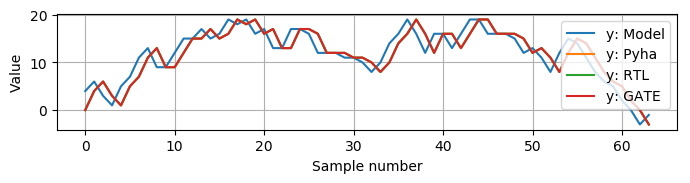
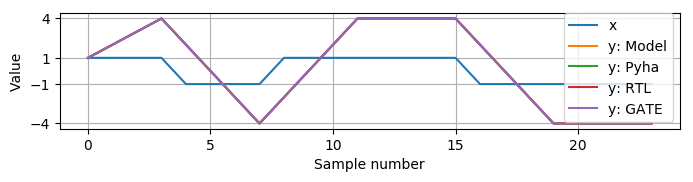
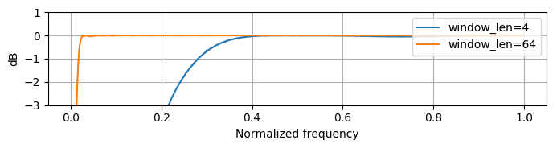

Introduction to hardware design with Pyha
=========================================

Thiw work tries to look the hardware desctiption process from the software developer side, shows differences.

This chapter shows how Pyha can be used to write digital hardware.

This chapter introduces the main contribution of this thesis, Pyha, that is a way of designing digital hardware using
Python programming language.

First part of this chapter gives an short introduction to the hardware design with Pyha. Just as Pyha tries to bring
software world practices to hardware world, i trie to write this chapter in readable way to software people.

This chapter is written in mind software developers that could start hardware programming, for that reason
many references and abstractsions are made.

The second half of this chapter shows off Pyha features for fixed point design, by gradually designing an FIR filter.


to cover:
    * Clocking abstraction
    * Design reuse
    * State machines
    * Show that __init__ can be used for any python code
    * Design flow, show unit tests..


Stateless design
----------------

Stateless is also called combinatory logic. In the sense of software we could think that a function is stateless
if it only uses local variables, has no side effects, returns are based on inputs only. That is, it may use
local variables of function but cannot use the class variables, as these are stateful.

This first chapter uses integer types only, as they are well understood by anyone and also fully synthesizable (to 32 bit logic).

Basic adder
~~~~~~~~~~~

Basic Pyha module is a Python class, that is derived from HW subclass. Simple adder with model implementaion is shown
on :numref:`adder-model`.

.. code-block:: python
    :caption: Simple adder model
    :name: pyha_adder

    class Adder(HW):
        def main(self, x):
            y = x + 1
            return y

        def model_main(self, xl):
            # for each element in xl add 1
            yl = [x + 1 for x in xl]
            return yl

.. note:: Pyha reserves the function name :code:`model_main` for defining the model and :code:`main` for the top
    level function. Designers may freely use other function names as pleased.

``model_main`` can contain any Python code, it is not to be synthesised. ``main`` is the function for synthesis.

:numref:`adder-model` shows the model implementation for the adder. The code loops over the input list 'xl' and adds 1 to each element.
Important thing to notice is that the model code works on lists, it takes input as list and outputs a list.

Key difference beteween the 'model_main' and 'main' is that the later works on singe samples while the model works
on lists, it is vectorized. This is big difference because model code has access to all the samples of the scope, while
main only has the single sample.

One of the key abstractions that Pyha uses is that the 'main' is called on each clock. One could imagine that
it is wrapped in a higher level for loop that continously supplies the samples.

Clock abstracted as forever running loop. In hardware determines how long time we need to wait before
next call to function so that all signals can propagate.

.. _adder_rtl:
.. figure:: ../examples/adder/img/add_rtl.png
    :align: center
    :figclass: align-center

    Synthesis result of :numref:`pyha_adder` (Intel Quartus RTL viewer)


Simulation and testing
^^^^^^^^^^^^^^^^^^^^^^

Pyha designs can be simulated in Python or VHDL domain. In addition, Pyha has integration to Intel Quartus software,
it supports running GATE level simulations, that is simulation of synthesized logic.

Pyha provides an ``simulate(dut, x)`` function, that uses ``x`` as input for module ``dut`` and runs all the
simulations, returning the outputs.

More information about this in the APPENDIX.

.. _adder_sim:
.. figure:: ../examples/adder/img/add_sim.png
    :align: center
    :figclass: align-center

    Simulation input and outputs

The :numref:`adder_sim` is plotted using the data from ``simulate`` function, as shown
all the simulations are equal.


Operations order
~~~~~~~~~~~~~~~~

Slightly more complex example is given on :numref:`pyha_adder_comp`. It features two outputs, note that the
``b`` output is dependent of ``a``.

.. code-block:: python
    :caption: Simple adder model
    :name: pyha_adder_comp

    ...
    def main(self, x):
        a = x + 1 + 3
        b = a + 2
        return a, b
    ...

.. _adder_multi_rtl:
.. figure:: ../examples/adder/img/add_multi_rtl.png
    :align: center
    :figclass: align-center

    Synthesis result of :numref:`pyha_adder_comp` (Intel Quartus RTL viewer)

The :numref:`adder_multi_rtl` shows the RTL result. Now this RTL may be suprising for people coming from software
development.

The simplified CPU can be imagined to have only one adder, then the code above would take 3 cycles of this adder to execute.
Hardware approach however is that all the operations are done in parallel.

So in general, operations in software consume time, while hardware consumes resources, this is general rule. To be
correct in hardware there are also pipeline delays but these can be ignored at this point.
In software operations consume time, but in hardware they consume resources, general rule.
Also note that just like in software any operation has a price on the execution time, in hardware any operation has
a price in term on resource usage.

Simulation and testing
^^^^^^^^^^^^^^^^^^^^^^

Testing of the circuit is done on the same data as previous.

.. _add_multi_sim:
.. figure:: ../examples/adder/img/add_multi_sim.png
    :align: center
    :figclass: align-center

    Simulation result


Main idea to understand is that while the software and hardware approach do different thing, they result in
same output, so in that sense they are equal. Just the natural state of software is to execute stuff in sequence, while
hardware is parallel (tho, the order of operations still matter).

One huge upside of Pyha is that designs can be debugged, :numref:`add_multi_debug` shows a breakpoint that was
reached on the first input sample. It is better than conventional methods!

.. _add_multi_debug:


    Debugging using PyCharm (Python editor)


Control statements
~~~~~~~~~~~~~~~~~~

Control statements like if, for and function calls are fully usable in synthesizable code.

If statement
^^^^^^^^^^^^

.. code-block:: python
    :caption: Select add amount with if
    :name: pyha_if_code

    ...
    def main(self, x, condition):
        if condition == 0:
            y = x + 3
        else:
            y = x + 1
        return y
    ...

.. _if_rtl:
.. figure:: ../examples/control/img/if_rtl.png
    :align: center
    :figclass: align-center

    Synthesis result of :numref:`pyha_if_code` (Intel Quartus RTL viewer)

Note that in hardware the if clause is implemented with 'multiplexer' it select the signal path based on condition.
So if ``condition == 0`` then bottom signal path is routed to output. Interesting thing to note is that both of the
adders are constantly 'executing', even when not selected.

Simulating this designs gives equal output for Model, Pyha, RTL and GATE simulations.

Even so that the hardware vs software approach to implement this structude is quite differet, they end with equal
outputs.

For statement
^^^^^^^^^^^^^

Loop statement usage, like ``for``, is somewhat limited in hardware. Since as we have seen all the hardware will be
layed out, the for condition cannot be dynamci, it must be constant.

:numref:`pyha_for_code` gives an simple ``for`` example, that adds [0, 1, 2, 3] to the input signal.

.. code-block:: python
    :caption: For adder
    :name: pyha_for_code

    ...
    def main(self, x):
        y = x
        for i in range(4):
            y = y + i

        return y
    ...

.. _for_rtl:
.. figure:: ../examples/control/img/for_rtl.png
    :align: center
    :figclass: align-center

    Synthesis result of :numref:`pyha_for_code` (Intel Quartus RTL viewer)


All the loops in hardware get fully unrolled, that means :numref:`pyha_for_code` is equal to
:numref:`pyha_for_code_unrolled`. Also because of this the ``for`` condition must be constant.

.. code-block:: python
    :caption: Unrolled ``for``, equivalent to :numref:`pyha_for_code`
    :name: pyha_for_code_unrolled

    ...
    def main(self, x):
        y = x
        y = y + 0
        y = y + 1
        y = y + 2
        y = y + 3
        return y
    ...

Simulating this designs gives equal output for Model, Pyha, RTL and GATE simulations.


Function calls
^^^^^^^^^^^^^^

So far this paper has only used the ``main`` function to define logic. Generally ``main`` function is just the
top level function that is first called by ``simulation`` and conversion processes. Shows an example:

.. code-block:: python
    :caption: For adder
    :name: pyha_functions_code

    ...
    def adder(self, x, b):
        y = x + b
        return y

    def main(self, x):
        y = self.adder(x, 1)
        return y
    ...

The synthesys result of :numref:`pyha_functions_code` is just an adder,
there is no mark that a function call has been used, so basically one could assume that all functions are
inlined during the synthesys process.

.. warning:: There cannot be more than one function call per expression, this limitation may be lifted in the future.


Conclusions
~~~~~~~~~~~

Main takeaway from this chapter is that software approach works for defining stateless hardware. This chapter demonstrated
that the output of software solution and hardware synthesys is equal for many examples. Even so, the way hardware
solution arcieves the result is 'unexpected' for the software designer.

Major point to remember is that software cost time while everything in hardware cost resources.

In addition, this work showed how using Pyha enables fast testing of hardware designs by automatically running all
relavant simulations and enabling debug in Python domain.

Basic points:

    - Clock asbtaction
    - Everything costs in hardware
    - Debuggable
    - Sample based processing for model
    - Sample rate abstraction


Intoducing state
----------------

So far this chapter has dealt with designs that require no state, that is data moves in to the ``main``, some operation
is performed and data moves out. Nothing is saved nor is any history used.
So far we have dealt with designs that require no state other than the function level. In real designs we frequently need
to store some value, so that it is accessable by the next function call.

Often there is a need to keep track of some value, so that it would be usable in the next function call aswell.
This denotes that we need to keep track of some value for longer than just one function call.

In traditional programming, class variables are very similar to local variables. The difference is that
class variables can 'remember' the value, while local variables exist only during the function
execution.

Accumulator and registers
~~~~~~~~~~~~~~~~~~~~~~~~~

For example, lets consider the design of accumulator, it operates by sequentially adding up all the input values.

This can be implemented with ``cumsum`` function:

.. code-block:: python
    :caption: Accumulator model
    :name: acc-model

    >>> x = [1, 2, 3, 4]
    >>> np.cumsum(x)
    array([ 1,  3,  6, 10])

Implemenation on :numref:`acc-model` depends on the fact that all of the input is known, this is not the case for
hardware designs. As shown in previous section, hardware designs get single sample on each execution.

For single sample based execution we would have to use class scope variable in order to save the accumulator value.

.. code-block:: python
    :caption: Accumulator
    :name: acc

    class Acc:
        def __init__(self):
            self.acc = 0

        def main(self, x):
            self.acc = self.acc + x
            return self.acc


Now, trying to run this would result in Pyha error, suggesting to change the ``self.acc`` to ``self.next.acc``.
After doing this, code is runnable.

.. _acc_rtl:
.. figure:: ../examples/accumulator/img/acc_rtl.png
    :align: center
    :figclass: align-center

    Synthesis result of :numref:`pyha_for_code` (Intel Quartus RTL viewer)


``rst_n`` signal can be used to set initial states for registers, in Pyha the initial value is determined by the
value assigned in ``__init__``, in this case it is 0.

Register
^^^^^^^^

In general we expect all the signals to start from a register and end to a register. This is to avoid all the
analog gliches that go on during the transimission process.
The delay from one register to
other determines the maximum clock rate (how fast registers can update). The slowest register pair determines the
delay for the whole design, weakest link priciple.

Registers basically cannot be understuud at software level..they just make no sense, for that reason we have to
go a bit deeper just for a while.

Hardware registers have just one difference to class variables, the value assigned to them does not take
effect immediately, but rather on the next clock edge. That is the basic idea of registers, they take a new value
on clock edge. When the value is set at **this** clock edge, it will be taken on **next** clock edge.

Register is the defining object of digital designs. Think about the adder, two signals feeding in the adder may have
different propagation delay, meaning that for some time the output of the adder is in invalid state (also each
bit may have slightly different stuff, different delay for each bit), in fact is is
probably fluctiating between many random values. After some measurable time we can say that the adder output is stable.
Register is like a checkpoint between the signal flow path.

Register is object that allows to 'skip' the analog fluctuations.

Basically on FPGA all delays for every component and wire is known. So the synthesis process can place components and
registers in such way that it guarantees that register samples the 'clean' value.

All the registers in the design update at the same time.

    * call
    * set self.next.acc = 1
    * self.acc is still 0
    * next call self.acc is 1


.. note:: Pyha takes the register initial values from the value written in ``__init__``.

Pyha way is to register all the outputs, that way i can be assumed that all the inputs are already registered.


Clock abstraction
^^^^^^^^^^^^^^^^^

Trying to stay in the software world, we can abstract away the clock edge by thinking that it denotes the
call to the 'main' function. Meaning that registers take the assigned value on the next function call,
meaning assignment is delayed by one function call.

Anyways, living in the software world we can just think that registers are delayed class variables.

In Digital signal processing applications we have sampling rate, that is basically equal to the clock rate. Think that
for each input sample the 'main' function is called, that is for each sample the clock ticks.

Testing
^^^^^^^

.. _acc_sim_delay:


    Simulation of the accumulator (x is random integer [-5;5])


Running the same testing code results in a :numref:`acc_sim_delay`. It shows that while the
model simulation differs from the rest of simulations. This is the effect of added register,
it adds one delay to the harwdware simulations.

The delay can be determined by counting the registers on the input to output path.


This is an standard hardware behaviour. Pyha provides special variable
:code:`self._delay` that specifies the delay of the model, it is useful:

    - Document the delay of your blocks
    - Upper level blocks can use it to define their own delay
    - Pyha simulations will adjust for the delay, so you can easily compare to your model.

.. note:: Use :code:`self._delay` to match hardware delay against models

After setting the :code:`self._delay = 1` in the __init__, we get:

This does not 'fix' the delay, it just shifts the hardware simulation sample so that they match up with model,
the design is still delayed by 1.

.. _acc_sim:
.. figure:: ../examples/accumulator/img/acc_sim.png
    :align: center
    :figclass: align-center

    Simulation of the delay **compensated** accumulator (x is random integer [-5;5])


Block processing and sliding adder
~~~~~~~~~~~~~~~~~~~~~~~~~~~~~~~~~~

This far we have been stuck with '1 sample' per function call. Now with the use of registers we could keep history
of samples, thus be block processing.
One very common task in real-life designs is to calculate results based not only the input samples but also some
history of samples. That is some form of block processing.

As an example imagine that we want to output the sum of last 4 inputs. To implement this, we could just keep
track of the last 4 elements and sum them up, implementation of this is show on :numref:`block_adder`. Note that
it also uses the output register ``y``.

.. code-block:: python
    :caption: Accumulator
    :name: block_adder

    class LastAcc(HW):
        def __init__(self):
            self.mem = [0, 0, 0, 0] # list of registers
            self.y = 0

        def main(self, x):
            # add new 'x' to list, throw away last element
            self.next.mem = [x] + self.mem[:-1]

            # add all element in the list
            sum = 0
            for a in self.mem:
                sum = sum + a

            self.next.y = sum
            return self.y
        ...

The ``self.next.mem = [x] + self.mem[:-1]`` line is also known as an 'shift register', because on every call it
shifts the list contents right and adds new ``x`` as first element. Also sometimes it is called delay-chain, as the
sample ``x`` takes 4 calls to travel from ``mem[0]`` to ``mem[3]``.


.. _block_adder_rtl:
.. figure:: ../examples/block_adder/img/rtl.png
    :align: center
    :figclass: align-center

    Synthesis result of :numref:`block_adder` (Intel Quartus RTL viewer)


Optimizing the design
^^^^^^^^^^^^^^^^^^^^^

The block adder built in last section is quite decent, in sense that it is following the digital design approach by
having all stuff between registers.

The synthesis result gives that the maximum clock rate for this design is ~170 Mhz.
Imagine that we want to make this design generic, that is make the summing window size easily changeable. Then we will
see problems, for example going from 4 to 6 changes the max clock speed to ~120 Mhz. Chaning it to 16 gives
already only ~60 Mhz max clock. Also for larger windows, it start using much more logic resources, as each
window requires an adder.

.. todo:: appendix for FPGA chip used

.. _rtl_6_critical:
.. figure:: ../examples/block_adder/img/rtl_6_critical.png
    :align: center
    :figclass: align-center

    Window size 6, RTL (Intel Quartus RTL viewer)


In that sense, it is not a good design since reusing it hard.


Conveniently, this design can be optimized to always use only 2 adders, no matter the window length.

.. code-block:: python
    :caption: Accumulator
    :name: slider_optim

    y[4] = x[4] + x[5] + x[6] + x[7] + x[8] + x[9]
    y[5] =        x[5] + x[6] + x[7] + x[8] + x[9] + x[10]
    y[6] =               x[6] + x[7] + x[8] + x[9] + x[10] + x[11]

    # reusing overlapping parts implementation
    y[5] = y[4] + x[10] - x[4]
    y[6] = y[5] + x[11] - x[5]

As shown on :numref:`slider_optim`, instead of summing all the elements, we can reuse the overlapping part of
the calculation to significantly optimize the algorithm.


.. code-block:: python
    :caption: Optimal sliding adder
    :name: optimal_adder

    class OptimalSlideAdd(HW):
        def __init__(self, window_len):
            self.mem = [0] * window_len
            self.sum = 0

            self._delay = 1

        def main(self, x):
            self.next.mem = [x] + self.mem[:-1]

            self.next.sum = self.sum + x - self.mem[-1]
            return self.sum
        ...


:numref:`optimal_adder` gives the implementation of optimal sliding adder. Note that the ``mem`` stayed the same, but
now it is rather used as a delay-chain. :numref:`rtl_optimal_int_critical` shows the synthesis result, as expected,
critical path is 2 adders.

.. _rtl_optimal_int_critical:
.. figure:: ../examples/block_adder/img/rtl_optimal_int_critical.png
    :align: center
    :figclass: align-center

    Window size 6, RTL (Intel Quartus RTL viewer)


Simulation shows that implemented design behaves same way in software and hardware (:numref:`block_adder_sim`).

.. _block_adder_sim:


    Simulation results for ``OptimalSlideAdd(window_len=4)``


Conclusion
~~~~~~~~~~

Class variables can be used to add state to the design. In Pyha all class variables are interpreted as hardware registers.
Key difference between software and hardware approach is that hardware registers have **delayed assignment**, because of
that they must be assigned to ``self.next`` keyword.

The delay introduced by the registers can be specified by the ``self._delay`` attribute.

Delay added by the registers may drastically change the algotithm, thats why it is important to always have a model and
unit tests, this is essential for hardware design.

In hardware, registers are also used to shorten the critical path, thus allowing higher clock rate. It is encouraged
to register all the outputs of the design.

In digital design signals are assumed to exist between registers. Total delay between the registers determines the
maximum sample rate.

While registers can be used as class storage in software designs, they are also used as checkpoints on the
signal paths, thus allowing high clock rates.


Fixed-point designs
-------------------

Previous chapters have used only ``integer`` types, that helped to focus on more important matters.
While integers are synthesisable, they always end up as 32 bit logic.

DSP applications are commonly described using floating point numbers. As shown in previous sections, every operation
in hardware takes resources and floating point calculations cost greatly. For that reason, it is common approach to
use fixed-point arithmetic instead.

Fixed-point arithmetic is in nature equal to integer arithmetic and thus can use the DSP blocks that
come with many FPGAs (some high-end FPGAs have also floating point DSP blocks :cite:`arria_dsp`).

Basics
~~~~~~

Pyha implements fixed-point numbers and complex fixed-point numbers, :numref:`fix_examples` gives some examples.

Pyha defines ``Sfix`` for FP objects, it is always signed. It works by defining bits designated for ``left`` and ``right``
of the decimal point. For example ``Sfix(0.3424, left=0, right=-17)`` has 0 bits for integer part
and 17 bits for fractional part. :numref:`fp_basics` gives some more examples, more information about the fixed point
type is given on APPENDIX.

.. code-block:: python
    :caption: Fixed point precision
    :name: fp_basics

    >>> Sfix(0.3424, left=0, right=-17)
    0.34239959716796875 [0:-17]
    >>> Sfix(0.3424, left=0, right=-7)
    0.34375 [0:-7]
    >>> Sfix(0.3424, left=0, right=-4)
    0.3125 [0:-4]

Default FP type in Pyha is ``Sfix(left=0, right=-17)``, that is capable of representing numbers between [-1;1] with
0.000007629 resolution. This format is chosen because it is 18 bits and fits into common FPGA DPS blocks
:cite:`cycloneiv` and it can represent normalized numbers.

General recommendation is to keep all the inputs and outputs of the block in the default type.


Fixed-point sliding adder
~~~~~~~~~~~~~~~~~~~~~~~~~

As an example, consider converting the sliding window adder, developed earlier, to FP implementation.

Conversion to FP requires changes only in the ``__init__`` function (:numref:`fp_sliding_adder`).

.. code-block:: python
    :caption: Fixed-point sliding adder
    :name: fp_sliding_adder

    def __init__(self, window_size):
        self.mem = [Sfix()] * window_size
        self.sum = Sfix(left=0)
    ...

First line sets ``self.mem`` to store ``Sfix()`` elements instead of ``integers``, note that it does not define the
fixed-point bounds, meaning it will store 'whatever' is assigned to it. Final bounds are determined during simulation.

For the ``self.sum`` register, another lazy statement of ``Sfix(left=0)``, this means that the integer bits
are forced to 0 bits on every assign to this register. Fractional part is left openly determined during simulation.
Rest of the code is identical to the 'integer' version.


.. _rtl_sfix_saturate:
.. figure:: ../examples/block_adder/img/rtl_sfix_saturate.png
    :align: center
    :figclass: align-center

    RTL with saturation logic (Intel Quartus RTL viewer)


Note that by default, FP types may saturate the result, saturation logic prevents the wraparound behaviour by
forcing the maximum or negative value when out of fixed point format.
Otherwise the RTL is similar to the 'integer' one, just now signals have mostly 18 bit widths.

Simulations/Testing
^^^^^^^^^^^^^^^^^^^

.. _fix_sat_wrap:
.. figure:: ../examples/block_adder/img/sim_fix.png
    :align: center
    :figclass: align-center

    Simulation results of FP sliding sum

Notice that the hardware simulations are bounded to [-1;1] range by the saturation logic, that is why the model
simulation is different at some parts (:numref:`fix_sat_wrap`).

Note that the ``simulate`` function automatically converts real inputs to default ``Sfix`` type. In same manner,
``Sfix`` outputs are converted to floating point numbers. That way designer does not have to deal with FP number
in unit-testing code. Example is given on :numref:`fp_test`.

.. note:: Pyha converts inputs and outputs to floating point values automatically.

.. code-block:: python
    :caption: Testing code
    :name: fp_test

    dut = OptimalSlidingAddFix(window_len=4)
    x = np.random.uniform(-0.5, 0.5, 64)
    y = simulate(dut, x)
    # plotting code ...


Moving average filter
~~~~~~~~~~~~~~~~~~~~~


The moving average (MA) is the most common filter in DSP, mainly because it is the easiest digital
filter to understand and use.  In spite of its simplicity, the moving average filter is
optimal for a common task: reducing random noise while retaining a sharp step response.  This makes it the
premier filter for time domain encoded signals :cite:`dspbook`.

.. _moving_average_noise:
.. figure:: ../examples/moving_average/img/moving_average_noise.png
    :align: center
    :figclass: align-center

    Example of MA as noise reduction

Moving average is an good algorithm for noise reduction (:numref:`moving_average_noise`.
Increasing the window length reduces more noise but also increases the complexity and delay of
the system (MA is a special case of FIR filter, same delay semantics apply).

.. _mavg_freqz:
.. figure:: ../examples/moving_average/img/moving_average_freqz.png
    :align: center
    :figclass: align-center

    Frequency response of MA filter

Good noise reduction performance can be explained by the frequency response of MA (:numref:`mavg_freqz`),
showing that it is a low-pass filter. Passband width and stopband attenuation are controlled by the
window length.

Implementation
^^^^^^^^^^^^^^

MA is implemented by using an sliding sum and dividing this with the window length.

We have already implemented the sliding sum part of the algorithm,.
The division can be implemented by shift right if divisor is power of two, that is what we will use this time.

In addition, division can be performed on each sample instead of on the sum, that is ``(a + b) / c == a/c + b/c``.
Doing this guarantees that the ``sum`` variable is always in [-1;1] range, thus saturation logic can be removed.

.. code-block:: python
    :caption: MA implementation in Pyha
    :name: mavg-pyha
    :linenos:

    class MovingAverage(HW):
        def __init__(self, window_len):
            self.window_pow = Const(int(np.log2(window_len)))

            self.mem = [Sfix()] * window_len
            self.sum = Sfix(0, 0, -17, overflow_style=fixed_wrap)
            self._delay = 1

        def main(self, x):
            div = x >> self.window_pow

            self.next.mem = [div] + self.mem[:-1]
            self.next.sum = self.sum + div - self.mem[-1]
            return self.sum
        ...

Code on :numref:`mavg-pyha` makes only a few significant changes to the sliding sum:

    * On line 3, ``self.window_pow`` stores the bit shift count (to support generic ``window_len``)
    * On line 6, type of ``sum`` is changed so that saturation is turned off and default type
    * On line 10, shift operator performs the division

.. _mavg_rtl:
.. figure:: ../examples/moving_average/img/mavg_rtl.png
    :align: center
    :figclass: align-center

    RTL view of moving average (Intel Quartus RTL viewer)


:numref:`mavg_rtl` shows the synthesized result of this work, as expexted it **looks** very similiar to the
sliding sum RTL.


Simulation/Testing
^^^^^^^^^^^^^^^^^^

MA is an optimal solution for performing matched filtering of rectangular pulses :cite:`dspbook`.
This is important for communication systems, :numref:`mavg_matched` shows an example of
(a) digital signal is corrupted with noise. MA with window length equal to samples per symbol can recover the
signal from the noise (b).

.. _mavg_matched:
.. figure:: ../examples/moving_average/img/moving_average_matched.png
    :align: center
    :figclass: align-center

    Moving average as matched filter

The 'model' deviates from rest of the simulations because the input signal viloates the [-1;1] bounds and hardware
simulations are forced to saturate the values.


Conclusion
~~~~~~~~~~

Floating point DSP systems can be easily implemented by using the fixed-point type.
The combination of 'lazy' bounds and default Sfix type provide easy conversion from floating point to fixed point.
In that sense it could be called 'semi-automatic conversion'.

Test data can be provided as floating point and return is float aswell, test code is not bloated with fixed point
semantics.

Constantly verifying against the model floating-point model greatly helps the design process.


Abstraction and Design reuse
----------------------------

Since Pyha object storage is basically all reigsters it allows submodules also.

.. note:: Limitation is that all the objects must be defined in the class ```__init__```.

Show how delay is used from submodules.

Good thing about Object-oriented programming is that the complexity of the implementation can be hidden/ abstracted.


Example: Linear-phase DC removal Filter
~~~~~~~~~~~~~~~~~~~~~~~~~~~~~~~~~~~~~~~

Direct conversion (homodyne or zero-IF) receivers have become very popular recently especially in the realm of
software defined radio. There are many benefits to direct conversion receivers,
but there are also some serious drawbacks, the largest being DC offset and IQ imbalances :cite:`bladerfdoc`.

In frequency domain, DC offset will look like a peak near the 0 Hz. In time domain, it manifests as a constant
component on the harmonic signal.


In :cite:`dcremoval_lyons`, Rick Lyons investigates the feasibility of using moving average algorithm as a DC removal
circuit by subtracting the MA output from the input signal. This structure works but has a passband ripple of up to
3 dB. In his work Rick shows that by cascading multiple stages of MA's the ripple can be reduced (:numref:`dc_freqz`).


.. _dc_freqz:
.. figure:: ../examples/dc_removal/img/dc_freqz.png
    :align: center
    :figclass: align-center

    Frequency response of DC removal circuit with MA length 8


Implementation is rather straight forward, algorithm must chain multiple MAs and then subtract the result from input.

.. code-block:: python
    :caption: Generic DC-Removal implementation
    :name: dc_removal

    class DCRemoval(HW):
        def __init__(self, window_len, cascades):
            self.mavg = [MovingAverage(window_len) for _ in range(cascades)]
            self.y = Sfix(0, 0, -17)

            self._delay = 1 + self.mavg[0]._delay * cascades

        def main(self, x):
            tmp = x
            for mav in self.mavg:
                tmp = mav.main(tmp)

            self.next.y = x - tmp
            return self.y
        ...


:numref:`dc_removal` shows the Python implementation. Class is parametrized so that count of MA and the
window length can be changed.

One thing to note that the :code:`model_main` and :code:`main` are nearly identical. That shows that Pyha has archived
one of the goals by simplifying hardware design portion.

.. _dc_rtl_annotated:
.. figure:: ../examples/dc_removal/img/dc_rtl_annotated.png
    :align: center
    :figclass: align-center

    Synthesis result of ``DCRemoval(window_len=4, cascades=4)`` (Intel Quartus RTL viewer)


This implementation is not exactly following the one in :cite:`dcremoval_lyons`. They suggest to delay match the
MA outputs and input signal, but since we can assume the DC component to be constant, it does not matter.

Note that in real-life design we would use this component with much larger ``window_len``, currently 4 was chosen
in order to get plottable RTL. As shown in MA chapter, longer ``window_len`` gives narrower filter.

..
    Total logic elements	204 / 39,600 ( < 1 % )
    Total memory bits	144 / 1,161,216 ( < 1 % )
    Max clock speed ~200 MHz
    Signal delay: 1 sample

..
    Total logic elements	251 / 39,600 ( < 1 % )
    Total memory bits	10,150 / 1,161,216 ( < 1 % )
    Max clock speed ~200 MHz
    Signal delay: 1 sample


.. _dc_comp:


    4 vs 256

Going from 4 to 256 only increases the memory usage of FPGA, still it is below 1%.


Other examples
~~~~~~~~~~~~~~

Here can list that Pyha has angle and abs for example?

.. todo:: show high level design, with fsk receiver, can we just connect the blocks? use inspectrum and real remote signal?
    Ease of reuse..even if we suck at hardware design!

Conclusion
~~~~~~~~~~

Pyha is object-oriented, meaning that the complexity can be easily hidden in the object definition, while reusing the
components is easy.


Suggested design flow
---------------------

This text has left out the model implementation many times to focus on the hardware details.

.. todo:: move this to intro? make nice figure? Here say that we deviate from this to more focus on hardware side.

This text has built the examples in what way, but actually the optimal design flow should go as this:


    * make model
    * extract unit tests, same can be reused for hw sims
    * make hw using floats, handle register effects
    * convert to fixed point
    * unit tests pass? profit!

Siin võiks olla mingi figure?


Conclusion
----------

Easy to use OOP, abstraction.

This chapter showed how Python OOP code can be converted into VHDL OOP code.

It is clear that Pyha provides many conveneince functions to greatly simplyfy the testing of
model based designs.

The initial goal of Pyha was to test ou how well could the software approach apply to the hardware world. As this
thesis shows that it is working well, the generated hardware output is unexpected to software people but resulting
output is the same. Pyha is an exploratory project, many things work and ca be done but still much improvements are needed
for example, inclusion of bus models like Wishbone, Avalon, AXI etc. Also currently Pyha works on single clock designs,
while its ok because mostly today desings are just many single clock designs connected with buses.

Future stuff:
Make it easier to use, windows build?