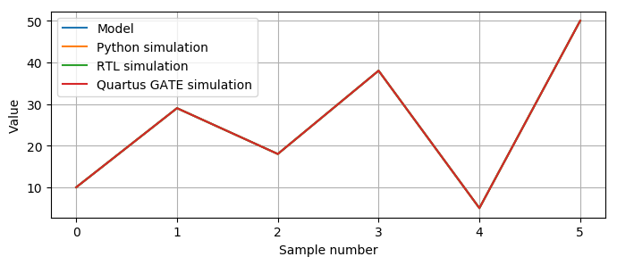

Introduction to Pyha and hardware design
========================================

This chapter introduces the main contribution of this thesis, Pyha, that is a way of designing digital hardware using
Python programming language.

First part of this chapter gives an short introduction to the hardware design with Pyha. Just as Pyha tries to bring
software world practices to hardware world, i trie to write this chapter in readable way to software people.

This chapter is written in mind software developers that could start hardware programming, for that reason
many references and abstractsions are made.

The second half of this chapter shows off Pyha features for fixed point design, by gradually designing an FIR filter.

Introduction
------------

Pyha is a tool that allows writing of digital hardware in Python language. Currently it focuses mostly on the DSP
applications.

Main features:

    - Simulate hardware in Python. Integration to run RTL and GATE simulations.
    - Structured, all-sequential and object oriented designs
    - Fixed point type support(maps to `VHDL fixed point library`_)
    - Semi-automatic conversion to fixed-point
    - Decent quality VHDL conversion output (get what you write, keeps hierarchy)
    - Integration to Intel Quartus (run GATE level simulations)
    - Tools to simplify verification

Pyha specifically focuses on making testing of the DSP algorithms simpler.
While many alternatives are based on C language, but most of the hardware design time is used up in
the process of testing and verification, who would like to do this in C, Python is much better language
for this!

Pyha proposes to use classes as a way of describing hardware. More specifically all the class variables
are to be interpreted as hardware registers, this fits well as they are long term state elements.

This chapter focuses on the Python side of Pyha, while the next chapter gives details on how Pyha details are
converted to VHDL and how they can be synthesised.

.. note:: The first half of this chapter uses 'integers' as base type in order to keep the examples
    simple. Second half starts using fixed-point numbers, that ade default for Pyha.

Describing hardware
-------------------

Assuming we have now enough knowledge and unit-tests we can start implementing
the Hardware model.

Block processing.

Adder??

Turning to block processing.

Model
~~~~~

.. code-block:: python
    :caption: Multiply-accumulate written in pure Python
    :name: mac-pyha

    class MAC:
         def model_main(self, xl, hl):
            y = []
            acc = 0.0
            for x, h in zip(xl, hl):
                mul = x * h
                acc = acc + mul
                y.append(acc)

            return y

Pure software-world approach would likely just return

.. note:: This could be also realized with one-liner :code:`return np.cumsum(np.array(xl) * np.array(hl))`. But currently
    pure Python is better.

.. code-block:: python
    :caption: Multiply-accumulate written in pure Python
    :name: mac-pyha

    >>> dut = MAC()
    >>> xl = [1, 2, 3, 4]
    >>> hl = [1, 1, 1, 1]
    >>> dut.model_main(xl, hl)
    [1.0, 3.0, 6.0, 10.0]

:numref:`mac-pyha` shows the MAC model written in Python. It uses the Numpy package for numeric calculations.

Stateless logic
~~~~~~~~~~~~~~~

Teen

Clock abstracted as forever running loop. In hardware determines how long time we need to wait before
next call to function so that all signals can propagate.

Stateless is also called combinatory logic. In the sense of software we could think that a function is stateless
if it only uses local variables, has no side effects, returns are based on inputs only. That is, it may use
local variables of function but cannot use the class variables, as these are stateful.

.. code-block:: python
   :caption: Stateless MAC implemented in Pyha
   :name: pyha-comb-mac

    class MAC(HW):
        def main(self, x, sum_in):
            mul = 123 * x
            y = sum_in + mul
            return y

        def model_main ...

:numref:`pyha-comb-mac` shows the design of a combinatory logic. In this case it is a simple xor operation between
two input operands. It is a standard Python class, that is derived from a baseclass *HW,
purpose of the baseclass is to do some metaclass stuff and register this class as Pyha module.

.. _mac_rtl_end:
.. figure:: ../examples/fir_mac/integer_based/img/comb_rtl.png
    :align: center
    :figclass: align-center

    Synthesis result of the revised code (Intel Quartus RTL viewer)

:numref:`mac_rtl_end` shows the synthesis result of the source code shown in :numref:`mac-next-update`.
It is clear that this is now equal to the system presented at the start of this chapter.

.. _mac_comb_sim:

    Synthesis result of the revised code (Intel Quartus RTL viewer)

Class contains an function 'main', that is considered as the top level function for all Pyha designs. This function
performs the xor between two inputs 'a' and 'b' and then returns the result.

In general all assigments to local variables are interpreted as combinatory logic.

.. todo:: how this turns to VHDL and RTL picture?

In software operations consume time, but in hardware they consume resources, general rule.

Not clocked...basically useless analog stuff.

Sequential logic
~~~~~~~~~~~~~~~~

Delay of 1 seems like not an big deal, but really it very much is. In general big part of the hardware design is
fighting with bugs introduced by register delays, this is especially true for beginners. Delays can drasticly change
the operation of a circuit and what is even worse, they may not change the operation drasticly. Delay of one signal path
must be matched with delay of all sequnetial signal paths. Thats why it is important to always have a model and
unit tests, this is essential for hardware design.

Show register on two signal paths??

Understanding registers
~~~~~~~~~~~~~~~~~~~~~~~

Clearly the way of defining registers is not working properly.
The mistake was to expect that the registers work in the same way as 'class variables' in traditional programming
languages.

In traditional programming, class variables are very similar to local variables. The difference is that
class variables can 'remember' the value, while local variables exist only during the function
execution.

Hardware registers have just one difference to class variables, the value assigned to them does not take
effect immediately, but rather on the next clock edge. That is the basic idea of registers, they take a new value
on clock edge. When the value is set at **this** clock edge, it will be taken on **next** clock edge.

Trying to stay in the software world, we can abstract away the clock edge by thinking that it denotes the
call to the 'main' function. Meaning that registers take the assigned value on the next function call,
meaning assignment is delayed by one function call.

VHDL defines a special assignment operator for this kind of delayed assignment, it is called 'signal assignment'.
It must be used on VHDL signal objects like :code:`a <= b`.

Jan Decaluwe, the author of MyHDL package, has written a relevant article about the necessity of signal assignment semantics
:cite:`jan_myhdl_signals`.

Using an signal assignment inside a clocked process always infers a register, because it exactly represents the
register model.

Registers in hardware have more purposes:

    - delay
    - max clock speed - how this corresponds to sample rate?

Explain somwhere that each call to function is a clock tick.

.. code-block:: python
   :caption: Basic sequential circuit in Pyha
   :name: pyha-reg

    class Reg(HW):
        def __init__(self):
            self.reg = 0

        def main(self, a, b):
            self.next.reg = a + b
            return self.reg

:numref:`pyha-reg` shows the design of a registered adder.

.. _mac_seq_rtl:

    Synthesis result of the revised code (Intel Quartus RTL viewer)

:numref:`mac_seq_rtl` shows the synthesis result of the source code shown in :numref:`mac-next-update`.
It is clear that this is now equal to the system presented at the start of this chapter.

.. _mac_seq_sim_delay:

    Synthesis result of the revised code (Intel Quartus RTL viewer)

Running the same testing code results in a :numref:`mac_seq_sim_delay`. It shows that while the
Python, RTL and GATE simulations are equal, model simulation differs. This is the effect of added register,
it adds one delay to the harwdware simulations.

This is an standard hardware behaviour. Pyha provides special variable
:code:`self._delay` that specifies the delay of the model, it is useful:

- Document the delay of your blocks
- Upper level blocks can use it to define their own delay
- Pyha simulations will adjust for the delay, so you can easily compare to your model.

.. note:: Use :code:`self._delay` to match hardware delay against models

After setting the :code:`self._delay = 1` in the __init__, we get:

.. _mac_seq_sim:
.. figure:: ../examples/fir_mac/integer_based/img/seq_sim.png
    :align: center
    :figclass: align-center

    Synthesis result of the revised code (Intel Quartus RTL viewer)

In Pyha, registers are inferred from the ogject storage, that is everything defined in 'self' will be made registers.

The 'main' function performs addition between two inputs 'a' and 'b' and then returns the result.
It can be noted that the sum is assigned to 'self.next' indicating that this is the next value register takes on
next clock.

Also returned is self.reg, that is the current value of the register.

In general this system is similiar to VHDL signals:

    - Reading of the signal returns the old value
    - Register takes the next value in next clock cycle (that is self.next.reg becomes self.reg)
    - Last value written to register dominates the next value

However there is one huge difference aswell, namely that VHDL signals do not have order, while all Pyha code is stctural.

.. todo:: how this turns to VHDL and RTL picture?

Pyha way is to register all the outputs, that way i can be assumed that all the inputs are already registered.

Simulation a

Fixed-point designs
-------------------

A multiply-accumulate(MAC) circuit is used as a demonstration circuit throughout the rest of this chapter.
It is a good choice as it is powerful element yet not very complex.
Last chapter of this thesis peresents more serious use cases.

One of the nuiciannce for software ppl in hardware is registers the second one are floating point calculations, or
to be more clear, the lack of them in the FPGA context. Pyha tries to simplyfy the usage of fixed point stuff.

Extended example
----------------

One change required to the MAC element is to add an 'sum_in' input rather than accumulating the sum.

.. _fir_freqz:
.. figure:: ../examples/fir_mac/fir/img/fir_freqz.png
    :align: center
    :figclass: align-center

    Synthesis result of the revised code (Intel Quartus RTL viewer)

Note that design uses only 2 18 bit multipliers.

.. _fir_rtl:
.. figure:: ../examples/fir_mac/fir/img/fir_rtl.png
    :align: center
    :figclass: align-center

    Synthesis result of the revised code (Intel Quartus RTL viewer)

.. _fir_sim:
.. figure:: ../examples/fir_mac/fir/img/fir_sim.png
    :align: center
    :figclass: align-center

    Synthesis result of the revised code (Intel Quartus RTL viewer)

This may not be the best way of writing an FIR filter in Pyha, but it well demonstrates the ease of reusing
components.

Conclusions
-----------

This chapter showed how Python OOP code can be converted into VHDL OOP code.

It is clear that Pyha provides many conveneince functions to greatly simplyfy the testing of
model based designs.

Future stuff:
Make it easier to use, windows build?