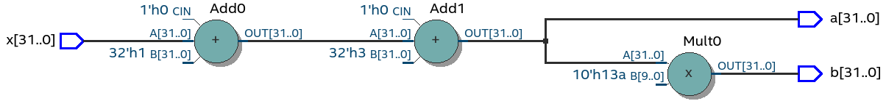
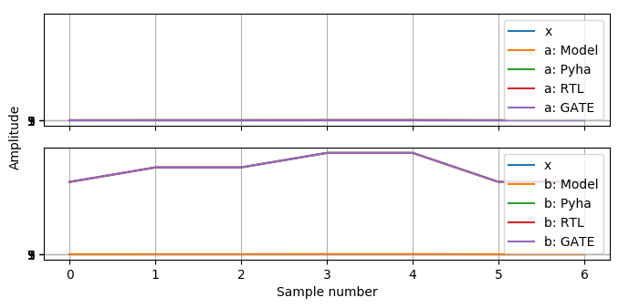
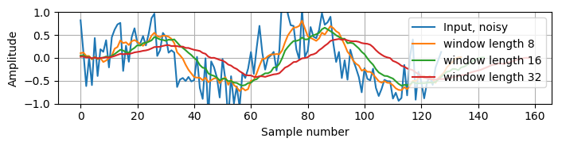
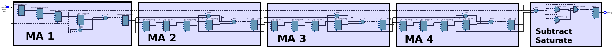

Introduction to hardware design with Pyha
=========================================

Thiw work tries to look the hardware desctiption process from the software developer side, shows differences.

This chapter shows how Pyha can be used to write digital hardware.

This chapter introduces the main contribution of this thesis, Pyha, that is a way of designing digital hardware using
Python programming language.

First part of this chapter gives an short introduction to the hardware design with Pyha. Just as Pyha tries to bring
software world practices to hardware world, i trie to write this chapter in readable way to software people.

This chapter is written in mind software developers that could start hardware programming, for that reason
many references and abstractsions are made.

The second half of this chapter shows off Pyha features for fixed point design, by gradually designing an FIR filter.

to cover:
    * Model
    * Clocking abstraction
    * Hardware is parallel, for is unrolled, comb example
    * Register needed for longer term state
    * Register adds delay
    * Register for pipelines and clock stuff
    * Sample based processing to block processing
    * Design reuse
    * Fixed point design?
    * Demonstrate multi-clock output?
    * Float conversions?
    * State machines
    * Multiply?
    * Show that __init__ can be used for any python code
    * Design flow, show unit tests..

Stateless design
----------------

Stateless is also called combinatory logic. In the sense of software we could think that a function is stateless
if it only uses local variables, has no side effects, returns are based on inputs only. That is, it may use
local variables of function but cannot use the class variables, as these are stateful.

This first chapter uses integer types only, as they are well understood by anyone and also fully synthesizable (to 32 bit logic).

Basic adder
~~~~~~~~~~~

Basic Pyha module is a Python class, that is derived from HW subclass. Simple adder with model implementaion is shown
on :numref:`adder-model`.

.. code-block:: python
    :caption: Simple adder model
    :name: pyha_adder

    class Adder(HW):
        def main(self, x):
            y = x + 1
            return y

        def model_main(self, xl):
            # for each element in xl add 1
            yl = [x + 1 for x in xl]
            return yl

.. note:: Pyha reserves the function name :code:`model_main` for defining the model and :code:`main` for the top
    level function. Designers may freely use other function names as pleased.

``model_main`` can contain any Python code, it is not to be synthesised. ``main`` is the function for synthesis.

:numref:`adder-model` shows the model implementation for the adder. The code loops over the input list 'xl' and adds 1 to each element.
Important thing to notice is that the model code works on lists, it takes input as list and outputs a list.

Key difference beteween the 'model_main' and 'main' is that the later works on singe samples while the model works
on lists, it is vectorized. This is big difference because model code has access to all the samples of the scope, while
main only has the single sample.

One of the key abstractions that Pyha uses is that the 'main' is called on each clock. One could imagine that
it is wrapped in a higher level for loop that continously supplies the samples.

Clock abstracted as forever running loop. In hardware determines how long time we need to wait before
next call to function so that all signals can propagate.

.. _adder_rtl:
.. figure:: ../examples/adder/img/add_rtl.png
    :align: center
    :figclass: align-center

    Synthesis result of :numref:`pyha_adder` (Intel Quartus RTL viewer)

Simulation and testing
^^^^^^^^^^^^^^^^^^^^^^

Pyha designs can be simulated in Python or VHDL domain. In addition, Pyha has integration to Intel Quartus software,
it supports running GATE level simulations, that is simulation of synthesized logic.

Pyha provides an ``simulate(dut, x)`` function, that uses ``x`` as input for module ``dut`` and runs all the
simulations, returning the outputs.

More information about this in the APPENDIX.

.. _adder_sim:
.. figure:: ../examples/adder/img/add_sim.png
    :align: center
    :figclass: align-center

    Simulation input and outputs

The :numref:`adder_sim` is plotted using the data from ``simulate`` function, as shown
all the simulations are equal.

Operations order
~~~~~~~~~~~~~~~~

Slightly more complex example is given on :numref:`pyha_adder_comp`. It features two outputs, note that the
``b`` output is dependent of ``a``.

.. code-block:: python
    :caption: Simple adder model
    :name: pyha_adder_comp

    ...
    def main(self, x):
        a = x + 1 + 3
        b = a + 2
        return a, b
    ...

.. _adder_multi_rtl:

    Synthesis result of :numref:`pyha_adder_comp` (Intel Quartus RTL viewer)

The :numref:`adder_multi_rtl` shows the RTL result. Now this RTL may be suprising for people coming from software
development.

The simplified CPU can be imagined to have only one adder, then the code above would take 3 cycles of this adder to execute.
Hardware approach however is that all the operations are done in parallel.

So in general, operations in software consume time, while hardware consumes resources, this is general rule. To be
correct in hardware there are also pipeline delays but these can be ignored at this point.
In software operations consume time, but in hardware they consume resources, general rule.
Also note that just like in software any operation has a price on the execution time, in hardware any operation has
a price in term on resource usage.

Simulation and testing
^^^^^^^^^^^^^^^^^^^^^^

Testing of the circuit is done on the same data as previous.

.. _add_multi_sim:

    Simulation result

Main idea to understand is that while the software and hardware approach do different thing, they result in
same output, so in that sense they are equal. Just the natural state of software is to execute stuff in sequence, while
hardware is parallel (tho, the order of operations still matter).

One huge upside of Pyha is that designs can be debugged, :numref:`add_multi_debug` shows a breakpoint that was
reached on the first input sample. It is better than conventional methods!

.. _add_multi_debug:
.. figure:: ../examples/adder/img/add_multi_debug.png
    :align: center
    :figclass: align-center

    Debugging using PyCharm (Python editor)

Control statements
~~~~~~~~~~~~~~~~~~

Control statements like if, for and function calls are fully usable in synthesizable code.

If statement
^^^^^^^^^^^^

.. code-block:: python
    :caption: Select add amount with if
    :name: pyha_if_code

    ...
    def main(self, x, condition):
        if condition == 0:
            y = x + 3
        else:
            y = x + 1
        return y
    ...

.. _if_rtl:
.. figure:: ../examples/control/img/if_rtl.png
    :align: center
    :figclass: align-center

    Synthesis result of :numref:`pyha_if_code` (Intel Quartus RTL viewer)

Note that in hardware the if clause is implemented with 'multiplexer' it select the signal path based on condition.
So if ``condition == 0`` then bottom signal path is routed to output. Interesting thing to note is that both of the
adders are constantly 'executing', even when not selected.

Simulating this designs gives equal output for Model, Pyha, RTL and GATE simulations.

Even so that the hardware vs software approach to implement this structude is quite differet, they end with equal
outputs.

For statement
^^^^^^^^^^^^^

Loop statement usage, like ``for``, is somewhat limited in hardware. Since as we have seen all the hardware will be
layed out, the for condition cannot be dynamci, it must be constant.

:numref:`pyha_for_code` gives an simple ``for`` example, that adds [0, 1, 2, 3] to the input signal.

.. code-block:: python
    :caption: For adder
    :name: pyha_for_code

    ...
    def main(self, x):
        y = x
        for i in range(4):
            y = y + i

        return y
    ...

.. _for_rtl:
.. figure:: ../examples/control/img/for_rtl.png
    :align: center
    :figclass: align-center

    Synthesis result of :numref:`pyha_for_code` (Intel Quartus RTL viewer)

All the loops in hardware get fully unrolled, that means :numref:`pyha_for_code` is equal to
:numref:`pyha_for_code_unrolled`. Also because of this the ``for`` condition must be constant.

.. code-block:: python
    :caption: Unrolled ``for``, equivalent to :numref:`pyha_for_code`
    :name: pyha_for_code_unrolled

    ...
    def main(self, x):
        y = x
        y = y + 0
        y = y + 1
        y = y + 2
        y = y + 3
        return y
    ...

Simulating this designs gives equal output for Model, Pyha, RTL and GATE simulations.

Function calls
^^^^^^^^^^^^^^

So far this paper has only used the ``main`` function to define logic. Generally ``main`` function is just the
top level function that is first called by ``simulation`` and conversion processes. Shows an example:

.. code-block:: python
    :caption: For adder
    :name: pyha_functions_code

    ...
    def adder(self, x, b):
        y = x + b
        return y

    def main(self, x):
        y = self.adder(x, 1)
        return y
    ...

The synthesys result of :numref:`pyha_functions_code` is just an adder,
there is no mark that a function call has been used, so basically one could assume that all functions are
inlined during the synthesys process.

.. warning:: There cannot be more than one function call per expression, this limitation may be lifted in the future.

Conclusions
~~~~~~~~~~~

Main takeaway from this chapter is that software approach works for defining stateless hardware. This chapter demonstrated
that the output of software solution and hardware synthesys is equal for many examples. Even so, the way hardware
solution arcieves the result is 'unexpected' for the software designer.

Major point to remember is that software cost time while everything in hardware cost resources.

In addition, this work showed how using Pyha enables fast testing of hardware designs by automatically running all
relavant simulations and enabling debug in Python domain.

Basic points:

    - Clock asbtaction
    - Everything costs in hardware
    - Debuggable
    - Sample based processing for model
    - Sample rate abstraction

Intoducing state
----------------

So far this chapter has dealt with designs that require no state, that is data moves in to the ``main``, some operation
is performed and data moves out. Nothing is saved nor is any history used.
So far we have dealt with designs that require no state other than the function level. In real designs we frequently need
to store some value, so that it is accessable by the next function call.

Often there is a need to keep track of some value, so that it would be usable in the next function call aswell.
This denotes that we need to keep track of some value for longer than just one function call.

In traditional programming, class variables are very similar to local variables. The difference is that
class variables can 'remember' the value, while local variables exist only during the function
execution.

Accumulator
~~~~~~~~~~~

For example, lets consider the design of accumulator, it operates by sequentially adding up all the input values.

This can be implemented with ``cumsum`` function:

.. code-block:: python
    :caption: Accumulator model
    :name: acc-model

    >>> x = [1, 2, 3, 4]
    >>> np.cumsum(x)
    array([ 1,  3,  6, 10])

Implemenation on :numref:`acc-model` depends on the fact that all of the input is known, this is not the case for
hardware designs. As shown in previous section, hardware designs get single sample on each execution.

For single sample based execution we would have to use class scope variable in order to save the accumulator value.

.. code-block:: python
    :caption: Accumulator
    :name: acc

    class Acc:
        def __init__(self):
            self.acc = 0

        def main(self, x):
            self.acc = self.acc + x
            return self.acc

Now, trying to run this would result in Pyha error, suggesting to change the ``self.acc`` to ``self.next.acc``.
After doing this, code is runnable.

.. _acc_rtl:
.. figure:: ../examples/accumulator/img/acc_rtl.png
    :align: center
    :figclass: align-center

    Synthesis result of :numref:`pyha_for_code` (Intel Quartus RTL viewer)

``rst_n`` signal can be used to set initial states for registers, in Pyha the initial value is determined by the
value assigned in ``__init__``, in this case it is 0.

Register
^^^^^^^^

Registers basically cannot be understuud at software level..they just make no sense, for that reason we have to
go a bit deeper just for a while.

Hardware registers have just one difference to class variables, the value assigned to them does not take
effect immediately, but rather on the next clock edge. That is the basic idea of registers, they take a new value
on clock edge. When the value is set at **this** clock edge, it will be taken on **next** clock edge.

Register is the defining object of digital designs. Think about the adder, two signals feeding in the adder may have
different propagation delay, meaning that for some time the output of the adder is in invalid state (also each
bit may have slightly different stuff, different delay for each bit), in fact is is
probably fluctiating between many random values. After some measurable time we can say that the adder output is stable.
Register is like a checkpoint between the signal flow path.

Register is object that allows to 'skip' the analog fluctuations.

Basically on FPGA all delays for every component and wire is known. So the synthesis process can place components and
registers in such way that it guarantees that register samples the 'clean' value.

All the registers in the design update at the same time.

    * call
    * set self.next.acc = 1
    * self.acc is still 0
    * next call self.acc is 1

.. note:: Pyha takes the register initial values from the value written in ``__init__``.

Clock abstraction
^^^^^^^^^^^^^^^^^

Trying to stay in the software world, we can abstract away the clock edge by thinking that it denotes the
call to the 'main' function. Meaning that registers take the assigned value on the next function call,
meaning assignment is delayed by one function call.

Anyways, living in the software world we can just think that registers are delayed class variables.

Testing
^^^^^^^

.. _acc_sim_delay:
.. figure:: ../examples/accumulator/img/acc_sim_delay.png
    :align: center
    :figclass: align-center

    Simulation of the accumulator (x is random integer [-5;5])

Running the same testing code results in a :numref:`acc_sim_delay`. It shows that while the
model simulation differs from the rest of simulations. This is the effect of added register,
it adds one delay to the harwdware simulations.

The delay can be determined by counting the registers on the input to output path.

This is an standard hardware behaviour. Pyha provides special variable
:code:`self._delay` that specifies the delay of the model, it is useful:

    - Document the delay of your blocks
    - Upper level blocks can use it to define their own delay
    - Pyha simulations will adjust for the delay, so you can easily compare to your model.

.. note:: Use :code:`self._delay` to match hardware delay against models

After setting the :code:`self._delay = 1` in the __init__, we get:

This does not 'fix' the delay, it just shifts the hardware simulation sample so that they match up with model,
the design is still delayed by 1.

.. _acc_sim:

    Simulation of the delay **compensated** accumulator (x is random integer [-5;5])

Block processing
~~~~~~~~~~~~~~~~

One very common task in real-life designs is to calculate results based not only the input samples but also some
history of samples. That is some form of block processing.

As an example imagine that we want to output the sum of last 4 inputs.

For this we need to keep track of the last 4 inputs. This can be solved by defining an list of register with 4 elements.

This can be done by just writing::

    self.memory = [0, 0, 0, 0]

Inside the ``main`` function we can write code that throws away last element of the list and adds the new sample,
this structure is also known as shift-register or delay-chain in the hardware world. Because it shifts the contents
on every cycle or delays the signal.

::

    self.next.memory = [x] + self.memory[:-1]

In Python ``[x]`` turns the sample into list, then ``+`` operator can be used to concat two lists. The ``[:-1]`` indexing
selects all the element, except the last one (denoted by -1).

After this we have a list that always contains the last 4 elements of input. Next we can add all the elements and
output the result.

.. code-block:: python
    :caption: Accumulator
    :name: block_adder

    class LastAcc(HW):
        def __init__(self):
            self.shr = [0, 0, 0, 0]
            self.y = 0

        def main(self, x):
            self.next.shr = [x] + self.shr[:-1]

            sum = 0
            for a in self.shr:
                sum = sum + a

            self.next.y = sum
            return self.y

        def model_main ...

Note that we also use output register as suggested.

.. _block_adder_rtl:
.. figure:: ../examples/block_adder/img/rtl.png
    :align: center
    :figclass: align-center

    Synthesis result of :numref:`block_adder` (Intel Quartus RTL viewer)

The :numref:`fake` shows that all the simulations are equal. Pyha runs automatically Model, Python, VHDL and GATE simulations.
Value of GATE level simulation is that sometimes software appraoch gives some other hardware, GATE shows that.

.. _block_adder_sim:
.. figure:: ../examples/block_adder/img/sim.png
    :align: center
    :figclass: align-center

    Simulation results

.. todo:: Actually hard to write model here..need to prepend data to take account hardware effects.

Pipelining
~~~~~~~~~~

In hardware class variables must be often used when we actually dont need to store anything, the need rises from
the need for clock speed.

The block adder built in last section is quite decent, in sense that it is following the digital design approach by
having all stuff between registers.

The synthesis result gives that the maximum clock rate for this design is ~170 Mhz.
Imagine that we want to make this design generic, that is make the summing window size easily changeable. Then we will
see problems, for example going from 4 to 6 changes the max clock speed to ~120 Mhz. Chaning it to 16 gives
already only ~60 Mhz max clock.

.. todo:: appendix for FPGA chip used

.. _rtl_6_critical:
.. figure:: ../examples/block_adder/img/rtl_6_critical.png
    :align: center
    :figclass: align-center

    Critical path RTL

In that sense, it is not a good design since reusing it hard.

The obious solution of adding registes between adder stages would not actually work, when delays come into play
stuff gets complicated!

.. todo:: CONFUSING!!! adding registers on adders WONT work, need to go transposed solution.

.. todo:: Arvan,et pipelining on liiga raske teema, parem loobuda sellest?

In general we expect all the signals to start from a register and end to a register. This is to avoid all the
analog gliches that go on during the transimission process.
The delay from one register to
other determines the maximum clock rate (how fast registers can update). The slowest register pair determines the
delay for the whole design, weakest link priciple.

While registers can be used as class storage in software designs, they are also used as checkpoints on the
signal paths, thus allowing high clock rates.

In Digital signal processing applications we have sampling rate, that is basically equal to the clock rate. Think that
for each input sample the 'main' function is called, that is for each sample the clock ticks.

Registers also used for pipelines.
Sometimes registers only used for delay.

This could have example on pipelining issues, like delay matching?

Pyha way is to register all the outputs, that way i can be assumed that all the inputs are already registered.

Every rule has exeception, for example delays on the feedback paths (data flows backward) are pure evil.

Pipelining is something that does not exist in software world.

Why bother with pipelining?
^^^^^^^^^^^^^^^^^^^^^^^^^^^

It determines the maximum samplerate for the design. In that sense, designs with low max sample rate are not easly
reusable, so pipelines mean reusability. Remember that hardware work on the weakest link principe, lowest clock rate
determines the whole clock rate for the design.

But why pipeline over lets say 20Mhz, thats the largest Wifiy band. One point is that it is just easier to
add register after each arithmetic operation, than to calculate in mind that maybe we can do 3 or 4 operations berofer
register.

Retiming?

Another point is clock TDA. Run the design on higher clock rate to save resources. Imagine Wify receiver for 20M band,
this has to have sample rate of 20M. But when we run it with say 100M we can push 4 different wify signals trough the same
circuit. That however depends on the synthesys tool ability to share common resources.

Negatives of pipelining is that the delay of the block is not constant in all configurations also pipelining increases
resource usage.

Also algorithm becomes more complex and harder to understand.

Abstraction and Design reuse
~~~~~~~~~~~~~~~~~~~~~~~~~~~~

Last section showed that designing even an simple algorithm in hardware can get very confusing as the registers
come into play.

Good thing about Object-oriented programming is that the complexity of the implementation can be hidden/ abstracted.

Here can list that Pyha has angle and abs for example?

Show instances and list of instances.
Do in fixed point?

Conclusion
~~~~~~~~~~

Class variables can be used in hardware, but they are delayed by one sample clock.

In digital design signals are assumed to exist between registers. Total delay between the registers determines the
maximum sample rate.

Delay of 1 seems like not an big deal, but really it very much is. In general big part of the hardware design is
fighting with bugs introduced by register delays, this is especially true for beginners. Delays can drasticly change
the operation of a circuit and what is even worse, they may not change the operation drasticly. Delay of one signal path
must be matched with delay of all sequnetial signal paths. Thats why it is important to always have a model and
unit tests, this is essential for hardware design.

In general when registers and delays come into play...everything gets very confusing and hard. Thats why it is important
to have an model, it also serves as an documentation.

In general the job of writing hardware is just taking in current register values and by using combinatory logic,
determine the next register values. This happens on every call.

In Pyha, registers are inferred from the ogject storage, that is everything defined in 'self' will be made registers.

Anyways, living in the software world we can just think that registers are delayed class variables.

Fixed-point designs
-------------------

So far only ``integer`` types have been used, in order to keep things simple and understandable.

In DSP applications we would like to rather use floating point numbers. As shown in previous chapter, every operation
in hardware takes resources and floating point calculations cost alot.

While floating point numbers are usable in hardware, it is common approach to use fixed-point arithmetic
instead. They work as integer arithmetic, they can also be mapped to DSP blocks that come with FPGAs.

.. todo:: some short intro to fixed point, move most to appendix

Pyha can convert floating point models to VHDL, and may run simulations up to the GATE level. That is useful as all the
register effect can be handled before the fixed point conversion. Only when delay effects have been analyzed can the
design be converted to fixed point.

Lets consider converting the moving-window adder to fixed-point implementation.

Pyha assumes inputs are normalized to -1 to 1.

Conversion to fixed point requires changes only in the ``__init__`` function.

.. code-block:: python
    :caption: Accumulator
    :name: Sfix block adder

    def __init__(self, window_size):
        self.shr = [Sfix()] * window_size
        self.sum = Sfix(left=0)

The first line denotest that the shift-register shall be holding ``Sfix`` elements instead of ``integers``.
Note that it does not define the fixed-point bounds, meaning it will store 'whatever' is assigned to it, it is
kind of lazy stuff.

For the ``self.sum`` we have used another lazy statement of ``Sfix(left=0)``, this means that the integer bits
are forced to 0 bits on every assign, that is value is saturated if larger.

.. _rtl_sfix_saturate:
.. figure:: ../examples/block_adder/img/rtl_sfix_saturate.png
    :align: center
    :figclass: align-center

    RTL with saturation logic

Saturation logic prevents the wraparound behaviour by forcing the maximum or negative value when
out of fixed point format. Otherwise the RTL is similiar to the ones we had with integers, now signals
have bounds.

.. _fix_sat_wrap:
.. figure:: ../examples/block_adder/img/fix_sat_wrap.png
    :align: center
    :figclass: align-center

    Wrap vs Saturate

Example: Moving average filter
~~~~~~~~~~~~~~~~~~~~~~~~~~~~~~

The moving average is the most common filter in DSP, mainly because it is the easiest digital
filter to understand and use.  In spite of its simplicity, the moving average filter is
optimal for a common task: reducing random noise while retaining a sharp step response.  This makes it the
premier filter for time domain encoded signals. :cite:`dspbook`

Moving averager is implemented by running an sliding window over the data. The contents of the window are added
and divided by the window length. :numref:`mavg_example` gives an example.

.. code-block:: python
    :caption: Moving average example, window size is 4
    :name: mavg_example

    x = [0.1, 0.2, 0.3, 0.4, 0.5, 0.6]
    y[0] = (x[0] + x[1] + x[2] + x[3]) / 4
    y[1] = (x[1] + x[2] + x[3] + x[4]) / 4
    y[2] = (x[2] + x[3] + x[4] + x[5]) / 4

We have already implemented the sliding sum part of the algorithm, only thing to add is division by the window length.
The division can be implemented by shift right if divisor is power of two. That is good enough, another approach is to use
1/4.

.. code-block:: python
    :caption: Moving average implementation
    :name: mavg-pyha
    :linenos:

    class MovingAverage(HW):
        def __init__(self, window_len):
            self.window_len = window_len

            self.shr = [Sfix()] * self.window_len
            self.sum = Sfix(0, 0, -17, overflow_style=fixed_wrap)

            self.window_pow = Const(int(np.log2(window_len)))

            self._delay = 1

        def main(self, x):
            div = x >> self.window_pow

            self.next.shr = [div] + self.shr[:-1]
            self.next.sum = self.sum + div - self.shr[-1]
            return self.sum

:numref:`mavg-pyha` shows the implementation. It has added two new lines to the sliding adder block. The
``self.window_pow`` calculates power of 2 value from the window length, this is used to indicate shift bits.

.. _mavg_rtl:
.. figure:: ../examples/moving_average/img/mavg_rtl.png
    :align: center
    :figclass: align-center

    RTL view of moving average (Intel Quartus RTL viewer)

:numref:`mavg_rtl` shows the synthesized result of this work.

Synhesizing with Quartus gave following resorce usage:

    - Total logic elements: 94 / 39,600 ( < 1 % )
    - Total memory bits:    54 / 1,161,216 ( < 1 % )
    - Embedded multipliers: 0 / 232 ( 0 % )

In additon, maximum reported clock speed is 222 MHz, that is over the 200 MHz limit of Cyclone IV device :cite:`cycloneiv`.

.. _moving_average_noise:

    Example of moving averager as noise reduction

As shown on :numref:`moving_average_noise`, moving average is a good noise reduction algorithm.
Increasing the averaging window reduces more noise but also increases the complexity and delay of
the system (moving average is a special case of FIR filter, same delay semantics apply).

.. _mavg_freqz:
.. figure:: ../examples/moving_average/img/moving_average_freqz.png
    :align: center
    :figclass: align-center

    Frequency response of moving average filter

:numref:`mavg_freqz` shows that the moving average algorithm acts basically as a low-pass
filter in the frequency domain. Passband width and stopband attenuation are controlled by the
moving averages length. Note that when taps number get high, then moving average basically returns
the DC offset of a signal.

.. _mavg_matched:
.. figure:: ../examples/moving_average/img/moving_average_matched.png
    :align: center
    :figclass: align-center

    Moving average as matched filter

In addition, moving average is also an optimal solution for performing matched filtering of
rectangular pulses :cite:`dspbook`.  On :numref:`mavg_matched` (a) digital signal is corrupted
with noise, by using moving average with length equal to the signal samples per symbol, enables to
recover the signal and send it to sampler (b).

Example: Linear-phase DC removal Filter
~~~~~~~~~~~~~~~~~~~~~~~~~~~~~~~~~~~~~~~

Direct conversion (homodyne or zero-IF) receivers have become very popular recently especially in the realm of
software defined radio. There are many benefits to direct conversion receivers,
but there are also some serious drawbacks, the largest being DC offset and IQ imbalances :cite:`bladerfdoc`.

In frequency domain, DC offset will look like a peak near the 0 Hz. In time domain, it manifests as a constant
component on the hermonic signal.

In :cite:`dcremoval_lyons`, Rick Lyons investigates the feasibility of using moving average algorithm as a DC removal
circuit by subtracting the MA output from the input signal. This structure works but has a passband ripple of up to
3 dB. In his work Rick shows that by cascading multiple stages of MA's the ripple can be reduced (:numref:`dc_freqz`).

.. _dc_freqz:
.. figure:: ../examples/dc_removal/img/dc_freqz.png
    :align: center
    :figclass: align-center

    Frequency response of DC removal circuit with MA length 8

Implementation is rather straight forward, algorithm must chain multiple MAs and then subtract the result from input.

.. code-block:: python
    :caption: Generic DC-Removal implementation
    :name: dc_removal

    class DCRemoval(HW):
        def __init__(self, window_len, cascades):
            self.mavg = [MovingAverage(window_len) for _ in range(cascades)]
            self.y = Sfix(0, 0, -17)

            self._delay = 1 + self.mavg[0]._delay * cascades

        def main(self, x):
            tmp = x
            for mav in self.mavg:
                tmp = mav.main(tmp)

            self.next.y = x - tmp
            return self.y

:numref:`dc_removal` shows the Python implementation. Class is parametrized so that count of MA and the
window length can be changed.

One thing to note that the :code:`model_main` and :code:`main` are nearly identical. That shows that Pyha has archived
one of the goals by simplifying hardware design portion.

.. _dc_rtl_annotated:

    Synthesis result of ``DCRemoval(window_len=4, cascades=4)`` (Intel Quartus RTL viewer)

This implementation is not exactly following the one in :cite:`dcremoval_lyons`. They suggest to delay match the
MA outputs and input signal, but since we can assume the DC component to be constant, it does not matter.

Note that in real-life design we would use this component with much larger ``window_len``, currently 4 was chosen
in order to get plottable RTL. As shown in MA chapter, longer ``window_len`` gives narrower filter.

..
    Total logic elements	204 / 39,600 ( < 1 % )
    Total memory bits	144 / 1,161,216 ( < 1 % )
    Max clock speed ~200 MHz
    Signal delay: 1 sample

..
    Total logic elements	251 / 39,600 ( < 1 % )
    Total memory bits	10,150 / 1,161,216 ( < 1 % )
    Max clock speed ~200 MHz
    Signal delay: 1 sample

.. _dc_comp:
.. figure:: ../examples/dc_removal/img/dc_comp.png
    :align: center
    :figclass: align-center

    4 vs 256

Going from 4 to 256 only increases the memory usage of FPGA, still it is below 1%.

Conclusion
~~~~~~~~~~

While fixed-point designs require some extra efforts, Pyha provides reasonably easy way for conversion.
Lazy init helps, auto conversion possible in future.

.. todo:: show high level design, with fsk receiver, can we just connect the blocks? use inspectrum and real remote signal?
    Ease of reuse..even if we suck at hardware design!

Proposed design flow
--------------------

This text has built the examples in what way, but actually the optimal design flow should go as this:

    * make model
    * extract unit tests, same can be reused for hw sims
    * make hw using floats, handle register effects
    * convert to fixed point
    * unit tests pass? profit!

Siin võiks olla mingi figure?

Conclusion
----------

Easy to use OOP, abstraction.

This chapter showed how Python OOP code can be converted into VHDL OOP code.

It is clear that Pyha provides many conveneince functions to greatly simplyfy the testing of
model based designs.

The initial goal of Pyha was to test ou how well could the software approach apply to the hardware world. As this
thesis shows that it is working well, the generated hardware output is unexpected to software people but resulting
output is the same. Pyha is an exploratory project, many things work and ca be done but still much improvements are needed
for example, inclusion of bus models like Wishbone, Avalon, AXI etc. Also currently Pyha works on single clock designs,
while its ok because mostly today desings are just many single clock designs connected with buses.

Future stuff:
Make it easier to use, windows build?