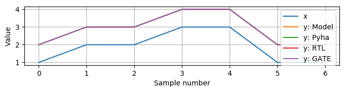
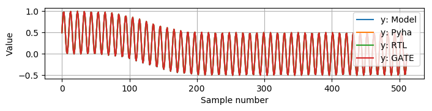

Hardware design with Pyha
=========================

This chapter introduces the main contribution of this thesis, Pyha - tool to design digital hardware in Python.

Pyha proposes to program hardware in same way as software is programmed, for that reason much of the efforts
of this chapter is to show to what hardware Pyha constructs maps.

First half of this chapter gives introduction to the generic hardware components. Note that the conversion to VHDL
is considered in the next chapter. Examples in the first half operate on the integer data type, to keep stuff
simple.

Second half of this chapter shows how Pyha can be used to implement fixed-point DSP systems, examples are
developed for moving-average filter and linar-phase-dc-removal.

All the examples presented in this chapter can be found online HERE, these include all the Python sources, unit-tests,
VHDL conversion files and Quartus project for synthesis.


Introduction
------------

Pyha follows the object-oriented design paradigm. Basic design unit is an Python class,
that is derived from HW subclass (to inherit hardware related functionality).

Pyha encourages the model based design flow, where model is the non-synthesisable code for simples possible
implementation. Most often the model is implemented with a call to Numpy or Scipy library, for DSP systems.
Helps testing

:numref:`pyha_adder` shows the implementation of simple circtuit that adds 1 to each input. Pyha reserves
the ``model_main`` functoon for defining the model and ``main`` as the toplevel for synthesis. Note that the
``model_main`` is completely ignored for synthesis.

.. todo:: init can have any code?

.. code-block:: python
    :caption: Simple adder, implemented in Pyha
    :name: pyha_adder

    class Adder(HW):
        def __init__(self, coef)
            self.coef = coef

        def main(self, x):
            y = x + self.coef
            return y

        def model_main(self, xl):
            # for each element in xl add 1
            yl = [x + self.coef for x in xl]
            return yl

The ``__init__`` part of the class can be used to run any Python code, all the class variables will be interpreted
as hardware registers and the values assigned in ``__init__`` as reset values.

In Pyha all class variables are interpreted as hardware registers. The ``__init__`` function may contain any Python code
to evaluate reset values for registers.

Note that the model implementation takes in a list of inputs wile the synthesisable code works with single sample
input, as is in hardware. Model code can be that way easily vectorized.

.. note:: All the examples in this chapter include the model implementation but most of them are not included in future
    code listings, that is to focus more on the hardware side of things.


Simulation and testing
~~~~~~~~~~~~~~~~~~~~~~

Pyha designs can be simulated in Python or VHDL domain. In addition, Pyha has integration to Intel Quartus software,
it supports running GATE level simulations (simulation of synthesized logic).

Pyha provides functions to automatically run all the simulations on the set of input data. :numref:`pyha_adder_test`
shows an example unit test for the 'adder' module.

.. code-block:: python
    :caption: Adder tester
    :name: pyha_adder_test

    x =      [1, 2, 2, 3, 3, 1, 1]
    expect = [2, 3, 3, 4, 4, 2, 2]

    dut = Adder()
    assert_simulation(dut, expect, x)

The ``assert_simulation(dut, expect, x)`` runs all the simulations (Model, Pyha, RTL and GATE)
and asserts the results equal the ``expexct``.


In addition there is a function ``simulations(dut, x)`` that returns all the outputs of different simulations, this
can be used to plot the results, as shown on :numref:`adder_sim`, all the simulations are equal.

.. _adder_sim:


    Simulation input and outputs


More information about the simulation functions can be found in the APPENDIX.


Synthesis
~~~~~~~~~

Running the GATE simulations require synthesis of the design. For this Pyha integrates to the Intel Quartus
software.

The synthesis target device is EP4CE40F23C8N, of Cyclone IV family. This is the same FPGA that powers the latest
LimeSDR chip and the BladeRF board.

In general it is a low cost FPGA with following features :cite:`cycloneiv`:

    - 39,600 logic elements
    - 1,134Kbits embedded memory
    - 116 embedded 18x18 multipliers
    - 4 PLLs
    - 200 MHz maximum clock speed

One useful tool in Quartus software is RTL viewer, it can be opened from ``Tools->Netlist viewers->RTL viewer``.
RTL viewer is useful to inspect the hardware synthesised for the Pyha design, this chapter uses it extensively.

.. _adder_rtl:


    RTL of the adder circuit

:numref:`adder_rtl` shows the RTL of the adder circuit. Notice that the integer types were synthesised to
32 bit logic ([31..0] is the signal width).

Design flow
~~~~~~~~~~~

General desing flow for Pyha designs is first to define the model code by preferably using some higher level library
like Numpy (numerical computing) or Scipy (scientific package). Then write unit tests that assert the required
performance requirements. For unit tests use the Pyha ``simulate`` functions so that the same tests can be later
run on hardware models.

Next step is to implement the synthesizable code, this step is greatly simplified if enough unit tests were already
collected while developing the model.

.. todo:: fixed point?

That is model based development with test-driven approach.

.. note:: While this is the best way to design, rest of this document does not follow it in order to keep stuff
    simple. Following text rather gets fast into the hardware part and tends to ignore the model and unit-testing
    part.


Stateless designs
-----------------

Designs that don't contain any memory elements can be considered stateless. In hardware world this is also known as
combinotary logic. In software world, this can be understood as an function that only uses local variables,
using class variables would introduce state.


Basic operations
~~~~~~~~~~~~~~~~

:numref:`pyha_adder_comp` shows the Pyha design, featuring circuit with one input and two outputs. Note that the
``b`` output is dependent of ``a``.

.. code-block:: python
    :caption: Basic stateless operations
    :name: pyha_adder_comp

    class Basic(HW):
        def main(self, x):
            a = x + 1 + 3
            b = a * 314
            return a, b

The :numref:`adder_multi_rtl` shows the RTL result. Note that each adder is an actual resource used in the FPGA
fabric. The ``a`` output is formed by running the ``x`` signal trough two adders (one adding 1 and next 3). The
``b`` has extra multiplier on signal path.

.. _adder_multi_rtl:
.. figure:: ../examples/adder/img/add_multi_rtl.png
    :align: center
    :figclass: align-center

    Synthesis result of :numref:`pyha_adder_comp` (Intel Quartus RTL viewer)


This example shows that in hardware operations have a price in terms of resource usage.
This is a big difference to software, where operations cost execution time.

Sharing the hardware resources is possible by using state-machines, but this quickly rises the design complexity.

All the simulations for this designs result in same output.
Key idea to understand is that while the software and hardware execute the ``main`` function in
different ways, they result in same output, so in that sense they are equal.


Huge upside of Pyha is that designs can be debugged, the 'Pyha' simulations just runs the ``main`` function
so all kinds of Python tools can be used.
:numref:`add_multi_debug` shows a debugging session on the :numref:`pyha_adder_comp` code. Using Python tools
for debugging can greatly increase the designers productivity.

.. _add_multi_debug:
.. figure:: ../examples/adder/img/add_multi_debug.png
    :align: center
    :figclass: align-center

    Debugging using PyCharm (Python editor)


Conditional statements
~~~~~~~~~~~~~~~~~~~~~~

Main conditional statement in Python is ``if``, it can be combined with ``elif`` and ``else``. All
of these are convertible to hardware. :numref:`pyha_if_code` shows an example of basic ``if else`` statement.

.. code-block:: python
    :caption: Select add amount with if
    :name: pyha_if_code

    class If(HW):
        def main(self, x, condition):
            if condition == 0:
                y = x + 3
            else:
                y = x + 1
            return y


.. _if_rtl:
.. figure:: ../examples/control/img/if_rtl.png
    :align: center
    :figclass: align-center

    Synthesis result of :numref:`pyha_if_code` (Intel Quartus RTL viewer)

In hardware the ``if`` clause is implemented with 'multiplexer'.
It works by, based on condition, routing one of the inputs to the output.
For example if ``condition == 0`` then bottom signal path is routed to output.
Interesting thing to note is that both of the adders are constantly 'executing', just one of the result is thrown away.

All the simulations for this design give equal outputs. Once again, it is worth noting that software and hardware
implementation give equal outputs.


Loop statements
~~~~~~~~~~~~~~~

All the loop statements will be unrolled in hardware, this requires that the loop control statement cannot
be dynamic.

:numref:`pyha_for_code` shows an simple ``for`` example, that adds [0, 1, 2, 3] to the input signal.

.. code-block:: python
    :caption: ``for`` example
    :name: pyha_for_code

    class For(HW):
        def main(self, x):
            y = x
            for i in range(4):
                y = y + i

            return y

.. _for_rtl:
.. figure:: ../examples/control/img/for_rtl.png
    :align: center
    :figclass: align-center

    Synthesis result of :numref:`pyha_for_code` (Intel Quartus RTL viewer)

The RTL may make more sense if we consider the unrolled version of the :numref:`pyha_for_code`, shown on
:numref:`pyha_for_code_unrolled`.

.. code-block:: python
    :caption: Unrolled ``for``, equivalent to :numref:`pyha_for_code`
    :name: pyha_for_code_unrolled

    y = x
    y = y + 0
    y = y + 1
    y = y + 2
    y = y + 3

As expected, software and hardware simulations give equal results.


Function calls
~~~~~~~~~~~~~~

So far only the ``main`` function has been used to define logic. in Pyha ``main`` function is just the
top level function that is first called by simulation and conversion processes. Other functions can be
freely be defined and called.

.. code-block:: python
    :caption: For adder
    :name: pyha_functions_code

    class Functions(HW):
        def adder(self, x, b):
            y = x + b
            return y

        def main(self, x):
            y = self.adder(x, 1)
            return y

The synthesis result of :numref:`pyha_functions_code` is just an adder,
there is no indication that a function call has been used, one can assume that all functions are
inlined during the synthesis process.

Note that calling the function multiple times would infer parallel hardware.

..
    .. warning:: There cannot be more than one function call per expression, this limitation may be lifted in the future.


Conclusions
~~~~~~~~~~~

This chapter has demonstrated that many of the software world constructs can be mapped to the hardware and
the outputs of the software and hardware simulations are equal. Some limitations exsist,
for example the ``for`` loop must be unrollable in order to use in hardware.

Major point to remember is that every statement converted to hardware costs resources. This is different to the
software world where statements instead cost execution time.


Designs with memory
-------------------

So far all the designs presented have been stateless or in other words without memory. Often there is a need
to store some value so that it would be usable by the next function call, this indicates that the design
must contain memory elements.

This chapter gives overview of memory based designs in Pyha.

In software programming, class variables are the main method of saving the some information from function call to another.


Accumulator and registers
~~~~~~~~~~~~~~~~~~~~~~~~~

For example, lets consider the design of accumulator, it operates by sequentially adding up all the input values.

.. code-block:: python
    :caption: Accumulator
    :name: acc
    :linenos:

    class Acc:
        def __init__(self):
            self.acc = 0

        def main(self, x):
            self.acc = self.acc + x
            return self.acc

Now, trying to run this would result in Pyha error, suggesting to change the line 6 to to ``self.next.acc = ...``.
After this code is runnable, reasons for this modification are explained shortly.

Synthesis result shown on the :numref:`acc_rtl` features an new element known as register.

.. _acc_rtl:


    Synthesis result of :numref:`pyha_for_code` (Intel Quartus RTL viewer)


Register
^^^^^^^^

Register is an hardware memory component, it samples the input signal ``D`` on the edge of the  ``CLK`` signal. In
that sense it acts like a buffer.

One of the new signals on the RTL figure is ``clk``, that is a clock signal that instructs the registers
to update the saved value (``D``).

In hardware clock is a mean of synchronizing the registers, thus allowing accurate timing analsys that allows
placing the components on the FPGA fabric in such way that all the analog transients happen **between** the clock
edges, thus the registers are guaranteed to sample the clean and correct signal.

Registers have one difference to software class variables, the value assigned to them does not take
effect immediately, but rather on the next clock edge.
When the value is set at **this** clock edge, it will be taken on **next** clock edge.

Pyha tries to stay in the software world, so the clock signal can be abstracted away
by thinking that it denotes the call to the 'main' function. Meaning that registers update their value on
every call to ``main`` (just before the call).

Think that the ``main`` function is started with the **current** register values known and the objective of
the ``main`` function is to find the **next** values for the registers.

In DSP systems one important variable is sample rate. In hardware the maximum clock rate and sample rate are
basically the same thing.
In Digital signal processing applications we have sampling rate, that is basically equal to the clock rate. Think that
for each input sample the 'main' function is called, that is for each sample the clock ticks.

Note that the way how the hardware is designed determines the maximum clock rate it can run off. So if we do
a bad job we may have to work with low sample rate designs. This is determined by the worst critical path.

Pyha way is to register all the outputs, that way i can be assumed that all the inputs are already registered.

``rst_n`` signal can be used to set initial states for registers, in Pyha the initial value is determined by the
value assigned in ``__init__``, in this case it is 0.


Testing
^^^^^^^

Running the same testing code results in a :numref:`acc_sim_delay`. It shows that the **model** simulation differs
from the rest of the simulations. It is visible that the hardware related simulations are **delayed by 1**.
This is the side-effect of the hardware registers, each register on the signal path adds one sample delay.

.. _acc_sim_delay:
.. figure:: ../examples/accumulator/img/acc_sim_delay.png
    :align: center
    :figclass: align-center

    Simulation of the accumulator (x is random integer [-5;5])

Pyha provides an :code:`self._delay` variable, that hardware classes can use to specify their delay.
Simulation functions can read this variable and compensate the simulation data so that the delay is compensated, that
eases the design of unit-tests.

All the simulations match in output (:numref:`acc_sim`), after setting the :code:`self._delay = 1` in the ``__init__``.

.. _acc_sim:
.. figure:: ../examples/accumulator/img/acc_sim.png
    :align: center
    :figclass: align-center

    Simulation of the delay **compensated** accumulator (x is random integer [-5;5])


Block processing and sliding adder
~~~~~~~~~~~~~~~~~~~~~~~~~~~~~~~~~~

One very common task in DSP designs is to calculate results based on some number of input samples (block processing).
Currently the ``main`` function has worked with the single input sample,
this can now be changed by keeping the history with registers.

Consider an algorithm that adds the last 4 inputs. :numref:`block_adder` shows an implementation that keeps
track of the last 4 inputs and sums them. Note that
the design also uses the output register ``y``.

.. code-block:: python
    :caption: Sliding adder algorithm
    :name: block_adder

    class SlidingAdder(HW):
        def __init__(self):
            self.shr = [0, 0, 0, 0] # list of registers
            self.y = 0

        def main(self, x):
            # add new 'x' to list, throw away last element
            self.next.shr = [x] + self.shr[:-1]

            # add all element in the list
            sum = 0
            for a in self.shr:
                sum = sum + a

            self.next.y = sum
            return self.y

The ``self.next.shr = [x] + self.shr[:-1]`` line is also known as an 'shift register', because on every call
shifts the list contents right and adds new ``x`` as the first element. Sometimes the same structure is used as an
delay-chain, because the sample ``x`` takes 4 updates to travel from ``shr[0]`` to ``shr[3]``.
This is a very common element in hardware DSP designs.

:numref:`block_adder_rtl` shows the RTL for this design, as expected the ``for``

.. _block_adder_rtl:
.. figure:: ../examples/block_adder/img/rtl.png
    :align: center
    :figclass: align-center

    Synthesis result of :numref:`block_adder` (Intel Quartus RTL viewer)


Optimizing the design
^^^^^^^^^^^^^^^^^^^^^

This desing can be made generic by chaning the ``__init__`` function to take the window length as a parameter
(:numref:`block_adder_generic`).

.. code-block:: python
    :caption: Generic sliding adder
    :name: block_adder_generic

    class SlidingAdder(HW):
        def __init__(self, window_len):
            self.shr = [0] * window_len
        ...


Problem with this design is that it starts using more resources as the ``window_len`` gets larger as every
stage requires an separate adder. Another problem is that the critical path gets longer decreasing the
clock rate. For example, the design with ``window_len=4`` synthesises to maximum clock of
170 MHz, while ``window_len=6`` to only 120 MHz.

.. _rtl_6_critical:
.. figure:: ../examples/block_adder/img/rtl_6_critical.png
    :align: center
    :figclass: align-center

    RTL of ``window_len=6``, red line is critical path (Intel Quartus RTL viewer)


In that sense it can be considered a bad design, as it is hard to reuse.
Conveniently, the algorithm can be optimized to use only 2 adders, no matter the window length.
:numref:`slider_optim` shows that instead of summing all the elements, the overlapping part of
previous calculation can be used to significantly optimize the algorithm.

.. code-block:: python
    :caption: Accumulator
    :name: slider_optim

    y[4] = x[4] + x[5] + x[6] + x[7] + x[8] + x[9]
    y[5] =        x[5] + x[6] + x[7] + x[8] + x[9] + x[10]
    y[6] =               x[6] + x[7] + x[8] + x[9] + x[10] + x[11]

    # reusing overlapping parts implementation
    y[5] = y[4] + x[10] - x[4]
    y[6] = y[5] + x[11] - x[5]

:numref:`optimal_adder` gives the implementation of optimal sliding adder, it features new register ``sum`` that keeps
track of the previous output. Note that the ``shr`` stayed the same, but is now rather used as a delay-chain.

.. code-block:: python
    :caption: Optimal sliding adder
    :name: optimal_adder

    class OptimalSlideAdd(HW):
        def __init__(self, window_len):
            self.shr = [0] * window_len
            self.sum = 0

            self._delay = 1

        def main(self, x):
            self.next.shr = [x] + self.shr[:-1]

            self.next.sum = self.sum + x - self.shr[-1]
            return self.sum
        ...


:numref:`rtl_optimal_int_critical` shows the synthesis result, as expected, critical path is 2 adders.

.. _rtl_optimal_int_critical:
.. figure:: ../examples/block_adder/img/rtl_optimal_int_critical.png
    :align: center
    :figclass: align-center

    Synthesis result of :numref:`block_adder`, ``window_len=4`` (Intel Quartus RTL viewer)

Simulations results(:numref:`block_adder_sim`) show that the hardware desing behaves exactly as the software model.
Note that the class has ``self._delay=1`` to compensate for the register delay.

.. _block_adder_sim:
.. figure:: ../examples/block_adder/img/sim.png
    :align: center
    :figclass: align-center

    Simulation results for ``OptimalSlideAdd(window_len=4)``


Conclusion
~~~~~~~~~~

In Pyha all class variables are interpreted as hardware registers. The ``__init__`` function may contain any Python code
to evaluate reset values for registers.

Key difference between software and hardware approach is that hardware registers have **delayed assignment**,
they must be assigned to ``self.next``.

The delay introduced by the registers may drastically change the algorithm,
thats why it is important to always have a model and unit tests, before starting hardware implementation.
Model delay can be specified by ``self._delay`` attribute, this helps the simulation functions to compensate for the delay.

Registers are also used to shorten the critical path or logic elements, thus allowing higher clock rate. It is encouraged
to register all the outputs of Pyha designs.


Fixed-point designs
-------------------

Examples on the previous chapters have used only the ``integer`` type, in order to simplify the designs.

DSP algorithms are described using floating point numbers. As shown in previous sections, every operation
in hardware takes resources and floating point calculations cost greatly. For that reason, in hardware world
it is more common to use fixed-point arithmetic instead.

Fixed-point arithmetic is in nature equal to integer arithmetic and thus can use the DSP blocks that
come with many FPGAs (some high-end FPGAs have also floating point DSP blocks :cite:`arria_dsp`).

Basics
~~~~~~

Pyha defines ``Sfix`` for FP objects, it is an signed number.
It works by defining bits designated for ``left`` and ``right``
of the decimal point. For example ``Sfix(0.3424, left=0, right=-17)`` has 0 bits for integer part
and 17 bits for fractional part. :numref:`fp_basics` shows some examples.
more information about the fixed point
type is given on APPENDIX.

.. todo:: Add more information about fixed point stuff to the appendix

.. code-block:: python
    :caption: Fixed point precision
    :name: fp_basics

    >>> Sfix(0.3424, left=0, right=-17)
    0.34239959716796875 [0:-17]
    >>> Sfix(0.3424, left=0, right=-7)
    0.34375 [0:-7]
    >>> Sfix(0.3424, left=0, right=-4)
    0.3125 [0:-4]

Default FP type in Pyha is ``Sfix(left=0, right=-17)``, it represents numbers between [-1;1] with
resolution of 0.000007629. This format is chosen because it fits into common FPGA DPS blocks
(18 bit signals :cite:`cycloneiv`)
and it can represent normalized numbers.

General recommendation is to keep all the inputs and outputs of the block in the default type.


Fixed-point sliding adder
~~~~~~~~~~~~~~~~~~~~~~~~~

Consider converting the sliding window adder to FP implementation. This
requires changes only in the ``__init__`` function (:numref:`fp_sliding_adder`).

.. code-block:: python
    :caption: Fixed-point sliding adder
    :name: fp_sliding_adder

    def __init__(self, window_size):
        self.shr = [Sfix()] * window_size
        self.sum = Sfix(left=0)
    ...

First line sets ``self.mem`` to store ``Sfix()`` elements. Notice that it does not define the
fixed-point bounds, meaning it will store 'whatever' is assigned to it. Final bounds are determined during simulation.

The ``self.sum`` register uses another lazy statement of ``Sfix(left=0)``, meaning that the integer bits
are forced to 0 bits on every assign to this register. Fractional part is left openly determined during simulation.
Rest of the code is identical to the 'integer' version.


Synthesis results are shown on :numref:`rtl_sfix_saturate`. In general the RTL looks familiar to the version
that used ``integer`` types. First noticable change is that the signals are now 18 bits wide due to the
default FP type. Second big addition is the saturation logic, which prevents the wraparound behaviour by
forcing the maximum or negative value when out of fixed point format. Saturation logic is by default enabled for
FP types.


.. _rtl_sfix_saturate:
.. figure:: ../examples/block_adder/img/rtl_sfix_saturate.png
    :align: center
    :figclass: align-center

    RTL with saturation logic (Intel Quartus RTL viewer)


:numref:`fix_sat_wrap` plots the simulation results.
Notice that the hardware simulations are bounded to [-1;1] range by the saturation logic, that is why the model
simulation is different at some parts.

.. _fix_sat_wrap:


    Simulation results of FP sliding sum

Simulation functions can automatically convert 'floating-point' inputs to default FP type. In same manner,
FP outputs are converted to floating point numbers. That way designer does not have to deal with FP numbers
in unit-testing code. Example is given on :numref:`fp_test`.

.. code-block:: python
    :caption: Test fixed-point design with floating-point numbers
    :name: fp_test

    dut = OptimalSlidingAddFix(window_len=4)
    x = np.random.uniform(-0.5, 0.5, 64)
    y = simulate(dut, x)
    # plotting code ...


Moving average filter
~~~~~~~~~~~~~~~~~~~~~


The moving average (MA) is the most common filter in DSP, mainly because it is the easiest digital
filter to understand and use.  In spite of its simplicity, the moving average filter is
optimal for a common task: reducing random noise while retaining a sharp step response.  This makes it the
premier filter for time domain encoded signals :cite:`dspbook`.

:numref:`moving_average_noise` shows that MA is an good algorithm for noise reduction.
Increasing the window length reduces more noise but also increases the complexity and delay of
the system (MA is a special case of FIR filter, same delay semantics apply).

.. _moving_average_noise:
.. figure:: ../examples/moving_average/img/moving_average_noise.png
    :align: center
    :figclass: align-center

    MA algorithm in removing noise

Good noise reduction performance can be explained by the frequency response of MA (:numref:`mavg_freqz`),
showing that it is a low-pass filter. Passband width and stopband attenuation are controlled by the
window length.

.. _mavg_freqz:
.. figure:: ../examples/moving_average/img/moving_average_freqz.png
    :align: center
    :figclass: align-center

    Frequency response of MA filter


Implementation in Pyha
^^^^^^^^^^^^^^^^^^^^^^

MA is implemented by using an sliding sum, that is divided by the sliding window length.
Sliding sum part has already been implemented in previous chapter.
The division can be implemented by shift right if divisor is power of two.

In addition, division can be performed on each sample instead of on the sum, that is ``(a + b) / c = a/c + b/c``.
Doing this guarantees that the ``sum`` variable is always in [-1;1] range, thus the saturation logic can be removed.

.. code-block:: python
    :caption: MA implementation in Pyha
    :name: mavg-pyha
    :linenos:

    class MovingAverage(HW):
        def __init__(self, window_len):
            self.window_pow = Const(int(np.log2(window_len)))

            self.mem = [Sfix()] * window_len
            self.sum = Sfix(0, 0, -17, overflow_style=fixed_wrap)
            self._delay = 1

        def main(self, x):
            div = x >> self.window_pow

            self.next.mem = [div] + self.mem[:-1]
            self.next.sum = self.sum + div - self.mem[-1]
            return self.sum
        ...

Code on :numref:`mavg-pyha` makes only few changes to the sliding sum:

    * On line 3, ``self.window_pow`` stores the bit shift count (to support generic ``window_len``)
    * On line 6, type of ``sum`` is changed so that saturation is turned off
    * On line 10, shift operator performs the division


:numref:`mavg_rtl` shows the synthesized result of this work, as expected it looks very similar to the
sliding sum RTL. In general, shift operators are hard to notice on the RTL graphs because they are implemented
by routing semantics.

.. _mavg_rtl:
.. figure:: ../examples/moving_average/img/mavg_rtl.png
    :align: center
    :figclass: align-center

    RTL view of moving average (Intel Quartus RTL viewer)


Simulation/Testing
^^^^^^^^^^^^^^^^^^

MA is an optimal solution for performing matched filtering of rectangular pulses :cite:`dspbook`.
This is important for communication systems, :numref:`mavg_matched` shows an example of
(a) digital signal is corrupted with noise. MA with window length equal to samples per symbol recovering the
signal from the noise (b).

.. _mavg_matched:
.. figure:: ../examples/moving_average/img/moving_average_matched.png
    :align: center
    :figclass: align-center

    Moving average as matched filter

The 'model' deviates from rest of the simulations because the input signal violates the [-1;1] bounds and hardware
simulations are forced to saturate the values.


Conclusion
~~~~~~~~~~

In Pyha, DSP systems can be implemented by using the fixed-point type.
The combination of 'lazy' bounds and default Sfix type provide simplified conversion from floating point to fixed point.
In that sense it could be called 'semi-automatic conversion'.

Simulation functions can automatically perform the floating to fixed point conversion, this enables writing
unit-tests using floating point numbers.

Comparing the FP implementation to the floating-point model can greatly simplify the final design process.


Abstraction and Design reuse
----------------------------

Pyha is based on object-oriented design practices. One benefit of this is that the implementation details can be
nicely abstracted by the class implementation. Another benefit is that it simplifies the design reuse, objects can
be created easily.

.. note:: Limitation is that all the objects must be defined in the class ```__init__```.

This chapter shows an example on how to reuse the moving average filter, developed earlier.

Linear-phase DC removal Filter
~~~~~~~~~~~~~~~~~~~~~~~~~~~~~~

Direct conversion (homodyne or zero-IF) receivers have become very popular recently especially in the realm of
software defined radio. There are many benefits to direct conversion receivers,
but there are also some serious drawbacks, the largest being DC offset and IQ imbalances :cite:`bladerfdoc`.

In frequency domain, DC offset will look like a peak near the 0 Hz. In time domain, it manifests as a constant
component on the harmonic signal.

In :cite:`dcremoval_lyons`, Rick Lyons investigates the use of moving average algorithm as a DC removal
circuit. This works by subtracting the MA output from the input signal. Problem with this approach is that it has
passband ripple of 3 dB. However, by conninting multiple stages of MA's in series, the ripple can be avoided
(:numref:`dc_freqz`) :cite:`dcremoval_lyons`.

.. _dc_freqz:
.. figure:: ../examples/dc_removal/img/dc_freqz.png
    :align: center
    :figclass: align-center

    Frequency response of DC removal filter (MA window length is 8)


Implementation
^^^^^^^^^^^^^^

The algorithm is composed of two parts. First four MA's are connected in series, outputting the DC component of the
signal. Second the MAs output is subtracted from the input signal, thus giving the signal without
DC component.

This implementation is not exactly following the one in :cite:`dcremoval_lyons`. They suggest to delay-match the
step 1 and 2 of the algorithm, but since we can assume the DC component to be more or less stable, it does not matter.

.. code-block:: python
    :caption: Generic DC-Removal implementation
    :name: dc_removal

    class DCRemoval(HW):
        def __init__(self, window_len):
            self.mavg = [MovingAverage(window_len), MovingAverage(window_len),
                         MovingAverage(window_len), MovingAverage(window_len)]
            self.y = Sfix(0, 0, -17)

            self._delay = 1

        def main(self, x):
            # run input signal over all the MA's
            tmp = x
            for mav in self.mavg:
                tmp = mav.main(tmp)

            # dc-free signal
            self.next.y = x - tmp
            return self.y
        ...


:numref:`dc_removal` shows the Python implementation. Class is parametrized so that the
window length can be changed.

.. _dc_rtl_annotated:
.. figure:: ../examples/dc_removal/img/dc_rtl_annotated.png
    :align: center
    :figclass: align-center

    Synthesis result of ``DCRemoval(window_len=4)`` (Intel Quartus RTL viewer)

As expected, the synthesis generates RTL for 4 MA filters that are connected in series, output of this is subtracted
from the input :numref:`dc_rtl_annotated`.


Note that in real design, one would want to use this component with larger ``window_len``. Here 4 was chosen to keep
the RTL simple. For example, using ``window_len=64`` gives much lower cutoff frequency (:numref:`dc_comp`),
FIR filter with the same performance would require hundreds of taps :cite:`dcremoval_lyons`. Another benefit is that
this filter delays the signal by only 1 sample.

.. _dc_comp:
.. figure:: ../examples/dc_removal/img/dc_comp.png
    :align: center
    :figclass: align-center

    Comparison of frequency response


This implementation is also very light on the FPGA resource usage (:numref:`resource_usage`).

.. code-block:: text
    :caption: Cyclone IV FPGA resource usage (``window_len = 64``)
    :name: resource_usage

    Total logic elements                242 / 39,600 ( < 1 % )
    Total memory bits                   2,964 / 1,161,216 ( < 1 % )
    Embedded Multiplier 9-bit elements	0 / 232 ( 0 % )


Testing
^^^^^^^

:numref:`dc_sim` shows the simulation result of removing constant DC component from harmonic signal.
The input is sinusoidal siganal with added DC component(+0.25), the output of the filter starts countering the
DC component until it is removed.


.. _dc_sim:


    Simulation of DC-removal filter in time domain


Conclusion
----------

This chapter has demonstrated that traditional software language features can be used to infer hardware components.
And the output of them are equal.
One must still keep in mind of how the code converts to hardware. For example that the loops will be unrolled.

Big difference between hardware and software is that in hardware, every arithmetical operator takes up resources.

Class variables can be used to add state to the design. In Pyha, class variables must be assigned to
``self.next`` as this mimics the hardware register behaviour. General rule is to always register the outputs of
Pyha designs.

DSP systems can be implemented by using the fixed-point type. Pyha has ‘semi-automatic conversion’ from
floating point to fixed point numbers. Verifying against floating point model helps the iteration speed.

Thanks to the object-oriented nature of Pyha, reusing of componentis is easy. There is no significant difference between
software and hardware approaches.
Pyha is object-oriented, meaning that the complexity can be easily hidden in the object definition, while reusing the
components is easy.

Pyha provides ``simulate`` function that can automatically run Model, Pyha, RTL and GATE level simultions. In
addition, ``assert_simulate`` can be used for fast design of unit-tests. These functions can automatically handle
fixed point conversion, so that testcode does not have to include fixed point semantics.

Pyha designs can be debugged in Python domain.


