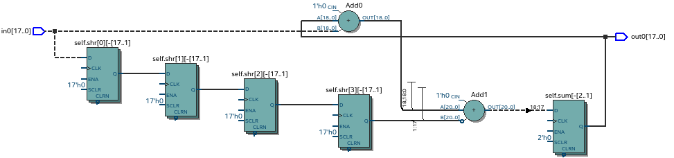

Hardware design with Pyha
=========================

This chapter introduces the main contribution of this thesis, Pyha - a tool to design digital hardware in Python.

Pyha proposes to program hardware in the same way as software; much of this chapter is focused on showing
differences between hardware and software constructs.

The fist half of the chapter demonstrates how basic hardware constructs can be defined, using Pyha.

The second half introduce the fixed-point type and provides use-cases on designing with Pyha.

All the examples presented in this chapter can be found online HERE, including all the Python sources, unit-tests,
VHDL conversion files and Quartus project for synthesis.

.. todo:: organise examples to web and put link

Introduction
------------

In this work, Pyha has been designed to follow the object-oriented design paradigm, while many of the other
HLS languages work on 'function' based designs. Advantage of the object-oriented way is that the class functions
can represent the combinatory logic while class variables represent state..ie registers. This is also more similiar
to regular software programming.

.. todo:: improve me

.. basic design unit is a Python class,
    that is derived from HW subclass (to inherit hardware related functionality).

For illustration purposes, :numref:`pyha_adder` shows the Pyhe implementation of an adder circuit.

.. code-block:: python
    :caption: Simple adder, implemented in Pyha; ``main`` is the synthesizable function.
    :name: pyha_adder

    class Adder(HW):
        def __init__(self, coef)
            self.coef = coef

        def main(self, x):
            y = x + self.coef
            return y

The class structure in Pyha has been designed so that the ``__init__`` function shall define all
the memory elements in the design, it may contain any Python code to evaluate reset values for registers; itself
it is not converted to VHDL, only the created variables are interpreted as memory. Class may contain any other
user defined functions, that are converted to VHDL; the ``main`` function is reserved for the top level entity.

.. todo:: about model! ref blade rf absd? need this because simulations have model output

.. note:: All the examples in this chapter include the model implementation. In order to keep code examples smaller,
    future listings omit the model code.

Simulation and testing
~~~~~~~~~~~~~~~~~~~~~~

One of the motivation in designing the Pyha tool has been the need to improve the verification and testing capabilities.
Also verification against an model, consider GNURadio model for example.

Pyha designs can be simulated in Python or VHDL domain. In addition, Pyha has integration to Intel Quartus software,
it supports running GATE level simulations i.e. simulation of synthesized logic.

Pyha provides functions to automatically run all the simulations on the set of input data. :numref:`pyha_adder_test`
shows an example unit test for the 'adder' module.

.. code-block:: python
    :caption: Unit test for the adder module
    :name: pyha_adder_test

    x =      [1, 2, 2, 3, 3, 1, 1]
    expect = [2, 3, 3, 4, 4, 2, 2]

    dut = Adder(coef=1)
    assert_simulation(dut, expect, x)

The ``assert_simulation(dut, expect, x)`` runs all the simulations (Model, Pyha, RTL and GATE)
and asserts the results equal the ``expexct`` vector, defined in the unit test.

In addition, ``simulations(dut, x)`` returns all the outputs of different simulations, this
can be used to plot the results, as shown in :numref:`adder_sim`.

.. todo:: remove the input signal from this plot!

.. _adder_sim:
.. figure:: ../examples/adder/img/add_sim.png
    :align: center
    :figclass: align-center

    Testing the adder module, ``simulation(dut, expect, x)`` outputs, all equivalent

More information about the simulation functions can be found in the APPENDIX.

.. todo:: Add simulation function definitins to appendix.

Synthesis
~~~~~~~~~

Synthesis is required to run the GATE level simulations; Pyha integrates to the Intel Quartus
software in order to archive this.

.. todo:: reference blade and lime

As an example synthesis target device is EP4CE40F23C8N, of the Cyclone IV family. This is the same FPGA that powers the latest
LimeSDR chip and the BladeRF board.
In general it is a low cost FPGA with following features :cite:`cycloneiv`:

    - 39,600 logic elements;
    - 1,134Kbits embedded memory;
    - 116 embedded 18x18 multipliers;
    - 4 PLLs;
    - 200 MHz maximum clock speed.

One useful tool in Quartus software is the RTL viewer, it visualizes the synthesised hardware for the Pyha design,
this chapter uses it extensively to illustrate synthesis results.

:numref:`adder_rtl` shows the synthesised RTL diagram of the adder circuit. Notice that the integer types were synthesised to
32 bit logic ([31..0] is the signal width).

.. _adder_rtl:
.. figure:: ../examples/adder/img/add_rtl.png
    :align: center
    :figclass: align-center

    Synthesised RTL of the ``Adder(coef=1)`` module, ``32'1h1`` means 32 bit constant with value 1 (Intel Quartus RTL viewer)

Stateless designs
-----------------

Designs that do not contain any memory elements can be considered stateless (a.k.a. combinatory logic in hardware terms).
In the software world, this can be understood as a function that only uses local variables.

Basic operations
~~~~~~~~~~~~~~~~

:numref:`pyha_adder_comp` shows the Pyha design, featuring a circuit with one input and two outputs. Note that the
``b`` output is dependent on ``a``.

.. code-block:: python
    :caption: Basic stateless design with one input ``x`` and two outputs ``a`` and ``b``
    :name: pyha_adder_comp

    class Basic(HW):
        def main(self, x):
            a = x + 1 + 3
            b = a * 314
            return a, b

:numref:`adder_multi_rtl` shows that each ``+`` instruction is mapped to an FPGA resource.
The ``a`` output is formed by adding '1' and '3' to the  ``x`` input. The
``b`` output has a multiplier on signal path, as expected.

.. _adder_multi_rtl:
.. figure:: ../examples/adder/img/add_multi_rtl.png
    :align: center
    :figclass: align-center

    Synthesis result of :numref:`pyha_adder_comp` (Intel Quartus RTL viewer)

This example shows that in hardware, operations have a price in terms of resource usage [#hwdelay]_.
This is a major difference to software, where operations mainly cost execution time instead.

..
    Sharing the hardware resources is possible by using state-machines, but this quickly rises the design complexity.

The key idea to understand is that while the software and hardware execute the ``main`` function in
different ways, they result in the same output, in that sense they are equivalent.
This idea is confirmed by Pyha simulation, reporting equal outputs for all simulations, that have been considered
in this thesis.

A major advantage of Pyha is that designs can be debugged in Python domain. Pyha simulations just runs the ``main`` function
so all kinds of Python tools can be used.
:numref:`add_multi_debug` shows a debugging session on the :numref:`pyha_adder_comp` code. Using Python tools
for debugging can greatly increase the designers productivity.

.. todo:: more info, this is strong point in this work!

.. _add_multi_debug:
.. figure:: ../examples/adder/img/add_multi_debug.png
    :align: center
    :figclass: align-center

    Debugging using PyCharm (Python editor)

.. [#hwdelay] Logic elements also introduce delay, but by pipelining this can be neglated.?

Conditional statements
~~~~~~~~~~~~~~~~~~~~~~

The main conditional statement in Python is ``if``, it can be combined with ``elif`` and ``else``. All
of these are synthesizable to hardware. :numref:`pyha_if_code` shows an example of a basic ``if else`` statement.

.. code-block:: python
    :caption: Example of a basic if else statement in Pyha
    :name: pyha_if_code

    class If(HW):
        def main(self, x, condition):
            if condition == 0:
                y = x + 3
            else:
                y = x + 1
            return y

:numref:`if_rtl` shows that in hardware the ``if`` clause is implemented by the 'multiplexer' component.
It routes one of the inputs to the output, depending on the value of the condition.
For example if ``condition == 0`` then bottom signal path is routed to output.
Interesting thing to note is that both of the adders are 'executing', just one of the result is thrown away.

.. _if_rtl:

    Synthesis result of :numref:`pyha_if_code` (Intel Quartus RTL viewer)

Once again, all the simulations result in equal outputs. As compared to???

Loop statements
~~~~~~~~~~~~~~~

In traditional HDL languages, for loops are usable only for unrolling purposes. Some advanced HLS languages, like
for example Vivado HLS, support more complex loops by interpreting them as state machines.

Pyha aims to support the advanced usage of loops, but this is considered as an future work. Currently
traditional unrollable loops are supported. This also means that the loop control statement cannot be dynamic.

:numref:`pyha_for_code` shows an simple ``for`` example, that adds [0, 1, 2, 3] to the input signal.

.. code-block:: python
    :caption: ``for`` example
    :name: pyha_for_code

    class For(HW):
        def main(self, x):
            y = x
            for i in range(4):
                y = y + i

            return y

:numref:`for_rtl` shows that RTL consists of chained adders, that have been also somewhat optimized.

.. _for_rtl:

    Synthesis result of :numref:`pyha_for_code` (Intel Quartus RTL viewer)

.. todo:: this RTL sucks...can we get better example? Maybe combine with if?

The RTL may make more sense if we consider the unrolled version, shown on
:numref:`pyha_for_code_unrolled`.

.. code-block:: python
    :caption: Unrolled ``for``, equivalent to :numref:`pyha_for_code`
    :name: pyha_for_code_unrolled

    y = x
    y = y + 0
    y = y + 1
    y = y + 2
    y = y + 3

Most importantly, all the simulations provide equal results.

Function calls
~~~~~~~~~~~~~~

So far only the ``main`` function has been used to define logic. In Pyha the ``main`` function is just the
top level function that is first called by simulation and conversion processes. Other functions can
freely be defined and called as shown in :numref:`pyha_functions_code`.

.. code-block:: python
    :caption: Calling an function in Pyha
    :name: pyha_functions_code

    class Functions(HW):
        def adder(self, x, b):
            y = x + b
            return y

        def main(self, x):
            y = self.adder(x, 1)
            return y

The synthesis result of :numref:`pyha_functions_code` is just an adder,
there is no indication that a function call has been used i.e. all functions are
inlined during the synthesis process.

Note that calling the function multiple times would infer parallel hardware.

.. todo:: maybe i can combine everything in this chapter to one chapter? For example suchs and so the function exampel..

..
    .. warning:: There cannot be more than one function call per expression, this limitation may be lifted in the future.

Summary
~~~~~~~

This chapter demonstrated that many of the software world constructs can be mapped to hardware when expressed in
Pyha and that the outputs of the software and hardware simulations are equivalent. Some limitations exist,
for example the ``for`` loops must be unrollable.

Major point to remember is that every statement converted to hardware costs resources on the FPGA fabric.

Designs with memory
-------------------

So far, all the designs presented have been stateless (without memory). Often algorithms need to store
some value for later use, this indicates that the design must contain memory elements.

This chapter gives an overview of memory based designs in Pyha.

Accumulator and registers
~~~~~~~~~~~~~~~~~~~~~~~~~

Consider the design of an accumulator; it operates by sequentially adding up all the input values.
:numref:`acc` shows the Pyha implementation, class scope variable is defined in the ``__init__`` function
to store the accumulator value.

.. code-block:: python
    :caption: Accumulator implemented in Pyha
    :name: acc
    :linenos:

    class Acc(HW):
        def __init__(self):
            self.acc = 0

        def main(self, x):
            self.acc = self.acc + x
            return self.acc

Trying to run this would result in a Pyha error, suggesting to change the line 6 to ``self.next.acc = ...``.
After this, the code is runnable; reasons for this modification are explained shortly.

.. todo:: this is not new, same semantics used in MyHDL and Pong Chu.

The synthesis results shown in the :numref:`acc_rtl` features an new element known as a register.

.. _acc_rtl:
.. figure:: ../examples/accumulator/img/acc_rtl.png
    :align: center
    :figclass: align-center

    Synthesis result of :numref:`pyha_for_code` (Intel Quartus RTL viewer)

Register
^^^^^^^^

.. todo:: this section is not finished

In software programming, class variables are the main method of saving the some information from function call to another.

A register is a hardware memory component; it samples the input signal ``D`` on the edge of the  ``CLK`` signal. In
that sense it acts like a buffer.

One of the new signals in the :numref:`acc_rtl` is ``clk``, that is a clock signal that instructs the registers
to update the saved value (``D``).

In hardware a clock is a mean of synchronizing the registers, thus allowing accurate timing analsys that allows
placing the components on the FPGA fabric in such way that all the analog transients happen **between** the clock
edges, thus the registers are guaranteed to sample the clean and correct signals.

Registers have one difference to software class variables i.e. the value assigned to them does not take
effect immediately, but rather on the next clock edge.
When the value is set at **this** clock edge, it will be taken on the **next** clock edge.

Pyha tries to stay in the software world, so the clock signal can be abstracted away
by thinking that it denotes the call to the 'main' function. This means that registers update their value on
every call to ``main`` (just before the call).

Think that the ``main`` function is started with the **current** register values known and the objective of
the ``main`` function is to find the **next** values for the registers.

.. todo:: This sample rate stuff is too bold statement, more expalnation
Furthermore, in DSP systems one important aspect is sample rate. In hardware the maximum clock rate and sample rate are
basically the same thing.
In Digital signal processing applications we have sampling rate, that is basically equal to the clock rate. Think that
for each input sample the 'main' function is called, that is for each sample the clock ticks.

Note that the way how the hardware is designed determines the maximum clock rate it can run off. So if we do
a bad job we may have to work with low sample rate designs. This is determined by the worst critical path.

The Pyha way is to register all the outputs, that way i can be assured that all the inputs are already registered.

The ``rst_n`` signal can be used to set initial states for registers, in Pyha the initial value is determined by the
value assigned in ``__init__``, in this case it is 0.

Testing
^^^^^^^

Simulation results in :numref:`acc_sim_delay` show that the **model** simulation differs
from the rest of the simulations. It is visible that the hardware related simulations are **delayed by 1** sample.
This is the side-effect of the hardware registers, each register on the signal path adds one sample delay.

.. _acc_sim_delay:
.. figure:: ../examples/accumulator/img/acc_sim_delay.png
    :align: center
    :figclass: align-center

    Simulation of the accumulator (x is a random integer [-5;5])

Pyha provides a :code:`self._delay` variable, that hardware classes can use to specify their delay.
Simulation functions can read this variable and compensate the simulation data so that the delay is compensated, that
eases the design of unit-tests.

The simulation results match in output (:numref:`acc_sim`), after setting the :code:`self._delay = 1` in the ``__init__``
function.

.. _acc_sim:
.. figure:: ../examples/accumulator/img/acc_sim.png
    :align: center
    :figclass: align-center

    Simulation of the delay-compensated accumulator (x is a random integer [-5;5])

.. _ch_sliding_adder:

Block processing and sliding adder
~~~~~~~~~~~~~~~~~~~~~~~~~~~~~~~~~~

One very common task in DSP designs is to calculate results based on some number of input samples (block processing).
Until now, the ``main`` function has worked with a single input sample,
this can now be changed by keeping the history with registers.

Consider an algorithm that adds the last 4 input values. :numref:`block_adder` shows an implementation that keeps
track of the last 4 input values and sums them. Note that
the design also uses the output register ``y``.

.. code-block:: python
    :caption: Sliding adder algorithm
    :name: block_adder

    class SlidingAdder(HW):
        def __init__(self):
            self.shr = [0, 0, 0, 0] # list of registers
            self.y = 0

        def main(self, x):
            # add new 'x' to list, throw away last element
            self.next.shr = [x] + self.shr[:-1]

            # add all element in the list
            sum = 0
            for a in self.shr:
                sum = sum + a

            self.next.y = sum
            return self.y

The ``self.next.shr = [x] + self.shr[:-1]`` line is also known as a 'shift register', because on every call it
shifts the list contents to the right and adds new ``x`` as the first element. Sometimes the same structure is used as a
delay-chain, because the sample ``x`` takes 4 updates to travel from ``shr[0]`` to ``shr[3]``.
This is a very common element in hardware DSP designs.

:numref:`block_adder_rtl` shows the RTL for this design, as expected the ``for`` has been unrolled, thus all the
summing is done.

.. _block_adder_rtl:
.. figure:: ../examples/block_adder/img/rtl.png
    :align: center
    :figclass: align-center

    Synthesis result of :numref:`block_adder` (Intel Quartus RTL viewer)

Optimizing the design
^^^^^^^^^^^^^^^^^^^^^

This design can be made generic by changing the ``__init__`` function to take the window length as a parameter
(:numref:`block_adder_generic`).

.. code-block:: python
    :caption: Generic sliding adder
    :name: block_adder_generic

    class SlidingAdder(HW):
        def __init__(self, window_len):
            self.shr = [0] * window_len
        ...

The problem with this design is that it starts using more resources as the ``window_len`` gets larger as every
stage requires a separate adder. Another problem is that the critical path gets longer, decreasing the
clock rate. For example, the design with ``window_len=4`` synthesises to maximum clock of
170 MHz, while ``window_len=6`` to only 120 MHz.

.. todo:: MHz on what FPGA?

.. _rtl_6_critical:

    RTL of ``window_len=6``, the red line shows the critical path (Intel Quartus RTL viewer)

In that sense, it can be considered a poor design, as it is hard to reuse.
Conveniently, the algorithm can be optimized to use only 2 adders, no matter the window length.
:numref:`slider_optim` shows that instead of summing all the elements, the overlapping part of
the previous calculation can be used to significantly optimize the algorithm.

.. code-block:: python
    :caption: Optimizing the sliding adder algorithm by using recursive implementation
    :name: slider_optim

    y[4] = x[4] + x[5] + x[6] + x[7] + x[8] + x[9]
    y[5] =        x[5] + x[6] + x[7] + x[8] + x[9] + x[10]
    y[6] =               x[6] + x[7] + x[8] + x[9] + x[10] + x[11]

    # reusing overlapping parts implementation
    y[5] = y[4] + x[10] - x[4]
    y[6] = y[5] + x[11] - x[5]

:numref:`optimal_adder` gives the implementation of the optimal sliding adder; it features a new register ``sum`,
that keeps
track of the previous output. Note that the ``shr`` stayed the same, but is now rather used as a delay-chain.

.. code-block:: python
    :caption: Optimal sliding adder
    :name: optimal_adder

    class OptimalSlideAdd(HW):
        def __init__(self, window_len):
            self.shr = [0] * window_len
            self.sum = 0

            self._delay = 1

        def main(self, x):
            self.next.shr = [x] + self.shr[:-1]

            self.next.sum = self.sum + x - self.shr[-1]
            return self.sum
        ...

:numref:`rtl_optimal_int_critical` shows the synthesis result; as expected, the critical path is along 2 adders.

.. _rtl_optimal_int_critical:
.. figure:: ../examples/block_adder/img/rtl_optimal_int_critical.png
    :align: center
    :figclass: align-center

    Synthesis result of :numref:`block_adder`, ``window_len=4`` (Intel Quartus RTL viewer)

Simulations results (:numref:`block_adder_sim`) show that the hardware desing behaves exactly as the software model.
Note that the class has ``self._delay=1`` to compensate for the register delay.

.. _block_adder_sim:
.. figure:: ../examples/block_adder/img/sim.png
    :align: center
    :figclass: align-center

    Simulation results for ``OptimalSlideAdd(window_len=4)``

Summary
~~~~~~~

In Pyha all class variables are interpreted as hardware registers. The ``__init__`` function may contain any Python code
to evaluate reset values for registers.

The key difference between software and hardware approaches is that hardware registers have **delayed assignment**,
they must be assigned to ``self.next``.

The delay introduced by the registers may drastically change the algorithm,
that is why it is important to always have a model and unit tests, before starting hardware implementation.
The model delay can be specified by ``self._delay`` attribute, this helps the simulation functions to compensate for the delay.

Registers are also used to shorten the critical path of chained logic elements, thus allowing higher clock rate. It is encouraged
to register all the outputs of Pyha designs.

Fixed-point designs
-------------------

Examples in the previous chapters have used only the ``integer`` type, in order to simplify the designs.

.. todo:: explain why float costs greatly?

DSP algorithms are mostly described using floating point numbers. As shown in previous sections, every operation
in hardware takes resources and floating point calculations cost greatly. For that reason, fixed-point arithmetic
is often used in hardware designs.

Fixed-point arithmetic is in nature equal to integer arithmetic and thus can use the DSP blocks that
come with many FPGAs (some high-end FPGAs have also floating point DSP blocks :cite:`arria_dsp`).

Basics
~~~~~~

Pyha defines ``Sfix`` for FP objects; it is a signed number.
It works by defining bits designated for ``left`` and ``right``
of the decimal point. For example ``Sfix(0.3424, left=0, right=-17)`` has 0 bits for integer part
and 17 bits for the fractional part. :numref:`fp_basics` shows some examples.
more information about the fixed point
type is given on APPENDIX.

.. todo:: Add more information about fixed point stuff to the appendix

.. code-block:: python
    :caption: Example of ``Sfix`` type, more bits give better results
    :name: fp_basics

    >>> Sfix(0.3424, left=0, right=-17)
    0.34239959716796875 [0:-17]
    >>> Sfix(0.3424, left=0, right=-7)
    0.34375 [0:-7]
    >>> Sfix(0.3424, left=0, right=-4)
    0.3125 [0:-4]

The default FP type in Pyha is ``Sfix(left=0, right=-17)``, it represents numbers between [-1;1] with
resolution of 0.000007629. This format is chosen because it fits into common FPGA DPS blocks
(18 bit signals :cite:`cycloneiv`)
and it can represent normalized numbers.

The general recommendation is to keep all the inputs and outputs of the block in the default type.

.. _ch_fp_sliding_adder:

Fixed-point sliding adder
~~~~~~~~~~~~~~~~~~~~~~~~~

Consider converting the sliding window adder, described in :numref:`ch_sliding_adder`, to FP implementation. This
requires changes only in the ``__init__`` function (:numref:`fp_sliding_adder`).

.. code-block:: python
    :caption: Fixed-point sliding adder
    :name: fp_sliding_adder

    def __init__(self, window_size):
        self.shr = [Sfix()] * window_size
        self.sum = Sfix(left=0)
    ...

The first line sets ``self.shr`` to store ``Sfix()`` elements. Notice that it does not define the
fixed-point bounds, meaning it will store 'whatever' is assigned to it. The final bounds are determined during simulation.

.. todo:: lazy stuff needs more explanation

The ``self.sum`` register uses another lazy statement of ``Sfix(left=0)``, meaning that the integer bits
are forced to 0 bits on every assign to this register. The fractional part is left determined by simulation.
The rest of the code is identical to the one described in :numref:`ch_sliding_adder`.

Synthesis results are shown in :numref:`rtl_sfix_saturate`. In general, the RTL diagram looks similar to the one at
:numref:`ch_sliding_adder`. First noticeable change is that the signals are now 18 bits wide due to the
default FP type. The second addition is the saturation logic, which prevents the wraparound behaviour by
forcing the maximum or negative value when they are out of fixed point format. Saturation logic is by default enabled for
FP types.

.. _rtl_sfix_saturate:
.. figure:: ../examples/block_adder/img/rtl_sfix_saturate.png
    :align: center
    :figclass: align-center

    RTL of fixed-point sliding adder (Intel Quartus RTL viewer)

:numref:`fix_sat_wrap` plots the simulation results.
Notice that the hardware simulations are bounded to [-1;1] range by the saturation logic, that is why the model
simulation is different at some points.

.. _fix_sat_wrap:
.. figure:: ../examples/block_adder/img/sim_fix.png
    :align: center
    :figclass: align-center

    Simulation results of FP sliding sum

Simulation functions can automatically convert 'floating-point' inputs to default FP type. In same manner,
FP outputs are converted to floating point numbers. That way, the designer does not have to deal with FP numbers
in unit-testing code. An example is given in :numref:`fp_test`.

.. code-block:: python
    :caption: Test fixed-point design with floating-point numbers
    :name: fp_test

    dut = OptimalSlidingAddFix(window_len=4)
    x = np.random.uniform(-0.5, 0.5, 64)
    y = simulate(dut, x)
    # plotting code ...

Moving average filter
~~~~~~~~~~~~~~~~~~~~~

.. todo:: rephrase as this is copy paste!

The moving average (MA) is the most common filter in DSP, mainly because it is the easiest digital
filter to understand and use.  In spite of its simplicity, the moving average filter is
optimal for a common task: reducing random noise while retaining a sharp step response.  This makes it the
premier filter for time domain encoded signals :cite:`dspbook`.

:numref:`moving_average_noise` shows that MA is a good algorithm for noise reduction.
Increasing the window length reduces more noise but also increases the complexity and delay of
the system (MA is a special case of FIR filter, same delay semantics apply).

.. _moving_average_noise:
.. figure:: ../examples/moving_average/img/moving_average_noise.png
    :align: center
    :figclass: align-center

    MA algorithm in removing noise

Good noise reduction performance can be explained by the frequency response of MA (:numref:`mavg_freqz`),
showing that it is a low-pass filter. Passband width and stopband attenuation are controlled by the
window length.

.. _mavg_freqz:
.. figure:: ../examples/moving_average/img/moving_average_freqz.png
    :align: center
    :figclass: align-center

    Frequency response of MA filter

Implementation in Pyha
^^^^^^^^^^^^^^^^^^^^^^

MA is implemented by using a sliding sum that is divided by the sliding window length.
The sliding sum part has already been implemented in :numref:`ch_fp_sliding_adder`.
The division can be implemented by a shift right operation if the divisor is power of two.

In addition, division can be performed on each sample instead of on the sum, that is ``(a + b) / c = a/c + b/c``.
Doing this guarantees that the ``sum`` variable is always in the [-1;1] range, thus the saturation logic can be removed.

.. code-block:: python
    :caption: MA implementation in Pyha
    :name: mavg-pyha
    :linenos:

    class MovingAverage(HW):
        def __init__(self, window_len):
            self.window_pow = Const(int(np.log2(window_len)))

            self.mem = [Sfix()] * window_len
            self.sum = Sfix(0, 0, -17, overflow_style=fixed_wrap)
            self._delay = 1

        def main(self, x):
            div = x >> self.window_pow

            self.next.mem = [div] + self.mem[:-1]
            self.next.sum = self.sum + div - self.mem[-1]
            return self.sum
        ...

The code in :numref:`mavg-pyha` makes only few changes to the sliding sum:

    * On line 3, ``self.window_pow`` stores the bit shift count (to support generic ``window_len``)
    * On line 6, type of ``sum`` is changed so that saturation is turned off
    * On line 10, shift operator performs the division

:numref:`mavg_rtl` shows the synthesized result of this work; as expected it looks very similar to the
sliding sum RTL schematics. In general, shift operators are hard to notice on the RTL schematics because they are implemented
by routing semantics.

.. _mavg_rtl:

    RTL view of moving average (Intel Quartus RTL viewer)

Simulation/Testing
^^^^^^^^^^^^^^^^^^

MA is an optimal solution for performing matched filtering of rectangular pulses :cite:`dspbook`.
This is important for communication systems. :numref:`mavg_matched` shows an example of
and digital signal, that is corrupted with noise. MA with window length equal to samples per symbol can recover the
signal from the noise.

.. _mavg_matched:
.. figure:: ../examples/moving_average/img/moving_average_matched.png
    :align: center
    :figclass: align-center

    Moving average as matched filter

The 'model' deviates from rest of the simulations because the input signal violates the [-1;1] bounds and hardware
simulations are forced to saturate the values.

Summary
~~~~~~~

In Pyha, DSP systems can be implemented by using the fixed-point type.
The combination of 'lazy' bounds and default Sfix type provide simplified conversion from floating point to fixed point.
In that sense it could be called 'semi-automatic conversion'.

Simulation functions can automatically perform the floating to fixed point conversion, this enables writing
unit-tests using floating point numbers.

Comparing the FP implementation to the floating-point model can greatly simplify the final design process.

Abstraction and Design reuse
----------------------------

Pyha is based on the object-oriented design practices, this greatly simplifies the design reuse as the classes
can be used to initiate objects.
Another benefit is that classes can abstract away the implementation details, in that sense Pyha can become a
high-level synthesis (HLS) language.

This chapter gives an example on how to reuse the moving average filter for ...

Linear-phase DC removal Filter
~~~~~~~~~~~~~~~~~~~~~~~~~~~~~~

Direct conversion (homodyne or zero-IF) receivers have become very popular recently especially in the realm of
software defined radio. There are many benefits to direct conversion receivers,
but there are also some serious drawbacks, the largest being DC offset and IQ imbalances :cite:`bladerfdoc`.

DC offset looks like a peak near the 0Hz on the frequency response.
In the time domain, it manifests as a constant component on the harmonic signal.

In :cite:`dcremoval_lyons`, Rick Lyons investigates the use of moving average algorithm as a DC removal
circuit. This works by subtracting the MA output from the input signal. The problem of this approach is the
3 dB passband ripple. However, by connecting multiple stages of MA's in series, the ripple can be avoided
(:numref:`dc_freqz`) :cite:`dcremoval_lyons`.

.. _dc_freqz:
.. figure:: ../examples/dc_removal/img/dc_freqz.png
    :align: center
    :figclass: align-center

    Frequency response of DC removal filter (MA window length is 8)

Implementation
^^^^^^^^^^^^^^

The algorithm is composed of two parts. First, four MA's are connected in series, outputting the DC component of the
signal. Second, the MA's output is subtracted from the input signal, thus giving the signal without
DC component. :numref:`dc_removal` shows the Pyha implementation.

.. code-block:: python
    :caption: DC-Removal implementation
    :name: dc_removal

    class DCRemoval(HW):
        def __init__(self, window_len):
            self.mavg = [MovingAverage(window_len), MovingAverage(window_len),
                         MovingAverage(window_len), MovingAverage(window_len)]
            self.y = Sfix(0, 0, -17)

            self._delay = 1

        def main(self, x):
            # run input signal over all the MA's
            tmp = x
            for mav in self.mavg:
                tmp = mav.main(tmp)

            # dc-free signal
            self.next.y = x - tmp
            return self.y
        ...

This implementation is not exactly following that of :cite:`dcremoval_lyons`. They suggest to delay-match the
step 1 and 2 of the algorithm, but since we can assume the DC component to be more or less stable, this can be
omitted.

:numref:`dc_rtl_annotated` shows that the synthesis generated 4 MA filters that are connected in series,
output of this is subtracted from the input.

.. _dc_rtl_annotated:
.. figure:: ../examples/dc_removal/img/dc_rtl_annotated.png
    :align: center
    :figclass: align-center

    Synthesis result of ``DCRemoval(window_len=4)`` (Intel Quartus RTL viewer)

In a real application, one would want to use this component with larger ``window_len``. Here 4 was chosen to keep
the RTL simple. For example, using ``window_len=64`` gives much better cutoff frequency (:numref:`dc_comp`);
FIR filter with the same performance would require hundreds of taps :cite:`dcremoval_lyons`. Another benefit is that
this filter delays the signal by only 1 sample.

.. _dc_comp:
.. figure:: ../examples/dc_removal/img/dc_comp.png
    :align: center
    :figclass: align-center

    Comparison of frequency response

This implementation is also very light on the FPGA resource usage (:numref:`resource_usage`).

.. code-block:: text
    :caption: Cyclone IV FPGA resource usage for ``DCRemoval(window_len=64)``
    :name: resource_usage

    Total logic elements                242 / 39,600 ( < 1 % )
    Total memory bits                   2,964 / 1,161,216 ( < 1 % )
    Embedded Multiplier 9-bit elements	0 / 232 ( 0 % )

Testing
^^^^^^^

:numref:`dc_sim` shows the situation where the input signal is corrupted with a DC component (+0.25),
the output of the filter starts countering the DC component until it is removed.

.. _dc_sim:
.. figure:: ../examples/dc_removal/img/dc_sim.png
    :align: center
    :figclass: align-center

    Simulation of DC-removal filter in the time domain

Conclusion
----------

This chapter has demonstrated that in Pyha traditional software language features can be used
to infer hardware components and their outputs are equivalent.
One must still keep in mind how the code converts to hardware, for example that the loops will be unrolled.
A major difference between hardware and software is that in hardware, every arithmetical operator takes up resources.

Class variables can be used to add memory to the design. In Pyha, class variables must be assigned to
``self.next`` as this mimics the **delayed** nature of registers. The general rule is to always register the outputs of
Pyha designs.

DSP systems can be implemented by using the fixed-point type. Pyha has ‘semi-automatic conversion’ from
floating point to fixed point numbers. Verifying against floating point model helps the design process.

Reusing Pyha designs is easy thanks to the object-oriented style that also works well for design abstraction.

Pyha provides the ``simulate`` function that can automatically run Model, Pyha, RTL and GATE level simulations. In
addition, ``assert_simulate`` can be used for fast design of unit-tests. These functions can automatically handle
fixed point conversion, so that tests do not have to include fixed point semantics. Pyha designs are debuggable
in the Python domain.

