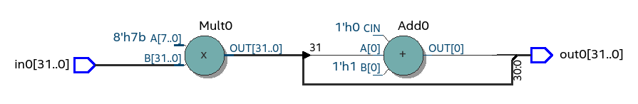

A sequential circuit, on the other hand, has an internal
state, or memory. Its output is a function of current input as well as the internal state. The
internal state essentially “memorizes” the effect of the past input values. The output thus is
affected by current input value as well as past input values (or the entire sequence of input
values). That is why we call a circuit with internal state a sequential circuit.
:cite:`chu_vhdl`

A combinational circuit, by definition, is a circuit whose output, after the initial transient
period, is a function of current input. It has no internal state and therefore is “memoryless”
about the past events (or past inputs) :cite:`chu_vhdl`. In other words, combinatory circuits have
no registers, i like to call it 'stuff between registers'.
Arguably better name for combinatory logic is 'stuff between two registers'.

Structured programming in VHDL
------------------------------

While VHDL is mostly known as a dataflow programming, it is actually derived from ADA programming lanugage,
where it inherits strong structurial semantics. As shown by :cite:`structvhdl_gaisler`,
using these higher-level programming constructs can be used to infer combinatory logic.

.. todo:: May be better to just delete this section as it has funnctionally bad example. + it used function instead
    of prcedure. However it is useful as it shows in a simple way how functions go to combinatory logic.

.. code-block:: vhdl
    :caption: Combinatory
    :name: comb-vhdl

    function main(a: integer) return integer is
        variable mul, acc: integer;
    begin
        mul := a * 123;
        acc := acc + mul;
        return acc;
    end function;

:numref:`comb-vhdl` show the MAC function in VHDL. It is functionally broken as the acc should save state
outside of the function.

.. _comb_mac_rtl:

    RTL of comb MAC (Intel Quartus RTL viewer)

Synthesisying this results in a RTL shown in :numref:`comb_mac_rtl`. Good news is that
it has all the required arithmetic elements. However, as expected it lacks the registers, rendering the design
functionally incorrect.

Benefit here is that the function in VHDL is very similiar to the Python one, conversion process would
surely be simple. Another result is that VHDL and Python have same result for local variables.