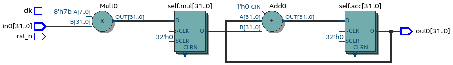
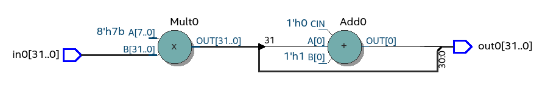
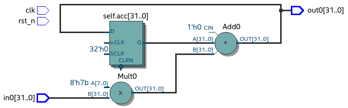

VHDL as intermediate language
=============================

This chapter aims

Todo

    - What features do i want to support?
    - Why do it?

In this section we try to do things the other way around, that is adapt VHDL to Python.

Major goal of this project is to support object-oriented hardware design. Goal is to provide simple object
support, advanced features like inherintance and overloadings are not considerted at this moment.

Lay down a common ground on which VHDL and Python coold be connected.

While other HDL converters use VHDL/Verilog as low level conversion target.
Pyha goes other way around, as shown by the Gardner study :cite:`structvhdl_gaisler`, VHDL language can be used
with quite high level progrmaming constructs. Pyha tries to take advantage of this.

This chapter tries to enchance the VHDL language with some basic Python elements in order
to provide some common ground for the conversion task.

Background
----------

What is IR, how VHDl has been used before?
What is going to be different here?
Chisel and FIRRTL.
Basesd on gaisler stydy try to do differently.

As stated by the goal of this work, converting Object-oriented designs into HDL.
While it may seem that VHDL has no support for OOP, it is actually not true.

There have been previous study regarding OOP in VHDL before. In :cite:`Benzakki1997` proposal was
made to extend VHDL language with OOP semantics, this effort ended with development of
OO-VHDL :cite:`oovhdl`, that is VHDL preprocessor that could turn proposend extensions to standard
VHDL. This work was done in ~2000, current status is unknown, it certanly did not make it to the
VHDL standard.

While the :cite:`oovhdl` tried to extend VHDLs data-flow side of OOP, there actually exsists another
way to do it, that is inherited from ADA.

Problem statement
-----------------

What do we want from this IR? What does it have to support?

.. code-block:: python
    :caption: Pipelined multiply-accumulate(MAC) implemented in Pyha
    :name: mac-pyha

    class MultiplyAccumulate(HW):
        def __init__(self):
            self.coef = 123
            self.mul = 0
            self.acc = 0

        def main(self, a):
            self.next.mul = a * self.coef
            self.next.acc = self.acc + self.mul
            return self.acc

.. _mac_rtl:

    RTL of MAC (Intel Quartus RTL viewer)

.. note:: In order to keep examples simple, only :code:`integer` types are used in this section.

Now

    - There may be more user defined functions
    - Object may be have subobjects
    - Subobjects may have their own subobjects, maybe even a list of objects.
    - Easy to map to Python, data model goes to stcuture and all methods just convert. profit

High-level functions in VHDL
----------------------------

**Show how combinatory logic can be made with simple function**

.. code-block:: vhdl
    :caption: Multiply-accumulate implemented in Pyha
    :name: mac-pyha

    function main(a: integer) return integer is
        variable mul, acc: integer;
    begin
        mul := 123 * a;
        acc := acc + mul;
        return acc;
    end function;

We could make similiar function in VHDL and as promised by Geisler, it can perfectly represent the combinatory
part of our program.

.. _comb_mac_rtl:

    RTL of comb MAC (Intel Quartus RTL viewer)

Synthesisying this results in a structure shown in :numref:`comb_mac_rtl`. It has the required arithmetic elements.
Problem with this circuit is that it is missing registers and that makes it completely useless.

Benefit here is that the function in VHDL is very similiar to the Python one, conversion process would
surely be simple.

A combinational circuit, by definition, is a circuit whose output, after the initial transient
period, is a function of current input. It has no internal state and therefore is “memoryless”
about the past events (or past inputs) :cite:`chu_vhdl`. In other words, combinatory circuits have
no registers, i like to call it 'stuff between registers'.

OOP-VHDL shown on :numref:`oop_vhdl` will probably look useless to anyone who has VHDL experience.
First reaction is probably that this thing is not synthesizeable.

Here we show that this simple example is already good enough to synthesize combinatory logic.

.. todo:: Example of synthesisying some combinatory stuff
    Comb class is quite useless actually..maybe rather show syth function with logic?

One thing to note is that the object side of this example is quite useless, we can use it only
to store constants.

Actually sequential logic could be inferred by guaranteeing that the class object values are
always read before written into. But this is an extreamly error prone way of inferring registers.
:cite:`chu_vhdl`

Adding state to VHDL functions
------------------------------

**How function gets object state, like in Python**

What is state?
Local variable in functions equal in VHDL and Python.

Long term state
~~~~~~~~~~~~~~~

In python can use global variables or classes to remember stuff between function calls.

In VHDL stuff is harder. Signal assignment?
VHDL extra uses for register, like delay?

.. code-block:: vhdl
    :caption: Multiply-accumulate implemented in Pyha
    :name: mac-pyha

    type self_t is record
        mul: integer;
        acc: integer;
    end record;

    procedure main(self: inout self_t; a: integer; ret_0: out integer) is
    begin
        self.mul := 123 * a;
        self.acc := self.acc + self.mul;
        ret_0 := self.acc;
    end procedure;

.. _ghetto_comb_mac_rtl:

    RTL of comb MAC (Intel Quartus RTL viewer)

This thing could actually work..functionally. However as far as hardware goes, this is total junk, because there
are no registers on the signal path.
Can OOP model be used in VHDL

Better way of defining registers
--------------------------------
**getting rid of signal assigment**

.. code-block:: vhdl
    :caption: Multiply-accumulate implemented in Pyha
    :name: mac-pyha

    type next_t is record
        mul: integer;
        acc: integer;
    end record;

    type self_t is record
        mul: integer;
        acc: integer;
        nxt: next_t;
    end record;

    procedure main(self: inout self_t; a: integer; ret_0: out integer) is
    begin
        self.nxt.mul := 123 * a;
        self.nxt.acc := self.acc + self.mul;
        ret_0 := self.acc;
    end procedure;

    -- this is called
    procedure update_register(self: inout self_t) is
    begin
        self.mul := self.nxt.mul;
        self.acc := self.nxt.acc;
    end procedure;

.. _mac_rtl:

    RTL of MAC (Intel Quartus RTL viewer)

Working with registers
~~~~~~~~~~~~~~~~~~~~~~

A sequential circuit, on the other hand, has an internal
state, or memory. Its output is a function of current input as well as the internal state. The
internal state essentially “memorizes” the effect of the past input values. The output thus is
affected by current input value as well as past input values (or the entire sequence of input
values). That is why we call a circuit with internal state a sequential circuit.
:cite:`chu_vhdl`

.. todo:: dff image?

Point here is that the design contains registers, these are memory elements that are controlled
by the clock signal.

Register has one input and one output. It outputs the current value stored in the memory. Input is
used to take the next value. Note that the input is only sampled on the clock edge.

VHDL has a special assigment to work with such kind of constructs, it is signal assignment.
Basically signal assigmnet is

.. code-block:: vhdl
    :caption: VHDL signal assignment
    :name: vhdl_signal

    a <= b;
    c <= a;

:numref:`vhdl_signal` shows VHDL signal assignment in action. First value of 'b' is assigned to 'a' and then
'a' assigned to 'c'. Now the problem with these assignments are that they work in a weird way, namely a is not actually
assigned b, and c is not assigned a. bla bla bla.

.. code-block:: vhdl
    :caption: Better VHDL signal assignment
    :name: better_vhdl_signal

    a.next := b;
    c.next := a;

:numref:`better_vhdl_signal` shows a more clear way of what is going on. Note that this uses regular assignment operator.
Assuming 'a' and 'c' are objects that have next variable.

Using 'next' attribute for signal assignment is now used in literally every other HDL than Verilog/VHDL

Author of MyHDL package has written a good writeup on how it handles signal assigment :cite:`jan_myhdl_signals`, in short
they use the same 'next' idiom. Even Pong P. Chu, author of one of the best VHDL books, teaches the
reader to write registers with two variables, one for the current value and another one for 'next'.

.. todo:: Signal assignment cannot be even used on variables!

Using an signal assigment inside a clocked process always infers a register.

Getting rid of signal assignments
~~~~~~~~~~~~~~~~~~~~~~~~~~~~~~~~~

As the final goal of this project is to convert Python into VHDL, signal assigment is a major problem
because it cannot easily be mapped to Python.

We would like to save registers as our class object values, and to get rid of signal assignment.

Much better way to work with registers is to embrace the style popularized by MyHDL, that is signal
is an object that has a current value and 'next' value.

One way to mimic the signal assignment with variables is to create to sets of variables for each signal.
One for the current value and nother one for 'next'.

.. code-block:: vhdl
    :caption: VHDl signal with next
    :name: better_vhdl_signal

    type next_t is record
        reg: integer;
    end record;

    type self_t is record
        reg: integer;
        nexts: next_t;
    end record;

That would allow us to write code like:

.. code-block:: vhdl
    :caption: VHDl signal with next
    :name: better_vhdl_signal

    variable var : self_t;

    -- set next value of register to be current value
    var.nexts.reg := var.reg;

Problem is that assuming we have clocked process, somone has to update the register value from 'next'
to correct value. With signal assignement this is done by VHDL.

Simulating VHDL simulator inside VHDL simulator
~~~~~~~~~~~~~~~~~~~~~~~~~~~~~~~~~~~~~~~~~~~~~~~

In order to update the register values after each clock tick, we have to write a function to do it and
need to manually call it.

.. code-block:: vhdl
    :caption: VHDl signal with next
    :name: better_vhdl_signal

    procedure update_self(self: inout self_t) is
    begin
        self.coef := self.\next\.coef;
        self.mul := self.\next\.mul;
        self.sum := self.\next\.sum;
    end procedure;

In general adding a function that handles all the registers in the class is not hard, but somone has to call it
and stuff.

Implementation of the simulation code relies heavily on the signal assignment semantics.
Basically code writes to the 'next' element and thats it. After the top-level function call,
all the 'next' values must be propagated into the original registers. This process is basically an
clock tick

Object-oriented model in VHDL
-----------------------------
**This should just package everything up, and show how to make instnces**

.. todo:: How to define OOP? No subclassing atm..

VHDL supports 'packages' to group common types and functions into one namespace. Package in VHDL
must contain an declaration and body (this is the same concept as header and source files in C).

.. code-block:: vhdl
   :caption: OOP in VHDL
   :name: oop_vhdl

   package ExamplePackage is

        type self_t is record
            var: integer;
        end record;

        procedure set_var(self:inout self_t; new_var: integer);
        procedure get_var(self:inout self_t; ret_0:out integer);
    end package;

    package body ExamplePackage is

        procedure set_var(self:inout self_t; new_var: integer) is
        begin
            self.var := new_var;
        end procedure;

        procedure get_var(self:inout self_t; ret_0:out integer) is
        begin
            ret_0 := self.var
        end procedure;

    end package body;

.. note::

    VHDL also supports 'functions' that can return a value, but these are not suitable for
    using with class model as they have no 'inout' parameter to handle the object datamodel.

:numref:`oop_vhdl` gives basic example on how to write OOP in VHDL. Base point of OOP is to define
some data and then functions that can perform operations with this data structure. In the example
we have used 'record' (like struct in C) to construct an datamodel for the object, to keep it simple
it only consists of one integer variable.

In addition, simple setter function is provided, that takes as a first parameter the datamodel
object and sets the integer variable to the second argument. It also provides a getter function,
VHDL procedures cannot :code:`return` values, but can use :code:`out` arguments as outputs, this
is convenient as it allows returning multiple values.

This method of writing OOP code is quite common in C also, principle is the same. Make a structure
to hold the datamodel and then always pass this structure as the first parameter to functions.

Initial register values
~~~~~~~~~~~~~~~~~~~~~~~

.. todo:: On vaja seda? Liiga detailne?

Another problem with the class model is that we lack a way to define register initial values.
In VHDL structures can be initialized while defining the variable, like
:code:`variable name: type := (elem1 => 1, elem2 => 2);`.

Problem with this method is that it gets complex very quickly, think about structure that has a member
of another structure, that has some array..etc.

Alternative is to require that each 'class' provides an 'reset' function that writes correct values
into the registers.

.. code-block:: vhdl
    :caption: VHDl signal with next
    :name: better_vhdl_signal

    procedure \_pyha_reset_self\(self: inout self_t) is
    begin
        self.\next\.coef := 0;
        self.\next\.mul := 0;
        self.\next\.sum := 0;
        \_pyha_update_self\(self);
    end procedure;

Here we write initial values to 'next' values and then use the predefined update function to transfer
them to current values aswell.

Multiple instances example
~~~~~~~~~~~~~~~~~~~~~~~~~~

Conclusion
----------

This chapter shows how to OOP in VHDL, we demonstrate that the approach is fully synthesisable.

Advantages
~~~~~~~~~~

It may look like a major overkill? Same thing with signal assignments so easy?

.. todo:: compare the oop way vs signal assignments way. Is it worth it?

Every register of the model is kept in record, it is easy to create shadow registers for the whole module.
Everything is concurrent, can debug and understand.

Disadvantage is that it can be only converted to VHDL. Advantages are numerous:

    - Similiar code in VHDL and Python
    - Clean conversion output
    - Easy to use VHDL Fixed point package

Synthesisability
~~~~~~~~~~~~~~~~

Multiple clock-domains
~~~~~~~~~~~~~~~~~~~~~~

This model has no restrictions on multiple clock domains??

.. todo:: Here talk about top level stuff also?

