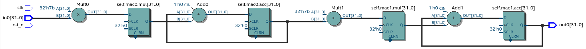

VHDL as intermediate language
=============================

This chapter develops synthesizable object-oriented (OOP) programming model for VHDL. Main motivation is to
use it as an intermediate language for High-Level synthesis.

Introduction
------------

Background
~~~~~~~~~~

The most commonly used design ’style’ for synthesizable VHDL models is what can
be called the ’dataflow’ style. A larger number of concurrent VHDL statements and
small processes connected through signals are used to implement the desired functionality.
Reading and understanding dataflow VHDL code is difficult since the concurrent
statements and processes do not execute in the order they are written, but when any of
their input signals change value.
:cite:`structvhdl_gaisler`

The biggest difference between a program in VHDL and standard programming language such as C,
is that VHDL allows concurrent statements and processes that are scheduled
for execution by events rather than in then order they are written. This reflects
indeed the dataflow behaviour of real hardware, but is  difficult to understand and analyse.
On the other hand, analysing the behaviour of programs written in sequential programming languages
does not become a problem even if the program tends to grow, since execution is done sequentially
from top to bottom :cite:`structvhdl_gaisler`.

Jiri Gaisler has proposed an 'Structured VHDL design method :cite:`structvhdl_gaisler`' in the ~2000
.He suggest to raise the hardware design abstraction level by using two-process
method.

The two-process method only uses two processes per entity: one process
that contains all combinatory (asynchronous) logic, and one process that contains all
sequential logic (registers). Using this structure, the complete algorithm can be coded
in sequential (non-concurrent) statements in the combinational process while the
sequential process only contains registers, i.e. the state :cite:`structvhdl_gaisler`.

Object-oriented style in VHDL has been studied before. In :cite:`Benzakki1997` proposal was
made to extend VHDL language with OOP semantics (dataflow based), this effort ended with development of
OO-VHDL :cite:`oovhdl`, an VHDL preprocessor, turning proposed extensions to standard
VHDL. This work did not make it do VHDL standard, the status of compiler is unknown.

Many tools on the market are capable of convert higher level language to VHDL.
However these tools only make use of the very basic dataflow semantics of VHDL language,
resulting in complex conversion process and typically unreadable VHDL output.

The author of MyHDL package has written good blog posts about signal assignments :cite:`jan_myhdl_signals` and software side of hardware
design :cite:`jan_myhdl_soft`. These ideas are relevant for this chapter.

Objective
~~~~~~~~~

Main motivation of this work is to use VHDL as an intermediate language for High-Level synthesis.

While the work of Jiri Gaisler greatly simplifies the programming experience of VHDL, it still
has some major drawbacks:

    - It is applicable only to single-clock designs :cite:`structvhdl_gaisler`
    - The 'structured' part can be only used to define combinatory logic, registers must be still inferred by signals assignments.
    - It still relies on many of the VHDL dataflow features, for example, design reuse is achieved trough the use of entities and port maps.

This work aims to improve the 'two process' model by proposing Object-oriented way for VHDL,
lifting all the previously listed drawbacks.

This sub-chapter uses examples in Python language in order to demonstrate the Python to VHDL converter (developed in next chapter)
and set some targets for the intermediate language.

Multiply-accumulate(MAC) circuit is used as a demonstration circuit throughout the rest of this chapter.

.. code-block:: python
    :caption: Pipelined multiply-accumulate(MAC) implemented in Pyha
    :name: mac-pyha

    class MAC:
        def __init__(self, coef):
            self.coef = coef
            self.mul = 0
            self.acc = 0

        def main(self, a):
            self.next.mul = a * self.coef
            self.next.acc = self.acc + self.mul
            return self.acc

.. note:: In order to keep examples simple, only :code:`integer` types are used in this chapter.

:numref:`mac-pyha` shows a MAC component implemented in Pyha
(Python to VHDL compiler implemented in the next chapter of this thesis)
Operation of this circuit is to multiply the input with coefficient and accumulate the result.
It synthesizes to logic shown on :numref:`mac_rtl`.

.. _mac_rtl:
.. figure:: img/mac_rtl.png
    :align: center
    :figclass: align-center

    Synthesis result of :numref:`mac-pyha` (Intel Quartus RTL viewer)

Main reason to pursue the OOP approach is the modularity and the ease of reuse. :numref:`mac-pyha-serial` defines
new class, containing two MACs that are to be connected in series.
As expected it synthesizes to a series structure (:numref:`pyha_mac_reuse_stack`).

.. code-block:: python
    :caption: Two MAC's connected in series
    :name: mac-pyha-serial

    class SeriesMAC:
        def __init__(self, coef):
            self.mac0 = MAC(123)
            self.mac1 = MAC(321)

        def main(self, a):
            out0 = self.mac0.main(a)
            out1 = self.mac1.main(out0)
            return out1

.. _pyha_mac_reuse_stack:

    Synthesis result of :numref:`mac-pyha-serial` (Intel Quartus RTL viewer)

With slight modification to the 'main' function (:numref:`mac-pyha-parallel`),
two MAC's can be connected in a way that synthesizes to parallel structure (:numref:`pyha_mac_reuse_parallel`).

.. code-block:: python
    :caption: Two MAC's in parallel
    :name: mac-pyha-parallel

    def main(self, a):
        out0 = self.mac0.main(a)
        out1 = self.mac1.main(a)
        return out0, out1

.. _pyha_mac_reuse_parallel:
.. figure:: img/mac_reuse_parallel.png
    :align: center
    :figclass: align-center

    Synthesis result of :numref:`mac-pyha-parallel` (Intel Quartus RTL viewer)

It is clear that OOP style could significantly simplify hardware design.
Objective of this work is to develop synthesizable VHDL model that could easily map to these MAC examples.

Using SystemVerilog instead of VHDL
~~~~~~~~~~~~~~~~~~~~~~~~~~~~~~~~~~~

SystemVerilog (SV) is the new standard for Verilog language, it adds significant amount of new features to the language
:cite:`sysverilog`. Most of the added synthesizable features already existed in VHDL, making the synthesizable subset
of these two languages almost equal. In that sense it is highly likely that ideas developed in this chapter could
apply for both programming languages.

However in my opinion, SV is worse IR language compared to VHDL, because it is much more permissive.
For example it allows out-of-bounds array indexing. This 'feature' is actually written into the
language reference manual :cite:`sysverilog_gotcha`. VHDL would error out the simulation, possibly saving debugging time.

While some communities have considered the verbosity and strictness of VHDL to be a downside, in my opinion it has always been an
strength, and even more now when the idea is to use it as IR language.

Only motivation for using SystemVerilog over VHDL is tool support. For example Yosys :cite:`yosys`, open-source
synthesys tool, supports only Verilog, however to my knowledge it does not yet support SystemVerilog features. There have
been also some efforts in adding VHDL frontend :cite:`vhdl_yosys`.

Object-oriented style in VHDL
-----------------------------

While VHDL is mostly known as a dataflow language, it inherits strong support for structured
programming from ADA.

Basic idea of OOP is to bundle up some common data and define functions that can perform actions on it.
Then one could define multiple sets of the data.
This idea fits well with hardware design, as 'data' can be thought as registers and combinatory logic as functions that
perform operations on the data.

VHDL includes an 'class' like structure called 'protected types' :cite:`vhdl-lrm`, unfortunately these are not meant for
synthesis. Even so, OOP style can be imitated, by combining data in records and passing it as a
parameter to 'class functions'. This is essentially the same way how C programmers do it.

.. code-block:: vhdl
    :caption: MAC data model in VHDL
    :name: vhdl-oop-data

    type self_t is record
        mul: integer;
        acc: integer;
        coef: integer;
    end record;

Constructing the data model for the MAC example can be done by using VHDL 'records' (:numref:`vhdl-oop-data`).
In the sense of hardware, we expect that the contents of this record will be synthesised as registers.

.. note:: We label the data model as 'self', to be equivalent with the Python world.

.. code-block:: vhdl
    :caption: OOP style function in VHDL (implementing MAC)
    :name: vhdl-oop-function

    procedure main(self: inout self_t; a: in integer; ret_0: out integer) is
    begin
        self.mul := a * self.coef;
        self.acc := self.acc + self.mul;
        ret_0 := self.acc;
    end procedure;

OOP style function can be constructed by adding first argument, that points to the data model object (:numref:`vhdl-oop-function`).
In VHDL procedure arguments must have a direction, for example the first argument 'self' is of direction 'inout',
this means it can be read and also written to.

One drawback of VHDL procedures is that they cannot return a value, instead 'out' direction arguments must be used.
Advantage of this is that the procedure may 'output/return' multiple values, as can Python functions.

.. _ghetto_comb_mac_rtl:
.. figure:: img/ghetto_comb_mac_rtl.png
    :align: center
    :figclass: align-center

    Synthesis result of :numref:`vhdl-oop-function` (Intel Quartus RTL viewer)

Synthesis results (:numref:`ghetto_comb_mac_rtl`) show that functionally correct MAC has been implemented.
However,in terms of hardware, it is not quite what was wanted.
Data model specified 3 registers, but only the one for 'acc' is present and even this is at the wrong location.

In fact, the signal path from **in0** to **out0** contains no registers at all, making this design useless.

Understanding registers
~~~~~~~~~~~~~~~~~~~~~~~

Clearly the way of defining registers is not working properly.
Mistake was to expect that the registers work in the same way as 'class variables' in traditional programming
languages.

In traditional programming, class variables are very similar to local variables. Difference is that
class variables can 'remember' the value, while local variables exist only during the function
execution.

Hardware registers have just one difference to class variables, value assigned to them does not take
effect immediately, rather on the next clock edge. That is the basic idea of registers, they take new value
on clock edge. When value is set at **this** clock edge, it will be taken on **next** clock edge.

Trying to stay in the software world, we can abstract away the clock edge by thinking that it denotes the
call to the 'main' function. Meaning that registers take the assigned value on the next function call,
meaning assignment is delayed by one function call.

VHDL defines a special assignment operator for this kind of delayed assignment, it is called 'signal assignment'.
It must be used on VHDL signal objects like :code:`a <= b`.

Jan Decaluwe, the author of MyHDL package, has written good article about the necessity of signal assignment semantics
:cite:`jan_myhdl_signals`.

Using an signal assignment inside a clocked process always infers a register, because it exactly represents the
register model.

Inferring registers with variables
~~~~~~~~~~~~~~~~~~~~~~~~~~~~~~~~~~

While 'signals' and 'signal assignment' are the VHDL way of defining registers, it poses a major problem because they
are hard to map to any other language than VHDL. This work aims to
use variables instead, because they are the same in every other programming language.

VHDL signals really come down to just having two variables, to represent the **next** and **current** values.
Signal assignment operator sets the value of **next** variable. On the next simulation delta, **current** is automatically
set to equal **next**.

This two variable method has been used before, for example Pong P. Chu, author of one of the best VHDL books,
suggests to use this style in defining sequential logic in VHDL :cite:`chu_vhdl`. Same semantics are also used in
MyHDL :cite:`jan_myhdl_signals`.

Adapting this style for the OOP data model is shown on :numref:`mac-next-data`.

.. code-block:: vhdl
    :caption: Data model with **next**
    :name: mac-next-data

    type next_t is record
        mul: integer;
        acc: integer;
        coef: integer;
    end record;

    type self_t is record
        mul: integer;
        acc: integer;
        coef: integer;

        nexts: next_t;
    end record;

New data model allows reading the register value as before and extends the structure to include the 'nexts' object,
so that it can used to assign new value for registers, for example :code:`self.nexts.acc := 0`.

Integration of the new data model to the 'main' function is shown on :numref:`mac-next-main`. Only changes are
that all the 'register writes' go to the 'nexts' object.

.. code-block:: vhdl
    :caption: Main function using 'nexts'
    :name: mac-next-main

    procedure main(self: inout self_t; a: integer; ret_0: out integer) is
    begin
        self.nexts.mul := a * self.coef;
        self.nexts.acc := self.acc + self.mul;
        ret_0 := self.acc;
    end procedure;

Last thing that must be handled is loading the **next** to **current**.
As stated before, this is done automatically by VHDL for signal assignment, by using
variables we have to take care of this ourselves. :numref:`mac-next-update` defines new function
'update_registers', taking care of this task.

.. code-block:: vhdl
    :caption: Function to update registers
    :name: mac-next-update

    procedure update_register(self: inout self_t) is
    begin
        self.mul := self.nexts.mul;
        self.acc := self.nexts.acc;
        self.coef:= self.nexts.coef;
    end procedure;

.. note:: Function 'update_registers' is called on clock raising edge.
    It is possible to infer multi-clock systems by updating subset of registers at different clock edge.

.. _mac_rtl_end:
.. figure:: img/mac_rtl.png
    :align: center
    :figclass: align-center

    Synthesis result of the upgraded code (Intel Quartus RTL viewer)

:numref:`mac_rtl_end` shows the synthesis result of the latest code. It is clear that this is now equal to the system
presented at the start of this chapter.

Creating instances
~~~~~~~~~~~~~~~~~~

General approach of creating instances is to define new variables of the 'self_t' type, :numref:`vhdl-instance`
gives an example of this.

.. code-block:: vhdl
    :caption: Class instances by defining records
    :name: vhdl-instance

    variable mac0: MAC.self_t;
    variable mac1: MAC.self_t;

Next step is to initialize the variables, this can be done at the variable definition, for example:
:code:`variable mac0: self_t := (mul=>0, acc=>0, coef=>123, nexts=>(mul=>0, acc=>0, coef=>123));`

Problem with this method is that all data-model must be initialized (including 'nexts'),
this will get unmaintainable very quickly, imagine having an instance that contains another instance or
even array of instances. In some cases it may also be required to run some calculations in order to determine
the initial values.

Traditional programming languages solve this problem by defining class constructor,
executing automatically for new objects.

In the sense of hardware, this operation can be called 'reset' function. :numref:`mac-vhdl-reset` is a reset function for
the MAC circuit. It sets the initial values for the data model and can also be used when reset signal is asserted.

.. code-block:: vhdl
    :caption: Reset function for MAC
    :name: mac-vhdl-reset

    procedure reset(self: inout self_t) is
    begin
        self.nexts.coef := 123;
        self.nexts.mul := 0;
        self.nexts.sum := 0;
        update_registers(self);
    end procedure;

But now the problem is that we need to create new reset function for each instance.

This can be solved by using VHDL 'generic packages' and 'package instantiation declaration' semantics :cite:`vhdl-lrm`.
Package in VHDL just groups common declarations to one namespace.

In case of the MAC class, 'coef' reset value could be set as package generic. Then each new package
initialization could define new reset value for it (:numref:`vhdl-package-init`).

.. code-block:: vhdl
    :caption: Initialize new package MAC_0, with 'coef' 123
    :name: vhdl-package-init

    package MAC_0 is new MAC
       generic map (COEF => 123);

Unfortunately, these advanced language features are not supported by most of the synthesis tools.
Workaround is to either use explicit record initialization (as at the start of this chapter)
or manually make new package for each instance.

Both of these solutions require unnecessary work load.

The Python to VHDL converter (developed in next chapter), uses the later option, it is not a problem as everything
is automated.

Final OOP model
~~~~~~~~~~~~~~~

Currently the OOP model consists of following elements:

    - Record for 'next'
    - Record for 'self'
    - User defined functions (like 'main')
    - 'Update registers' function
    - 'Reset' function

VHDL supports 'packages' to group common types and functions into one namespace. Package in VHDL
must contain an declaration and body (same concept as header and source files in C).

:numref:`package-mac` shows the template package for VHDL 'class'.
All the class functionality is now in common namespace.

.. code-block:: vhdl
   :caption: Package template for OOP style VHDL
   :name: package-mac

    package MAC is
        type next_t is record
            ...
        end record;

        type self_t is record
            ...
            nexts: next_t;
        end record;

        procedure reset(self: inout self_t);
        procedure update_registers(self: inout self_t);
        procedure main(self:inout self_t);
        -- other user defined functions
    end package;

    package body MAC is
        procedure reset(self: inout self_t) is
        begin
            ...
        end procedure;

        procedure update_registers(self: inout self_t) is
        begin
            ...
        end procedure;

        procedure main(self:inout self_t) is
        begin
            ...
        end procedure;
        -- other user defined functions
    end package body;

Examples
--------

This chapter provides some simple examples based on the MAC component and OOP model, that were developed in previous chapter.

Instances in series
~~~~~~~~~~~~~~~~~~~

Creating new class that connects two MAC instances in series is simple, first we need to create two
MAC instances called MAC_0 and MAC_1 and add them to the data model (:numref:`mac-series-data`).

.. code-block:: vhdl
    :caption: Datamodel of 'series' class
    :name: mac-series-data

    type self_t is record
        mac0: MAC_0.self_t;
        mac1: MAC_1.self_t;

        nexts: next_t;
    end record;

Next step is to call MAC_0 operation on the input and then pass the output
trough MAC_1, whom output is the final output (:numref:`mac-series-main`).

.. code-block:: vhdl
    :caption: Function that connects two MAC's in series
    :name: mac-series-main

    procedure main(self:inout self_t; a: integer; ret_0:out integer) is
        variable out_tmp: integer;
    begin
        MAC_0.main(self.mac0, a, ret_0=>out_tmp);
        MAC_1.main(self.mac1, out_tmp, ret_0=>ret_0);
    end procedure;

.. _mac_reuse_stack:

    Synthesis result of the new class (Intel Quartus RTL viewer)

Logic is synthesized in series (:numref:`mac_reuse_stack`). That is exactly what was specified.

Instances in parallel
~~~~~~~~~~~~~~~~~~~~~

Connecting two MAC's in parallel can be done by just returning output of MAC_0 and MAC_1 (:numref:`mac-parallel`).

.. code-block:: vhdl
    :caption: Main function for parallel instances
    :name: mac-parallel

    procedure main(self:inout self_t; a: integer; ret_0:out integer; ret_1:out integer) is
    begin
        MAC_0.main(self.mac0, a, ret_0=>ret_0);
        MAC_1.main(self.mac1, a, ret_0=>ret_1);
    end procedure;

.. _mac_reuse_parallel:
.. figure:: img/mac_reuse_parallel.png
    :align: center
    :figclass: align-center

    Synthesis result of :numref:`mac-parallel` (Intel Quartus RTL viewer)

Two MAC's are synthesized in parallel, as shown on :numref:`mac_reuse_parallel`.

Parallel instances in different clock domains
~~~~~~~~~~~~~~~~~~~~~~~~~~~~~~~~~~~~~~~~~~~~~

Multiple clock domains can be easily supported by updating registers at specified clock domain.
:numref:`mac-parallel-clocks` shows the contents of top-level process, where 'mac0' is updated by 'clk0' and
'mac1' by 'clk1'.
Note that nothing has to be changed in the data model or main function.

.. code-block:: vhdl
    :caption: Top-level for multiple clocks
    :name: mac-parallel-clocks

    if (not rst_n) then
        ReuseParallel_0.reset(self);
    else
        if rising_edge(clk0) then
            MAC_0.update_registers(self.mac0);
        end if;

        if rising_edge(clk1) then
            MAC_1.update_registers(self.mac1);
        end if;
    end if;

.. _mac_parallel_two_clocks:
.. figure:: img/mac_parallel_two_clocks.png
    :align: center
    :figclass: align-center

    Synthesis result with modified top-level process (Intel Quartus RTL viewer)

Synthesis result (:numref:`mac_parallel_two_clocks`) is as expected, MAC's are still in parallel but now the registers are clocked by different clocks. Reset signal is common
for the whole design.

Conclusion
----------

This chapter developed, synthesizable, object-oriented model for VHDL.

Major advantage is that none of the VHDL data-flow semantics are used (except for top level entity). This makes
development similar to regular software. New programmers can learn this way much faster as the previous knowledge
transfers.

Moreover, this model is not restricted to one clock domain and allows simple way of describing registers.

Major motivation for this model was to ease converting higher level languages into VHDL. This goal has been definitely
reached, next section of this thesis develops Python bindings with relative ease. Conversion is drastically simplified as
Python class maps to VHDL class, Python function maps to VHDL function and so on.

Synthesizability has been demonstrated using Intel Quartus toolset. Bigger designs, like frequency-shift-keying receiver,
have been implemented on Intel Cyclone IV device. There has been
no problems with hierarchy depth, objects may contain objects which itself may contain arrays of objects.

.. bibliography:: bibliography.bib
    :style: unsrt