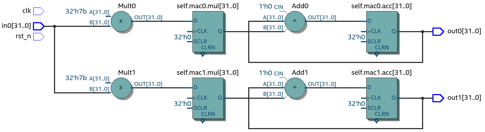

VHDL as intermediate language
=============================

This chapter develops synthesisable and object-oriented (OOP) programming model for VHDL. Main motivation of it
is to act as an intermediate language for High-Level synthesis, that is, to allow higher level OOP langues to easly
convert into VHDL.

Objective
---------

Conventioanal VHDL programming is very different from normal programming. In VHDL programmers deal with concurrent
statemetns, signals and wirering together components, that is all very far from the normal programming languages.

Gaols is to introduce alternative model, where same things can be achieved but with programming model much closer to
everyday programmers.

Problem with VHDL is that it is so very different from normal programming languages, that makes
conversion hard and error prone.

.. code-block:: python
    :caption: Pipelined multiply-accumulate(MAC) implemented in Pyha
    :name: mac-pyha

    class MAC:
        def __init__(self, coef):
            self.coef = coef
            self.mul = 0
            self.acc = 0

        def main(self, a):
            self.next.mul = a * self.coef
            self.next.acc = self.acc + self.mul
            return self.acc

.. note:: In order to keep examples simple, only :code:`integer` types are used in this section.

:numref:`mac-pyha` shows a MAC component implementend in Pyha
Pyha is experimental Python to VHDL compiler implemented in the next chapter of this thesis.
Operation of this circuit is to multiply the input with some coefficent and then accumulate the result.
This code synthesizes to logic as shown on :numref:`mac_rtl`.

.. _mac_rtl:
.. figure:: img/mac_rtl.png
    :align: center
    :figclass: align-center

    Synthesis result of :numref:`mac-pyha` (Intel Quartus RTL viewer)

This chapter tries to find and VHDL model that could easly accomodate this OOP based style.

The main reason to pursue the OOP approach is the modularity and the ease of reuse.

One prolem in VHDL is that reusing components is not trivial, programmers must do 'wiring' work that is error
prone. Making arrays of components is even harder.

On the other hand these operations are very easy with OOP approach, for example :numref:`mac-pyha-serial` defines
new class, that has two MACs in series, as expected, this is very easy to achieve in OOP style.
As expected it synthesizes to a structure where two MACs are connected in series,
shown on :numref:`pyha_mac_reuse_stack`.

.. code-block:: python
    :caption: Two MAC's connected in series
    :name: mac-pyha-serial

    class SeriesMAC:
        def __init__(self, coef):
            self.mac0 = MAC(123)
            self.mac1 = MAC(321)

        def main(self, a):
            out0 = self.mac0.main(a)
            out1 = self.mac1.main(out0)
            return out1

.. _pyha_mac_reuse_stack:
.. figure:: img/mac_reuse_stack.png
    :align: center
    :figclass: align-center

    Synthesis result of :numref:`mac-pyha-serial` (Intel Quartus RTL viewer)

:numref:`mac-pyha-parallel` shows that by modiyfing the main function,
it is possible to infer two parallel MACs instead
As expected this would synthesize to parallel MACS as shown on :numref:`pyha_mac_reuse_parallel`.

.. code-block:: python
    :caption: Two MAC's in parallel
    :name: mac-pyha-parallel

    def main(self, a):
        out0 = self.mac0.main(a)
        out1 = self.mac1.main(a)
        return out0, out1

.. _pyha_mac_reuse_parallel:

    Synthesis result of :numref:`mac-pyha-parallel` (Intel Quartus RTL viewer)

Note that it would also be possible to create lists of objects..etc.
It is clear that such kind of programming would be useful for hardware.

Basically in this chapter we are looking to develop an VHDL model that could easly describe these
previously listed examples.

Major features that we are looking for:

    - OOP style for conversion ease
    - Familiarity to normal programmers
    - Must be fully synthesisable
    - Should not limit the hardware description stuff, like multiple clocks
    - Unify/simplify Python to VHDL conversion

Background
----------

What is IR, how VHDl has been used before?
What is going to be different here?
Chisel and FIRRTL, skip?

There have been previous study regarding OOP in VHDL. In :cite:`Benzakki1997` proposal was
made to extend VHDL language with OOP semantics, this effort ended with development of
OO-VHDL :cite:`oovhdl`, that is VHDL preprocessor that could turn proposend extensions to standard
VHDL. This work was done in ~2000, current status is unknown, it certanly did not make it to the
VHDL standard.

While the :cite:`oovhdl` tried to extend VHDLs data-flow side of OOP, there actually exsists another
way to do it, that is inherited from ADA.

There are many tools on the market that convert some higher level language to VHDL, for example MyHDL converts
Python to VHDL and Verilog. However these tools only make use of the very basic elements of VHDL language. The result
of this is that coneversion process is complex and hard to understand. Also the output VHDL generally does not
keep design hirarchy and is very hard to read for humans.

While other HDL converters use VHDL/Verilog as low level conversion target.
Pyha goes other way around, as shown by the Gardner study :cite:`structvhdl_gaisler`, VHDL language can be used
with quite high level progrmaming constructs. Pyha tries to take advantage of this.

The author of MyHDL package has written some good blog posts about signal assigmennts and software side of hardware
design :cite:`jan_myhdl_signals`, :cite:`jan_myhdl_soft`. These ideas are relaveant for this chapter.

Jiri Gaisler has proposed an 'Structured VHDL design method' in the ~2000 :cite:`structvhdl_gaisler`. He proposes
to raise the hardware design abstraction level by instead of writing 'dataflow' style. Use two process method
where the algorithmic part is described by the regular function in one process and registers are in another process.

Gaisler notest that functions only good for combinatory logic and in one clock domian, try to improve that.

The goal of the two-process method is to:

    - Provide uniform algorithm encoding
    - Increase abstraction level
    - Improve readability
    - Clearly identify sequential logic
    - Simplify debugging
    - Improve simulation speed
    - Provide one model for both synthesis and simulation

This work improves upon the work of Jiri Gaisler.

Siin v]ib ka kirjutada VHDL vs Verilog asjadest, Verilog populaarsem? OS tools.

Using SystemVerilog instead of VHDL
~~~~~~~~~~~~~~~~~~~~~~~~~~~~~~~~~~~

As of 2009, Verilog was renamed to SystemVerilog, it adds significant amout of new features to the language.
:cite:`sysverilog`.

Some basic experiments have been made with SystemVerilog, in my opinion it extends Verilog with features that
were mostly already available in VHDL (for example packages, overloading ..). The synthesisable subset of VHDL
and SystemVerilog seem to be almost equal. In that sense it is highly likely that ideas developed in this chapter could
apply for both programming languages.

However in my opinion, SystemVerilog is worse IR language compared to VHDL, because it is much more permissive.
For example it allows out-of-bounds array indexing, that 'feature' is actually written into the
language reference manual :cite:`sysverilog_gotcha`. VHDL would error out the simulation.

While the verbosity and strictness have been considered a weakness of VHDL, in my opinion it has always been an
strength, even more now when the plan is to use it as IR language.

Only motivation for using SystemVerilog over VHDL is tool support. For example Yosys :cite:`yosys`, open-source
synthesys tool, supports only Verilog, however to my knowledge it does not yet support SystemVerilog features. There have
been also some efforts in adding VHDL frontend to Yosys :cite:`vhdl_yosys`.

Object-oriented style in VHDL
-----------------------------

While VHDL is mostly known as a dataflow programming, it is actually derived from ADA programming lanugage,
where it inherits strong structurial semantics. As shown by :cite:`structvhdl_gaisler`,
using these higher-level programming constructs can be used to infer combinatory logic.

Basic idea of OOP is to bundle up some common data and define functions that can perform actions on this data.
This idea could fit well with hardware design, we could define 'data' as registers and functions as combinatory logic.

VHDL has an 'class' like strucutre called protected types :cite:`vhdl-lrm`, but unfortionatly these are not working for
synthesis.

Even so, OOP style can be mimiced in VHDL, by combining data in records and passing it as a first
parameter to all functions that work on it. This is the same way how C programmers do it.

.. code-block:: vhdl
    :caption: MAC datamodel in VHDL
    :name: vhdl-oop-data

    type self_t is record
        mul: integer;
        acc: integer;
        coef: integer;
    end record;

:numref:`vhdl-oop-data` constructs the datamodel for the MAC. We expect that these will be turned to registers by
the synthesise tool.

.. code-block:: vhdl
    :caption: MAC main function in VHDL
    :name: vhdl-oop-function

    procedure main(self: inout self_t; a: in integer; ret_0: out integer) is
    begin
        self.mul := a * self.coef;
        self.acc := self.acc + self.mul;
        ret_0 := self.acc;
    end procedure;

:numref:`vhdl-oop-function` shows new MAC main function. In VHDL procedure arguments must have a direction, for example
the first argument 'self' is of direction 'inout', this means it can be read and also written to. One downside of
procedures is that they cannot return a value, instead 'out' direction arguments must be used, advantage is that
multiple return values can be supported.

.. _ghetto_comb_mac_rtl:
.. figure:: img/ghetto_comb_mac_rtl.png
    :align: center
    :figclass: align-center

    Synthesis result of :numref:`vhdl-oop-function` (Intel Quartus RTL viewer)

.. note:: Top level file can be see here.

:numref:`ghetto_comb_mac_rtl` shows that functionally correct MAC has been implemented. However it is not quite
what we want in terms of hardware. In the datamodel we hoped to have 3 registers, but only the one for 'acc' is present
and even this is on wrong location.

In fact the signal path from **in0** to **out0** contains no registers at all, making this design rather useless.

Understanding registers
~~~~~~~~~~~~~~~~~~~~~~~

Clearly the way of defining registers is not working properly.
Problem is that we expected the registers to work in the same way as 'class variables' in conventional programming
languages, but in hardware registers work a bit differently.

In conventional programming, class variables is very similiar of just using a local variable.
Only difference to the local variables is that the value will remember the value to the next call of the function.

Hardware registers as class variables have just one striking difference, value assigned to register does not take
effect immediately, rather on the next clock edge. Thats just how registers are, they
take next value on the clock edge.

As we are trying to stay in the software world, we can abstract away the **clock edge** by thinking that it is the
same as function call. That is on very clock edge our 'main' function is executed. This means that hardware registers
take the assigned value on the next function call, we could say that the assignment is delayed by one.

VHDL defines an special type of objects, called signals, for these kind of variables.
VHDL defines a special assignment operator for this kind of delayed stuff, it is called 'signal assignment'.
It is defined like :code:`a <= b`.

VHDL signals really come down to just having to variables. One to represent the next value and other for the current
value. The signal assignment assigns to the 'next' and in the next simulation delta loads the value to the current.

Using an signal assigment inside a clocked process always infers a register.

Inferring registers with variables
~~~~~~~~~~~~~~~~~~~~~~~~~~~~~~~~~~

While 'signals' and 'signal assignment' is the VHDL way of defining registers, it poses a major problem because they
are hard to map to any other language than VHDL, making conversion hard. In this work we would rather like to
use variables, because they are the same in every other programming language.

In order to j2rjepidevalt infer registers we must mimic the signal assignment semantics with variables.

VHDL signals really come down to just having two variables, representing the current and next values.
The signal assignment assigns to the 'next' and in the next simulation delta loads the value to the current.

This two variable method is not anything new, for example Pong P. Chu, author of one of the best VHDL books,
suggests to use this style in defining sequential logic in VHDL :cite:`chu_vhdl`. Same semantics are also used in
MyHDL.

First step in adapting the MAC to this style would be to define duplicate variables for the OOP datamodel.
:numref:`mac-next-data` shows one way to do this.

alternative way? each element signal object?

.. code-block:: vhdl
    :caption: Datamodel with **next** section
    :name: mac-next-data

    type next_t is record
        mul: integer;
        acc: integer;
        coef: integer;
    end record;

    type self_t is record
        mul: integer;
        acc: integer;
        coef: integer;

        nexts: next_t;
    end record;

New datamodel allows reading the register value as before, but extends the structure to include the 'nexts' keyword
that can be used to assign new value for the register, for example :code:`self.nexts.acc := 0`.

New style should also be incorporated to the 'main' function. Next register values shall be written to the
'nexts', this is shown on :numref:`mac-next-main`.

.. code-block:: vhdl
    :caption: Main function using 'nexts'
    :name: mac-next-main

    procedure main(self: inout self_t; a: integer; ret_0: out integer) is
    begin
        self.nexts.mul := a * self.coef;
        self.nexts.acc := self.acc + self.mul;
        ret_0 := self.acc;
    end procedure;

Another thing that must be handled it loading the 'next' values to current values, that is updating the registers.
In VHDL this is done automatically if signal assignment is used.By using
variables we have to take care of this ourselves. For this we can define new function that handles the
update for all the registers, this is shown on :numref:`mac-next-update`.

.. code-block:: vhdl
    :caption: Function to update registers
    :name: mac-next-update

    procedure update_register(self: inout self_t) is
    begin
        self.mul := self.nexts.mul;
        self.acc := self.nexts.acc;
        self.coef:= self.nexts.coef;
    end procedure;

.. note:: Function 'update_registers' is called on clock raising edge. This determines their clock domain.
    It is possible to infer multiclock systems by updating some subeset of registers at different clock edge.

.. _mac_rtl_end:
.. figure:: img/mac_rtl.png
    :align: center
    :figclass: align-center

    Synthesis result of the upgraded code (Intel Quartus RTL viewer)

:numref:`mac_rtl_end` shows the synthesis result of the last code. It is clear that this is now equal to the system
presented at the start of this chapter, exactly what we wanted.

Initial register values
~~~~~~~~~~~~~~~~~~~~~~~

The OOP model for VHDL is almost complete, only thing it misses is initialization of registers. In conventional
programming languages this is done by the class constructor, that is automatically executed when objects are made.

In the sense of hardware we can call this function 'reset', it shall be called when the reset signal is assertd.

.. code-block:: vhdl
    :caption: Reset function for MAC
    :name: mac-vhdl-reset

    procedure reset(self: inout self_t) is
    begin
        self.nexts.coef := 123;
        self.nexts.mul := 0;
        self.nexts.sum := 0;
        update_registers(self);
    end procedure;

:numref:`mac-vhdl-reset` shows 'reset' implementation for MAC, it writes
initial values to 'next' and then use the 'update_registers'.

Putting everything together
~~~~~~~~~~~~~~~~~~~~~~~~~~~

Currently we have following elements required for one 'class' definition:

    - Record for 'next'
    - Record for 'self'
    - User defined functions (like 'main')
    - 'Update registers' function
    - 'Reset' function

VHDL supports 'packages' to group common types and functions into one namespace. Package in VHDL
must contain an declaration and body (same concept as header and source files in C).

:numref:`package-mac` lists the final code for the MAC example.

.. code-block:: vhdl
   :caption: Full code of OOP style MAC
   :name: package-mac

    package MAC is
        type next_t is record
            coef: integer;
            mul: integer;
            acc: integer;
        end record;

        type self_t is record
            coef: integer;
            mul: integer;
            acc: integer;

            nexts: next_t;
        end record;

        procedure reset(self: inout self_t);
        procedure update_registers(self: inout self_t);
        procedure main(self:inout self_t; a: integer; ret_0:out integer);
    end package;

    package body MAC is

        procedure reset(self: inout self_t) is
        begin
            self.nexts.coef := 123;
            self.nexts.mul := 0;
            self.nexts.acc := 0;
            update_registers(self);
        end procedure;

        procedure update_registers(self: inout self_t) is
        begin
            self.coef := self.nexts.coef;
            self.mul := self.nexts.mul;
            self.acc := self.nexts.acc;
        end procedure;

        procedure main(self:inout self_t; a: integer; ret_0:out integer) is
        begin
            self.nexts.mul := self.coef * a;
            self.nexts.acc := self.acc + self.mul;
            ret_0 := self.acc;
            return;
        end procedure;
    end package body;

Creating instances
~~~~~~~~~~~~~~~~~~

Creating new instances of the package could be done with VHDL instantiation declaration and package generics.
For example the MAC class, we would like to set the 'coef' value for new instances. For this we could define
the package with a 'generic' definiton and initialize new packages like shown on :numref:`vhdl-package-init`.
In the reset function we could then use 'COEF' for 'coef' init value.

.. code-block:: vhdl
    :caption: Initialize new package MAC_0, with 'coef' 123
    :name: vhdl-package-init

    package MAC_0 is new MAC
       generic map (COEF => 123);

It is clear that VHDL is a very powerful language, there can even be type generics :cite:`vhdl-lrm`.
Sadly, these are advaced features of the language and are known to be supported only on few simulators.

Synthesisy tools like from Intel or Xilinx does not support generic packages nor pacakge initializations.

There are two ways around this issue:

    - Instead of using reset function, reset registers with assignment
    - For each instance create only new reset function
    - For each instance manually create new package with modified reset function

The first option proposes setting reset values inline on reset, for example,
:code:`self: self_t := (mul=>0, acc=>0, coef=>123, nexts=>(mul=>0, acc=>0, coef=>123));`. Problem with this method is
that it needs to set all the members of struct (including 'nexts'), this will get unmaintainable very quiqly, imagine
having an instance that contains another instance or even array of instances.

Second option would keep one package for each objects but different reset functions. This may end up in error-prone code
where wrong reset function is used accitendally.

Last option proposes to manually do the work of package initialization, that is for each instance make a new package.
This will end up in alot of duplicated code.

In general all of these solutions have problems, in this work i have chosen the last option, because it is safe unlike the
second option. In the end creating of new packages is automated by the Python bindings developed in the next chapter.

Examples
~~~~~~~~

This chapter provides examples that make use of the MAC model and OOP.

Instances in series
^^^^^^^^^^^^^^^^^^^

This paragraph shows how to create a new class that itself includes two MAC's connected in series,
that is, signal flows is as **in** -> MAC0 -> MAC1 -> **out**.

Assuming we have already created two MAC packages called MAC_0 and MAC_1, connecting these in series is simple.

.. code-block:: vhdl
    :caption: Datamodel and main function of 'series' class
    :name: mac-series

    type self_t is record
        mac0: MAC_0.self_t;
        mac1: MAC_1.self_t;

        nexts: next_t;
    end record;

    procedure main(self:inout self_t; a: integer; ret_0:out integer) is
        variable out_tmp: integer;
    begin
        MAC_0.main(self.mac0, a, ret_0=>out_tmp);
        MAC_1.main(self.mac1, out_tmp, ret_0=>ret_0);
    end procedure;

:numref:`mac-series` shows the important parts of the series MAC implementation. Datamodel consists
of two MAC objects and the main function just calls the main of these objects. Output of MAC_0 is fed into MAC_1, which
results in final output.

.. _mac_reuse_stack:
.. figure:: img/mac_reuse_stack.png
    :align: center
    :figclass: align-center

    Synthesis result of :numref:`mac-series` (Intel Quartus RTL viewer)

Logic is synthesized in series, as shown on :numref:`mac_reuse_stack`. That is exactly what was specified.

Instances in parallel
^^^^^^^^^^^^^^^^^^^^^

Connecting two MAC's in parallel can be done by just adding one output for the main function and returning output of
MAC_0 as separate output instead of input to MAC_1, this is shown on :numref:`mac-parallel`

.. code-block:: vhdl
    :caption: Main function for parallel instances
    :name: mac-parallel

    procedure main(self:inout self_t; a: integer; ret_0:out integer; ret_1:out integer) is
    begin
        MAC_0.main(self.mac0, a, ret_0=>ret_0);
        MAC_1.main(self.mac1, a, ret_0=>ret_1);
    end procedure;

.. _mac_reuse_parallel:

    Synthesis result of :numref:`mac-parallel` (Intel Quartus RTL viewer)

Two MAC's are synthesized in parallel, as shown on :numref:`mac_reuse_parallel`.

Parallel instances in different clock domains
^^^^^^^^^^^^^^^^^^^^^^^^^^^^^^^^^^^^^^^^^^^^^

Multiple clock domains can be easly supported by just updating registers at specified clock edges.
:numref:`mac-parallel-clocks` shows the contents of top-level process, where we intend to have 'clk0' for 'mac0' and
'clk1' for 'mac1'. Beauty of this method is that nothing has to be changed in the 'main' functions.

.. code-block:: vhdl
    :caption: Top-level for multiple clocks
    :name: mac-parallel-clocks

    if (not rst_n) then
        ReuseParallel_0.reset(self);
    else
        if rising_edge(clk0) then
            MAC_0.update_registers(self.mac0);
        end if;

        if rising_edge(clk1) then
            MAC_1.update_registers(self.mac1);
        end if;
    end if;

.. _mac_parallel_two_clocks:
.. figure:: img/mac_parallel_two_clocks.png
    :align: center
    :figclass: align-center

    Synthesis result with modified top-level process (Intel Quartus RTL viewer)

Synthesis result (:numref:`mac_parallel_two_clocks`) is as expected, MAC's are still in parallel but now the registers are clocked by different clocks. Reset signal is common
for the whole design.

Mention Qsys and interconnects here?

Conclusion
----------

This work started from the Gaisler study, while he presented two process design methology, hes use of functions was
limited to de combinatory logic only and overall was limited to single clock. He was also using many of the awkward VHDl features.

This work extends the gaisler stuff by proposing OOP model into VHDL and introducing the way of defining registers using
only registers, this allows the functions to work with registers aswell. In addtion, one clock domain restriction is lifted.

Major advantage of this model is that it does not use any specialized data-flow features of VHDL (except top level entity).
New programmers can learn this way of programming much quicker as mostly they can make use of the stuff they already know.
Only some rules like that stuff must be assigned to 'next' must be known.

Another benefit of OOP style model is that is significantly simplifies converting other OOP languages to VHDL and
that was the major goal of this section. Next section shows how and experimental Python compiler is built on top of this.

Every register of the model is kept in record, it is easy to create shadow registers for the whole module.
Everything is concurrent, can debug and understand.

Easier to understand for new programmers, this model contains only elements that should be already familiar for
programmers dealing with normal languages.

As demonstrated, proposed model is synthesizable with Intel Quartus toolset. This model has also been
used in bigger designs, like frequency-shift-keying receiver implemented on Altera Cyclone IV device. There has been
no problems with hierarchy depth, that is objects can contain objects which itself may contain arrays of objects and so on.

.. bibliography:: bibliography.bib
    :style: unsrt